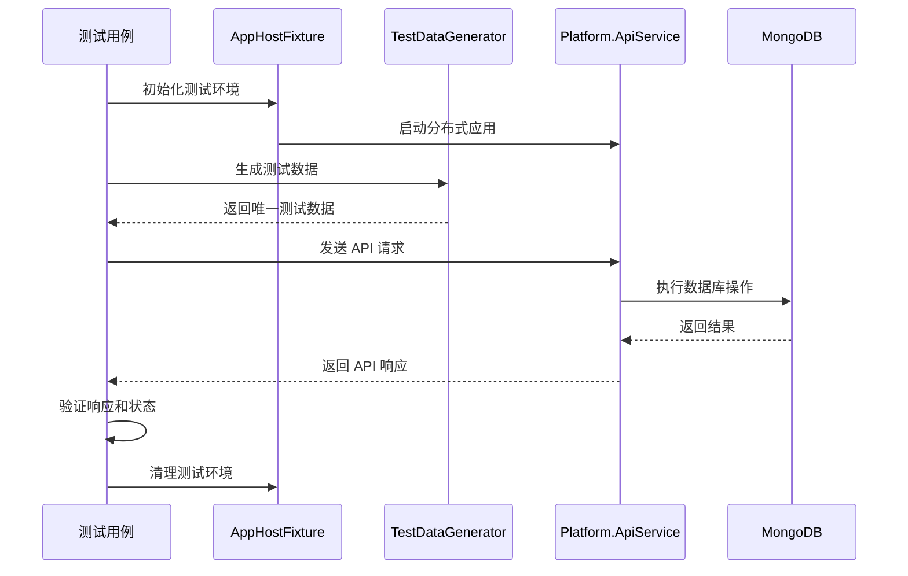
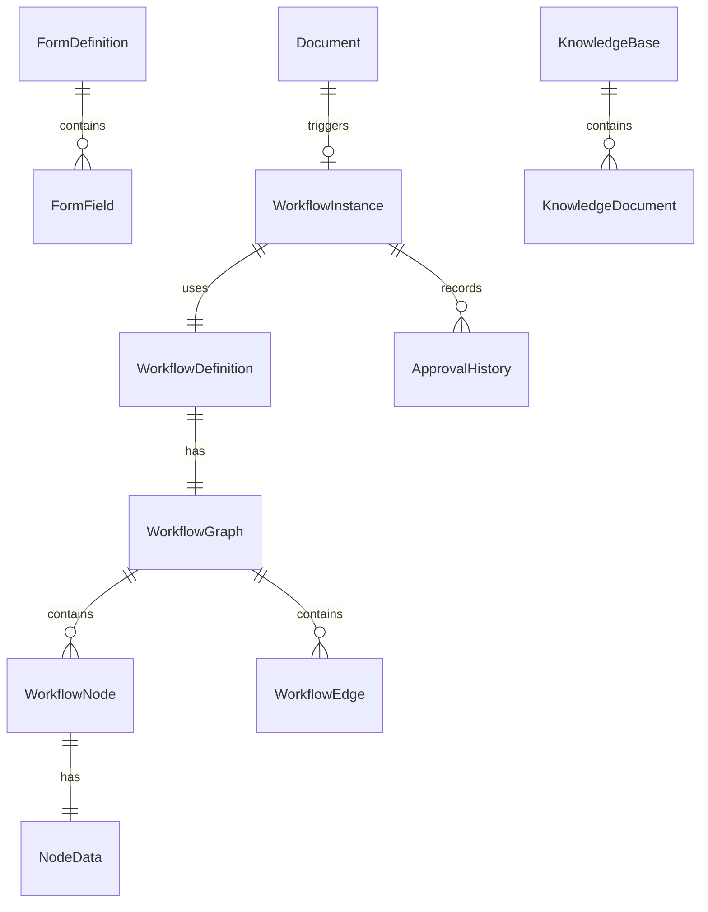

# Design Document: Platform.AppHost.Tests API 测试扩展

## Overview

本设计文档定义了 Platform.AppHost.Tests 项目的 API 测试扩展功能的技术实现方案。该功能将为四个核心业务模块添加集成测试：表单定义（Form Definition）、知识库（Knowledge Base）、流程定义（Process Definition）和公文审批（Document Approval）。

### 目标

1. 为四个核心模块提供全面的 API 集成测试覆盖
2. 验证 API 端点的正确性、数据完整性和业务流程的端到端功能
3. 确保测试的独立性、可重复性和可维护性
4. 利用 Aspire 的 AppHostFixture 管理分布式应用生命周期
5. 使用 xUnit 框架组织和执行测试用例

### 范围

本设计涵盖以下内容：

- 表单定义 API 的 CRUD 操作测试
- 知识库 API 的 CRUD 操作测试
- 流程定义 API 的 CRUD 操作和实例管理测试
- 公文审批 API 的完整生命周期测试（创建、提交、审批、查询）
- 跨模块的端到端集成测试
- 错误处理和边界条件测试
- 测试数据生成和管理基础设施

## Architecture

### 测试架构概览

测试系统采用分层架构，确保测试的可维护性和可扩展性：

```
Platform.AppHost.Tests/
├── AppHostFixture.cs              # Aspire 应用生命周期管理
├── Tests/
│   ├── FormDefinitionTests.cs    # 表单定义测试
│   ├── KnowledgeBaseTests.cs     # 知识库测试
│   ├── WorkflowDefinitionTests.cs # 流程定义测试
│   ├── DocumentApprovalTests.cs   # 公文审批测试
│   └── EndToEndIntegrationTests.cs # 端到端集成测试
├── Helpers/
│   ├── HttpClientExtensions.cs   # HTTP 客户端扩展方法
│   ├── TestDataGenerator.cs      # 测试数据生成器
│   └── ApiTestHelpers.cs         # API 测试辅助方法（新增）
└── Models/
    ├── ApiResponse.cs             # API 响应模型
    ├── FormTestModels.cs          # 表单测试模型（新增）
    ├── KnowledgeBaseTestModels.cs # 知识库测试模型（新增）
    ├── WorkflowTestModels.cs      # 流程测试模型（新增）
    └── DocumentTestModels.cs      # 公文测试模型（新增）
```

### 测试执行流程



### 关键设计决策

1. **使用现有的 AppHostFixture**: 复用已有的 Aspire 应用生命周期管理，确保测试环境的一致性
2. **测试数据隔离**: 每个测试用例生成唯一的测试数据（使用时间戳和 GUID），避免测试之间的相互影响
3. **不进行测试后清理**: 遵循现有测试模式，不在测试后删除数据，依赖数据唯一性保证测试独立性
4. **分层测试策略**: 
   - 单元测试：测试单个 API 端点的 CRUD 操作
   - 集成测试：测试跨模块的业务流程
   - 端到端测试：测试完整的业务场景
5. **使用 xUnit 的 IClassFixture**: 在测试类级别共享 AppHostFixture，减少应用启动开销

## Components and Interfaces

### 1. 测试数据生成器扩展 (TestDataGenerator)

扩展现有的 `TestDataGenerator` 类，添加四个模块的测试数据生成方法。

```csharp
public static class TestDataGenerator
{
    // 表单定义测试数据生成
    public static FormDefinitionRequest GenerateValidFormDefinition();
    public static FormDefinitionRequest GenerateFormDefinitionWithFields(int fieldCount);
    
    // 知识库测试数据生成
    public static KnowledgeBaseRequest GenerateValidKnowledgeBase();
    public static KnowledgeBaseRequest GenerateKnowledgeBaseWithCategory(string category);
    
    // 流程定义测试数据生成
    public static WorkflowDefinitionRequest GenerateValidWorkflowDefinition();
    public static WorkflowDefinitionRequest GenerateWorkflowWithNodes(int nodeCount);
    public static WorkflowGraph GenerateMinimalValidGraph();
    
    // 公文测试数据生成
    public static DocumentRequest GenerateValidDocument();
    public static DocumentRequest GenerateDocumentWithFormData(Dictionary<string, object> formData);
}
```

### 2. API 测试辅助方法 (ApiTestHelpers)

新增辅助类，提供常用的测试验证方法。

```csharp
public static class ApiTestHelpers
{
    // 验证分页响应结构
    public static void AssertPagedResponse<T>(ApiResponse<object> response, int expectedCurrent, int expectedPageSize);
    
    // 验证 API 响应成功
    public static void AssertSuccessResponse<T>(ApiResponse<T> response);
    
    // 验证 API 响应失败
    public static void AssertErrorResponse<T>(ApiResponse<T> response, string expectedCode);
    
    // 等待异步操作完成（用于流程实例状态变更）
    public static Task<T> WaitForConditionAsync<T>(Func<Task<T>> operation, Func<T, bool> condition, int maxAttempts = 10);
}
```

### 3. 测试模型类

为每个模块定义请求和响应模型，映射到 API 的数据结构。

#### FormTestModels.cs
```csharp
public record FormDefinitionRequest
{
    public string Name { get; init; } = string.Empty;
    public string? Description { get; init; }
    public string? Key { get; init; }
    public List<FormFieldRequest> Fields { get; init; } = new();
    public bool IsActive { get; init; } = true;
}

public record FormFieldRequest
{
    public string Label { get; init; } = string.Empty;
    public string Type { get; init; } = "Text";
    public bool Required { get; init; } = false;
    public string DataKey { get; init; } = string.Empty;
}

public record FormDefinitionResponse
{
    public string Id { get; init; } = string.Empty;
    public string Name { get; init; } = string.Empty;
    public string Key { get; init; } = string.Empty;
    public List<FormFieldRequest> Fields { get; init; } = new();
    public bool IsActive { get; init; }
}
```

#### KnowledgeBaseTestModels.cs
```csharp
public record KnowledgeBaseRequest
{
    public string Name { get; init; } = string.Empty;
    public string? Description { get; init; }
    public string Category { get; init; } = string.Empty;
    public bool IsActive { get; init; } = true;
}

public record KnowledgeBaseResponse
{
    public string Id { get; init; } = string.Empty;
    public string Name { get; init; } = string.Empty;
    public string? Description { get; init; }
    public string Category { get; init; } = string.Empty;
    public bool IsActive { get; init; }
    public int ItemCount { get; init; }
}
```

#### WorkflowTestModels.cs
```csharp
public record WorkflowDefinitionRequest
{
    public string Name { get; init; } = string.Empty;
    public string? Description { get; init; }
    public string Category { get; init; } = string.Empty;
    public WorkflowGraphRequest Graph { get; init; } = new();
    public bool IsActive { get; init; } = true;
}

public record WorkflowGraphRequest
{
    public List<WorkflowNodeRequest> Nodes { get; init; } = new();
    public List<WorkflowEdgeRequest> Edges { get; init; } = new();
}

public record WorkflowNodeRequest
{
    public string Id { get; init; } = string.Empty;
    public string Type { get; init; } = string.Empty;
    public NodeDataRequest Data { get; init; } = new();
    public NodePositionRequest Position { get; init; } = new();
}

public record NodeDataRequest
{
    public string? Label { get; init; }
    public string NodeType { get; init; } = string.Empty;
    public object? Config { get; init; } // 节点配置，支持不同节点类型的特定配置
}

public record NodePositionRequest
{
    public double X { get; init; }
    public double Y { get; init; }
}

public record WorkflowEdgeRequest
{
    public string Id { get; init; } = string.Empty;
    public string Source { get; init; } = string.Empty;
    public string Target { get; init; } = string.Empty;
    public string? SourceHandle { get; init; } // 用于条件分支等场景
}

public record WorkflowInstanceResponse
{
    public string Id { get; init; } = string.Empty;
    public string WorkflowDefinitionId { get; init; } = string.Empty;
    public string DocumentId { get; init; } = string.Empty;
    public string Status { get; init; } = string.Empty;
}

// 支持的 26 种节点类型常量
public static class NodeTypes
{
    public const string Start = "start";
    public const string End = "end";
    public const string Ai = "ai";
    public const string AiJudge = "ai-judge";
    public const string Answer = "answer";
    public const string Approval = "approval";
    public const string Code = "code";
    public const string Condition = "condition";
    public const string DocumentExtractor = "document-extractor";
    public const string Email = "email";
    public const string HttpRequest = "http-request";
    public const string HumanInput = "human-input";
    public const string Iteration = "iteration";
    public const string KnowledgeSearch = "knowledge-search";
    public const string ListOperator = "list-operator";
    public const string Log = "log";
    public const string Notification = "notification";
    public const string ParameterExtractor = "parameter-extractor";
    public const string QuestionClassifier = "question-classifier";
    public const string SetVariable = "set-variable";
    public const string SpeechToText = "speech-to-text";
    public const string Template = "template";
    public const string TextToSpeech = "text-to-speech";
    public const string Timer = "timer";
    public const string Tool = "tool";
    public const string VariableAggregator = "variable-aggregator";
    public const string VariableAssigner = "variable-assigner";
    public const string Vision = "vision";
}
```

#### DocumentTestModels.cs
```csharp
public record DocumentRequest
{
    public string Title { get; init; } = string.Empty;
    public string? Content { get; init; }
    public string DocumentType { get; init; } = string.Empty;
    public string? Category { get; init; }
    public Dictionary<string, object>? FormData { get; init; }
}

public record DocumentResponse
{
    public string Id { get; init; } = string.Empty;
    public string Title { get; init; } = string.Empty;
    public string? Content { get; init; }
    public string DocumentType { get; init; } = string.Empty;
    public string Status { get; init; } = string.Empty;
    public string? WorkflowInstanceId { get; init; }
}

public record SubmitDocumentRequest
{
    public string WorkflowDefinitionId { get; init; } = string.Empty;
    public Dictionary<string, object>? Variables { get; init; }
}

public record ApprovalRequest
{
    public string? Comment { get; init; }
}
```

### 4. 测试类结构

每个模块的测试类遵循相同的结构模式：

```csharp
public class ModuleTests : IClassFixture<AppHostFixture>
{
    private readonly AppHostFixture _fixture;
    private readonly ITestOutputHelper _output;
    private HttpClient _httpClient;
    private string _accessToken;

    public ModuleTests(AppHostFixture fixture, ITestOutputHelper output)
    {
        _fixture = fixture;
        _output = output;
    }

    // 测试初始化：注册用户并获取访问令牌
    private async Task InitializeAuthenticationAsync()
    {
        // 注册测试用户
        // 登录获取令牌
        // 设置 HTTP 客户端授权头
    }

    // CRUD 操作测试
    [Fact]
    public async Task Create_WithValidData_ShouldSucceed() { }
    
    [Fact]
    public async Task GetList_ShouldReturnPagedData() { }
    
    [Fact]
    public async Task GetById_WithExistingId_ShouldReturnData() { }
    
    [Fact]
    public async Task Update_WithValidData_ShouldSucceed() { }
    
    [Fact]
    public async Task Delete_WithExistingId_ShouldSucceed() { }
    
    // 错误处理测试
    [Fact]
    public async Task Create_WithMissingRequiredField_ShouldReturnValidationError() { }
    
    [Fact]
    public async Task GetById_WithNonExistentId_ShouldReturn404() { }
}
```

## Data Models

### 测试数据模型设计原则

1. **使用 record 类型**: 利用 C# 9.0 的 record 类型，提供不可变性和值相等性
2. **与 API 模型对齐**: 测试模型结构与 API 实际接受/返回的数据结构保持一致
3. **支持部分更新**: 更新请求模型使用可空类型，支持部分字段更新
4. **包含必要的验证属性**: 在测试数据生成时确保符合 API 验证规则

### 核心数据模型关系



### 测试数据生成策略

1. **唯一性保证**: 
   - 使用 `DateTimeOffset.UtcNow.ToUnixTimeMilliseconds()` + `Guid.NewGuid()` 生成唯一标识符
   - 格式: `{prefix}_{timestamp}_{guid}`
   - 示例: `form_1234567890_abc123`

2. **字段长度控制**:
   - Name 字段: 最大 100 字符
   - Description 字段: 最大 500 字符
   - Key 字段: 最大 50 字符

3. **必需字段填充**:
   - 所有标记为必需的字段都必须有有效值
   - 使用合理的默认值（如 Category = "测试分类"）

4. **关联数据处理**:
   - 在测试中先创建依赖资源（如先创建表单定义，再创建引用该表单的流程定义）
   - 保存创建的资源 ID，用于后续测试步骤


## Correctness Properties

*A property is a characteristic or behavior that should hold true across all valid executions of a system—essentially, a formal statement about what the system should do. Properties serve as the bridge between human-readable specifications and machine-verifiable correctness guarantees.*

### Property Reflection

After analyzing all acceptance criteria, I identified several opportunities to consolidate redundant properties:

1. **CRUD Round-trip Properties**: Requirements 1.3, 2.3, 3.3, and 4.3 all test the same pattern (create then retrieve). These can be consolidated into module-specific round-trip properties.

2. **Delete Verification Properties**: Requirements 1.5, 2.5, 3.5, and 4.5 all test the same pattern (delete then verify 404). These follow the same logical structure.

3. **Pagination Properties**: Requirements 1.2, 2.2, 3.2, and 4.2 all test pagination structure. While module-specific, they validate the same pagination contract.

4. **Filtering Properties**: Requirements 1.8, 2.7, 3.8, and 3.9 all test filtering logic. These can be consolidated where the filtering mechanism is identical.

5. **Update Properties**: Requirements 1.4, 2.4, 3.4, and 4.4 all test update operations. These follow the same pattern.

6. **Authentication and Authorization**: Requirements 7.1, 7.2, 7.6, and 7.7 test cross-cutting concerns that apply to all endpoints.

The consolidated properties below eliminate redundancy while maintaining comprehensive coverage.

### Property 1: CRUD Round-trip Consistency (Forms)

*For any* valid form definition with name and fields, creating the form and then retrieving it by ID should return a form object with the same name, fields, and an auto-generated Key field.

**Validates: Requirements 1.1, 1.3, 1.7**

### Property 2: CRUD Round-trip Consistency (Knowledge Bases)

*For any* valid knowledge base with name and category, creating the knowledge base and then retrieving it by ID should return a knowledge base object with the same name, category, and description.

**Validates: Requirements 2.1, 2.3**

### Property 3: CRUD Round-trip Consistency (Workflows)

*For any* valid workflow definition with name and valid graph (containing at least one start node), creating the workflow and then retrieving it by ID should return a workflow object with the same name, graph structure, and version information.

**Validates: Requirements 3.1, 3.3**

### Property 4: CRUD Round-trip Consistency (Documents)

*For any* valid document with title and content, creating the document and then retrieving it by ID should return a document object with the same title, content, and initial status of Draft.

**Validates: Requirements 4.1, 4.3**

### Property 5: Pagination Structure Consistency

*For any* paginated list endpoint (forms, knowledge bases, workflows, documents) with valid pagination parameters (current, pageSize), the response should contain a data array, total count, and the pagination parameters should match the request.

**Validates: Requirements 1.2, 2.2, 3.2, 4.2, 5.5**

### Property 6: Update Reflection

*For any* existing resource (form, knowledge base, workflow, document) and valid update data, updating the resource should result in the updated fields being reflected in subsequent GET requests while unchanged fields remain the same.

**Validates: Requirements 1.4, 2.4, 2.8, 3.4, 4.4**

### Property 7: Delete Then 404

*For any* existing resource (form, knowledge base, workflow, document), deleting the resource should return 200 OK, and subsequent GET requests for that resource ID should return 404 Not Found.

**Validates: Requirements 1.5, 2.5, 3.5, 4.5, 7.7**

### Property 8: Keyword Filtering Accuracy

*For any* keyword search on list endpoints (forms, knowledge bases), all returned results should have the keyword present in their name or description fields, and no results should be returned that don't match the keyword.

**Validates: Requirements 1.8, 2.7**

### Property 9: Category and Status Filtering Accuracy

*For any* category or status filter on workflow list endpoint, all returned results should match the specified filter criteria, and no results should be returned that don't match.

**Validates: Requirements 3.8, 3.9**

### Property 10: Workflow Instance Creation

*For any* valid workflow definition ID and document ID, starting a workflow instance should return 200 OK with a workflow instance object containing a generated ID, the provided workflow definition ID, the provided document ID, and an initial status of Running.

**Validates: Requirements 3.10**

### Property 11: Document Submission Workflow Trigger

*For any* valid document ID and workflow definition ID, submitting the document should return 200 OK with a workflow instance object in Running status, and the document's WorkflowInstanceId field should be populated with the instance ID.

**Validates: Requirements 4.6**

### Property 12: Approval Action State Update

*For any* workflow instance in Running status where the current user is an approver, performing an approval action (approve/reject) should return 200 OK, and the workflow instance status should be updated accordingly.

**Validates: Requirements 4.7, 4.8**

### Property 13: Approval History Completeness

*For any* document that has been submitted for approval and has undergone approval actions, the approval history should contain entries for all approval actions with timestamps, approver IDs, actions, and comments.

**Validates: Requirements 4.10**

### Property 14: Pending Documents User Filtering

*For any* user requesting their pending documents list, all returned documents should have workflow instances where the user is in the current approver list, and no documents should be returned where the user is not an approver.

**Validates: Requirements 4.9**

### Property 15: Form-Workflow Integration

*For any* workflow definition that binds a form definition, starting a workflow instance should correctly load the form definition, and the form fields should be accessible in the workflow context.

**Validates: Requirements 6.2**

### Property 16: Approver Assignment Correctness

*For any* document submitted for approval with a workflow definition containing approver rules, the workflow instance's current approver list should contain the users specified by the approver rules.

**Validates: Requirements 6.3**

### Property 17: Document-Workflow State Synchronization

*For any* approval action completed on a workflow instance, both the document status and the workflow instance status should be updated synchronously and reflect the same approval state.

**Validates: Requirements 6.4**

### Property 18: Unauthenticated Request Rejection

*For any* API endpoint, sending a request without an authentication token should return 401 Unauthorized.

**Validates: Requirements 7.1**

### Property 19: Non-existent Resource 404

*For any* GET, PUT, or DELETE request with a resource ID that doesn't exist, the response should return 404 Not Found.

**Validates: Requirements 7.2**

### Property 20: Authorization Enforcement

*For any* approval action request where the current user is not in the workflow instance's current approver list, the response should return a permission error (403 Forbidden or similar).

**Validates: Requirements 7.6**

## Error Handling

### 错误处理策略

测试系统需要验证 API 在各种错误场景下的行为：

1. **验证错误 (400 Bad Request)**:
   - 缺少必需字段
   - 字段值超出长度限制
   - 无效的数据格式（如无效的 JSON）
   - 分页参数超出有效范围
   - 流程图形定义不合法

2. **认证错误 (401 Unauthorized)**:
   - 缺少身份验证令牌
   - 无效的身份验证令牌
   - 过期的身份验证令牌

3. **授权错误 (403 Forbidden)**:
   - 用户尝试审批不属于自己的公文
   - 用户访问其他租户的资源

4. **资源不存在 (404 Not Found)**:
   - 访问不存在的资源 ID
   - 访问已被软删除的资源

5. **业务逻辑错误 (400 Bad Request with specific error code)**:
   - 审批拒绝时缺少拒绝原因
   - 流程图形缺少起始节点
   - 尝试启动已删除的流程定义

### 错误响应结构

所有错误响应应遵循统一的 `ApiResponse<T>` 结构：

```json
{
  "success": false,
  "code": "VALIDATION_ERROR",
  "message": "表单名称不能为空",
  "data": null,
  "traceId": "00-abc123...",
  "errors": {
    "Name": ["表单名称不能为空"]
  }
}
```

### 测试实现策略

1. **边界条件测试**: 使用 xUnit 的 `[Fact]` 测试特定的边界条件和错误场景
2. **错误消息验证**: 验证错误响应包含有意义的错误消息和错误代码
3. **HTTP 状态码验证**: 确保返回正确的 HTTP 状态码
4. **错误恢复测试**: 验证系统在错误后能够继续正常处理后续请求

## Testing Strategy

### 测试方法论

本项目采用双重测试策略，结合单元测试和属性测试：

#### 单元测试 (Unit Tests)

使用 xUnit 的 `[Fact]` 特性，测试特定的示例和边界条件：

- **特定示例**: 验证具体的业务场景（如完整的公文审批流程）
- **边界条件**: 测试输入验证、错误处理、权限检查
- **集成点**: 测试模块之间的交互（如表单与流程的绑定）

**示例**:
```csharp
[Fact]
public async Task CreateForm_WithMissingName_ShouldReturnValidationError()
{
    // Arrange
    var request = new FormDefinitionRequest { Name = "", Fields = new() };
    
    // Act
    var response = await _httpClient.PostAsJsonAsync("/api/forms", request);
    
    // Assert
    Assert.Equal(HttpStatusCode.BadRequest, response.StatusCode);
    var apiResponse = await response.Content.ReadAsJsonAsync<ApiResponse<object>>();
    Assert.False(apiResponse.Success);
    Assert.Contains("VALIDATION", apiResponse.Code);
}
```

#### 属性测试 (Property-Based Tests)

虽然 C# 生态系统中的属性测试库不如其他语言成熟，我们将通过循环执行来模拟属性测试：

- **最小迭代次数**: 每个属性测试至少执行 100 次迭代
- **随机数据生成**: 使用 `TestDataGenerator` 生成随机但有效的测试数据
- **标签格式**: 在测试方法的 XML 注释中标注对应的设计属性

**示例**:
```csharp
/// <summary>
/// Property-based test: CRUD Round-trip Consistency (Forms)
/// Feature: apphost-api-tests-expansion, Property 1: CRUD Round-trip Consistency (Forms)
/// 
/// Validates: Requirements 1.1, 1.3, 1.7
/// 
/// For any valid form definition with name and fields, creating the form and then
/// retrieving it by ID should return a form object with the same name, fields, and
/// an auto-generated Key field.
/// </summary>
[Fact]
public async Task FormCrudRoundtrip_ShouldMaintainConsistency()
{
    const int iterations = 100;
    
    for (int i = 0; i < iterations; i++)
    {
        // Generate random form data
        var formRequest = TestDataGenerator.GenerateValidFormDefinition();
        
        // Create form
        var createResponse = await _httpClient.PostAsJsonAsync("/api/forms", formRequest);
        Assert.Equal(HttpStatusCode.OK, createResponse.StatusCode);
        
        var createResult = await createResponse.Content.ReadAsJsonAsync<ApiResponse<FormDefinitionResponse>>();
        Assert.True(createResult.Success);
        Assert.NotNull(createResult.Data.Id);
        Assert.NotEmpty(createResult.Data.Key); // Property 1.7: Key auto-generated
        
        // Retrieve form
        var getResponse = await _httpClient.GetAsync($"/api/forms/{createResult.Data.Id}");
        Assert.Equal(HttpStatusCode.OK, getResponse.StatusCode);
        
        var getResult = await getResponse.Content.ReadAsJsonAsync<ApiResponse<FormDefinitionResponse>>();
        Assert.True(getResult.Success);
        Assert.Equal(formRequest.Name, getResult.Data.Name);
        Assert.Equal(formRequest.Fields.Count, getResult.Data.Fields.Count);
    }
}
```

### 测试组织结构

#### 1. 表单定义测试 (FormDefinitionTests.cs)

- **CRUD 操作测试**: 创建、读取、更新、删除
- **列表和筛选测试**: 分页、关键词筛选
- **验证错误测试**: 缺少必需字段、无效数据
- **属性测试**: Round-trip 一致性、Key 自动生成

#### 2. 知识库测试 (KnowledgeBaseTests.cs)

- **CRUD 操作测试**: 创建、读取、更新、删除
- **列表和筛选测试**: 分页、关键词筛选
- **状态管理测试**: IsActive 状态更新
- **属性测试**: Round-trip 一致性、筛选准确性

#### 3. 流程定义测试 (WorkflowDefinitionTests.cs)

- **CRUD 操作测试**: 创建、读取、更新、删除
- **图形验证测试**: 有效图形、无效图形（缺少起始节点）
- **列表和筛选测试**: 分页、分类筛选、状态筛选
- **实例管理测试**: 启动流程实例、查询实例列表
- **属性测试**: Round-trip 一致性、图形验证、实例创建

#### 4. 公文审批测试 (DocumentApprovalTests.cs)

- **CRUD 操作测试**: 创建、读取、更新、删除
- **提交和审批测试**: 提交公文、审批通过、审批拒绝
- **待审批列表测试**: 获取当前用户待审批公文
- **审批历史测试**: 查询审批历史记录
- **属性测试**: Round-trip 一致性、审批状态更新、历史完整性

#### 5. 端到端集成测试 (EndToEndIntegrationTests.cs)

- **完整审批流程**: 创建表单 → 创建流程 → 创建公文 → 提交审批 → 审批通过
- **表单-流程集成**: 验证流程绑定表单后的行为
- **知识库-流程集成**: 验证流程中的知识库检索节点
- **状态同步测试**: 验证公文和流程实例状态同步

### 测试执行配置

#### xUnit 配置 (xunit.runner.json)

```json
{
  "$schema": "https://xunit.net/schema/current/xunit.runner.schema.json",
  "parallelizeAssembly": false,
  "parallelizeTestCollections": false,
  "maxParallelThreads": 1
}
```

**说明**: 
- 禁用并行执行，因为测试共享同一个 AppHostFixture 和数据库
- 确保测试按顺序执行，避免资源竞争

#### 测试项目配置 (Platform.AppHost.Tests.csproj)

需要添加的 NuGet 包：
- `Aspire.Hosting.Testing` (已有)
- `xunit` (已有)
- `xunit.runner.visualstudio` (已有)
- `Microsoft.NET.Test.Sdk` (已有)

### 测试数据管理

#### 数据隔离策略

1. **唯一标识符**: 每个测试用例生成唯一的测试数据
2. **不清理数据**: 遵循现有测试模式，不在测试后删除数据
3. **时间戳 + GUID**: 使用组合方式确保唯一性

#### 认证管理

每个测试类在初始化时：
1. 注册一个唯一的测试用户
2. 登录获取访问令牌
3. 在所有后续请求中使用该令牌

```csharp
private async Task InitializeAuthenticationAsync()
{
    var registration = TestDataGenerator.GenerateValidRegistration();
    
    var registerResponse = await _httpClient.PostAsJsonAsync("/api/auth/register", registration);
    Assert.Equal(HttpStatusCode.OK, registerResponse.StatusCode);
    
    var loginRequest = new LoginRequest 
    { 
        Username = registration.Username, 
        Password = registration.Password 
    };
    
    var loginResponse = await _httpClient.PostAsJsonAsync("/api/auth/login", loginRequest);
    var loginResult = await loginResponse.Content.ReadAsJsonAsync<ApiResponse<LoginResponseData>>();
    
    _accessToken = loginResult.Data.Token;
    _httpClient.DefaultRequestHeaders.Authorization = 
        new AuthenticationHeaderValue("Bearer", _accessToken);
}
```

### 测试覆盖率目标

- **API 端点覆盖**: 100% 的 CRUD 端点
- **业务流程覆盖**: 所有关键业务流程（创建、提交、审批）
- **错误场景覆盖**: 所有定义的错误处理场景
- **集成点覆盖**: 所有模块间的集成点

### 持续集成考虑

1. **测试执行时间**: 预计总执行时间 5-10 分钟（包括应用启动）
2. **资源清理**: 测试完成后，Aspire 应用会自动停止和清理
3. **失败重试**: 对于偶发性失败（如网络超时），可以配置重试机制
4. **日志输出**: 使用 `ITestOutputHelper` 输出详细的测试日志，便于调试

