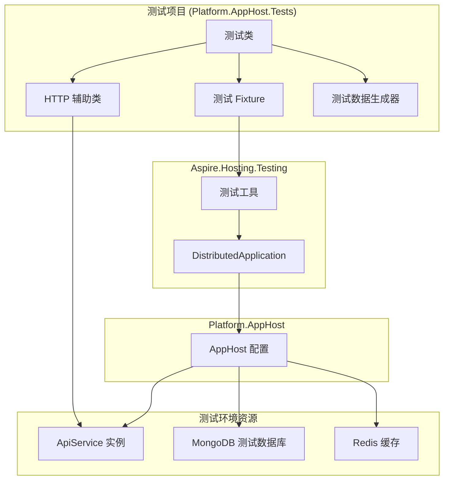
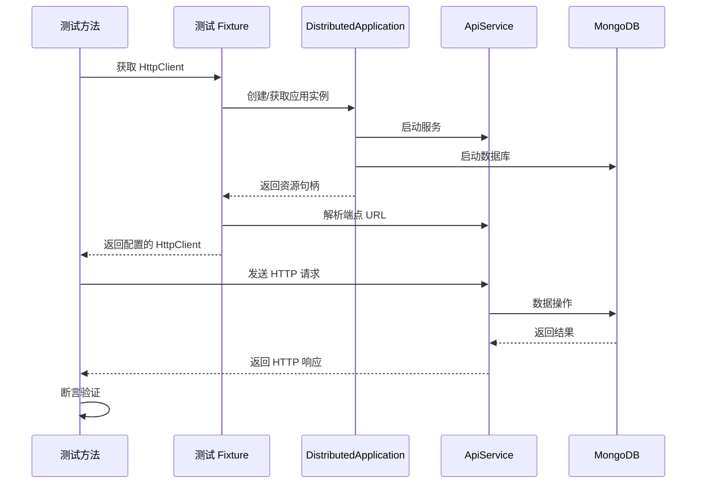
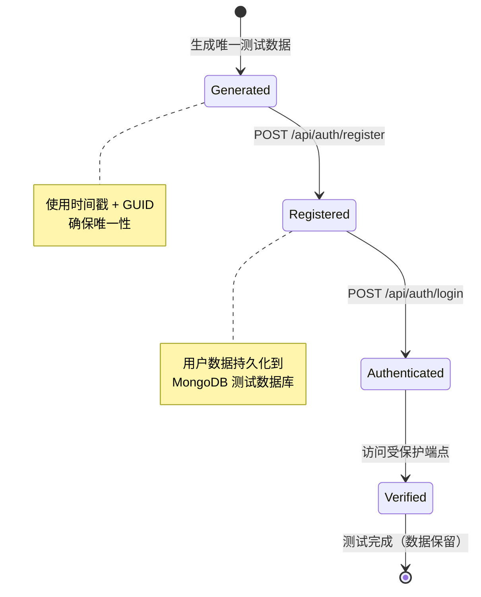

# 设计文档

## 概述

本设计文档描述了使用 Aspire.Hosting.Testing 框架为 Platform.AppHost 实现集成测试的技术方案。这些测试将验证 Platform.ApiService 的用户注册和登录 API 在完整的分布式应用程序环境中的正确性，包括服务发现、配置管理和服务间通信。

### 目标

- 创建一个专门的 xUnit 测试项目 (Platform.AppHost.Tests)，使用 Aspire.Hosting.Testing 框架
- 实现集成测试，验证身份验证 API 在 Aspire 编排环境中的行为
- 确保测试具有良好的隔离性、可重复性和诊断能力
- 使用基于属性的测试方法验证 API 的通用正确性

### 范围

**包含：**
- 测试项目设置和配置
- 分布式应用程序生命周期管理
- 用户注册 API 测试
- 用户登录 API 测试
- 端到端身份验证流程测试
- 资源健康状态验证
- 测试数据隔离策略

**不包含：**
- 单元测试（由其他测试项目覆盖）
- 性能测试和负载测试
- UI 自动化测试
- 生产环境部署配置

## 架构

### 测试架构概览



### 组件交互流程



## 组件和接口

### 1. 测试项目结构

**Platform.AppHost.Tests.csproj**
- 目标框架：.NET 10.0
- 测试框架：xUnit
- 关键依赖：
  - Aspire.Hosting.Testing
  - xunit (2.9.3+)
  - xunit.runner.visualstudio (3.1.5+)
  - Microsoft.NET.Test.Sdk (18.3.0+)
  - System.IdentityModel.Tokens.Jwt (用于 JWT 验证)

### 2. 测试 Fixture 类

```csharp
public class AppHostFixture : IAsyncLifetime
{
    private DistributedApplication? _app;
    private HttpClient? _httpClient;
    
    public HttpClient HttpClient => _httpClient 
        ?? throw new InvalidOperationException("Fixture not initialized");
    
    public async Task InitializeAsync()
    {
        // 创建分布式应用程序实例
        var appHost = await DistributedApplicationTestingBuilder
            .CreateAsync<Projects.Platform_AppHost>();
        
        // 配置测试特定设置
        appHost.Configuration["Jwt:SecretKey"] = "test-secret-key-for-integration-tests-min-32-chars";
        appHost.Configuration["Smtp:Host"] = ""; // 禁用邮件发送
        
        _app = await appHost.BuildAsync();
        await _app.StartAsync();
        
        // 等待 ApiService 就绪
        var apiService = _app.GetResource("apiservice");
        await _app.WaitForResourceAsync(apiService.Name, 
            KnownResourceStates.Running)
            .WaitAsync(TimeSpan.FromSeconds(60));
        
        // 创建 HTTP 客户端
        _httpClient = _app.CreateHttpClient(apiService.Name);
        _httpClient.Timeout = TimeSpan.FromSeconds(30);
        _httpClient.DefaultRequestHeaders.Accept.Add(
            new MediaTypeWithQualityHeaderValue("application/json"));
    }
    
    public async Task DisposeAsync()
    {
        _httpClient?.Dispose();
        if (_app != null)
        {
            await _app.DisposeAsync();
        }
    }
}
```

### 3. 测试数据生成器

```csharp
public static class TestDataGenerator
{
    public static RegisterRequest GenerateValidRegistration()
    {
        var timestamp = DateTimeOffset.UtcNow.ToUnixTimeMilliseconds();
        var guid = Guid.NewGuid().ToString("N")[..8];
        
        return new RegisterRequest
        {
            Username = $"user_{timestamp}_{guid}",
            Password = "Test@123456",
            Email = $"test_{timestamp}_{guid}@example.com",
            PhoneNumber = null // 可选字段
        };
    }
    
    public static RegisterRequest GenerateInvalidRegistration(
        InvalidationType type)
    {
        var valid = GenerateValidRegistration();
        return type switch
        {
            InvalidationType.EmptyUsername => valid with { Username = "" },
            InvalidationType.ShortUsername => valid with { Username = "ab" },
            InvalidationType.ShortPassword => valid with { Password = "123" },
            InvalidationType.InvalidEmail => valid with { Email = "not-an-email" },
            _ => throw new ArgumentException("Unknown validation type")
        };
    }
}

public enum InvalidationType
{
    EmptyUsername,
    ShortUsername,
    ShortPassword,
    InvalidEmail
}
```

### 4. HTTP 辅助方法

```csharp
public static class HttpClientExtensions
{
    public static async Task<HttpResponseMessage> PostAsJsonAsync<T>(
        this HttpClient client,
        string requestUri,
        T content)
    {
        var json = JsonSerializer.Serialize(content, new JsonSerializerOptions
        {
            PropertyNamingPolicy = JsonNamingPolicy.CamelCase
        });
        
        var httpContent = new StringContent(json, 
            Encoding.UTF8, 
            "application/json");
        
        return await client.PostAsync(requestUri, httpContent);
    }
    
    public static async Task<T?> ReadAsJsonAsync<T>(
        this HttpContent content)
    {
        var json = await content.ReadAsStringAsync();
        return JsonSerializer.Deserialize<T>(json, new JsonSerializerOptions
        {
            PropertyNamingPolicy = JsonNamingPolicy.CamelCase
        });
    }
}
```

### 5. 响应模型

```csharp
// API 统一响应包装
public class ApiResponse<T>
{
    public bool Success { get; set; }
    public string? Code { get; set; }
    public string? Message { get; set; }
    public T? Data { get; set; }
    public string? TraceId { get; set; }
    public Dictionary<string, string[]>? Errors { get; set; }
}

// 注册响应数据
public class RegisterResponseData
{
    public string? Id { get; set; }
    public string? Username { get; set; }
    public string? Email { get; set; }
    public bool IsActive { get; set; }
}

// 登录响应数据
public class LoginResponseData
{
    public string? Type { get; set; }
    public string? CurrentAuthority { get; set; }
    public string? Token { get; set; }
    public string? RefreshToken { get; set; }
    public DateTime? ExpiresAt { get; set; }
}
```

## 数据模型

### 测试数据生命周期



### 测试数据隔离策略

每个测试使用唯一的用户数据，通过以下方式确保隔离：

1. **用户名唯一性**：`user_{timestamp}_{guid}`
2. **邮箱唯一性**：`test_{timestamp}_{guid}@example.com`
3. **无测试间依赖**：每个测试生成自己的数据
4. **无需清理**：测试数据不会冲突，可以保留用于调试

## 正确性属性

*属性是一个特征或行为，应该在系统的所有有效执行中保持为真——本质上是关于系统应该做什么的形式化陈述。属性充当人类可读规范和机器可验证正确性保证之间的桥梁。*

### 属性 1：有效注册成功并返回完整响应

*对于任何*有效的注册请求（用户名 3-20 字符、密码至少 6 字符、有效邮箱格式），向注册端点发送请求应该返回 200 OK 状态码，并且响应应该包含已创建用户的 ID 和用户名字段。

**验证：需求 4.1, 4.2**

### 属性 2：重复用户名注册失败

*对于任何*已注册的用户名，尝试使用相同用户名再次注册应该返回错误响应（非 2xx 状态码），并且不应创建重复的用户账户。

**验证：需求 4.3**

### 属性 3：无效注册数据被拒绝

*对于任何*不符合验证规则的注册请求（空用户名、短用户名、短密码、无效邮箱格式），向注册端点发送请求应该返回验证错误响应，并且响应应该包含描述验证失败原因的错误信息。

**验证：需求 4.4**

### 属性 4：有效登录成功并返回完整令牌响应

*对于任何*已注册用户的有效凭据（正确的用户名和密码），向登录端点发送请求应该返回 200 OK 状态码，并且响应应该包含有效的 JWT 访问令牌和刷新令牌，且访问令牌应该是格式正确的 JWT，包含必要的声明（如用户 ID、用户名、过期时间）。

**验证：需求 5.1, 5.2, 5.3, 5.5**

### 属性 5：无效凭据登录失败

*对于任何*无效的登录凭据（不存在的用户名或错误的密码），向登录端点发送请求应该返回错误响应（401 或类似状态码），并且不应返回访问令牌。

**验证：需求 5.4**

### 属性 6：注册-登录往返成功

*对于任何*有效的用户注册数据，完成注册后立即使用相同的凭据登录应该成功，返回有效的访问令牌，并且登录响应中的用户信息应该与注册时提供的数据匹配（用户名、邮箱）。

**验证：需求 4.5, 6.2, 6.4, 6.5**

### 属性 7：身份验证令牌授予受保护端点访问权限

*对于任何*通过登录获得的有效访问令牌，使用该令牌作为 Bearer 令牌访问受保护的端点（如 /api/auth/current-user）应该成功返回 200 OK 状态码和用户信息，而不使用令牌或使用无效令牌访问相同端点应该返回 401 未授权响应。

**验证：需求 6.3**

## 错误处理

### 测试基础设施错误处理

1. **资源启动失败**
   - 如果 DistributedApplication 无法启动，测试应该快速失败
   - 错误消息应该指示哪个资源启动失败（ApiService、MongoDB 等）
   - 超时设置：资源启动等待最多 60 秒

2. **服务发现失败**
   - 如果无法解析 ApiService 端点 URL，抛出 InvalidOperationException
   - 错误消息应该包含资源名称和可用资源列表

3. **HTTP 请求失败**
   - 记录请求详细信息：方法、URL、请求体
   - 记录响应详细信息：状态码、响应体
   - 使用 xUnit 的 ITestOutputHelper 输出诊断信息

### 应用程序错误验证

测试应该验证 API 正确处理错误情况：

1. **验证错误**（400 Bad Request）
   - 响应应该包含 `success: false`
   - 响应应该包含 `code: "VALIDATION_ERROR"`
   - 响应应该包含描述性的错误消息
   - 响应可能包含 `errors` 字典，映射字段名到错误消息

2. **身份验证错误**（401 Unauthorized）
   - 响应应该包含 `code: "UNAUTHORIZED"`
   - 响应应该包含描述性消息

3. **业务逻辑错误**（如重复用户名）
   - 响应应该包含 `success: false`
   - 响应应该包含特定的错误代码
   - 响应应该包含描述性消息

## 测试策略

### 双重测试方法

本项目采用单元测试和基于属性的测试相结合的方法：

- **单元测试**：验证特定示例、边缘情况和错误条件
- **基于属性的测试**：验证所有输入的通用属性

两者是互补的，对于全面覆盖都是必要的。单元测试捕获具体的错误，基于属性的测试验证一般正确性。

### 单元测试平衡

单元测试对于特定示例和边缘情况很有帮助，但应避免编写过多的单元测试——基于属性的测试处理大量输入的覆盖。

**单元测试应该关注：**
- 演示正确行为的特定示例
- 组件之间的集成点
- 边缘情况和错误条件

**基于属性的测试应该关注：**
- 对所有输入都成立的通用属性
- 通过随机化实现全面的输入覆盖

### 基于属性的测试配置

由于 C# 生态系统中没有广泛采用的成熟的基于属性的测试库（如 Haskell 的 QuickCheck 或 Python 的 Hypothesis），我们将使用**手动随机化方法**实现基于属性的测试：

**实现策略：**
1. 每个属性测试运行最少 100 次迭代
2. 使用 `TestDataGenerator` 为每次迭代生成随机有效/无效数据
3. 每个测试使用 `[Fact]` 属性，内部包含循环进行多次迭代
4. 使用注释标记每个测试引用的设计文档属性
5. 标记格式：`// Feature: aspire-apphost-auth-tests, Property {number}: {property_text}`

**示例实现：**

```csharp
// Feature: aspire-apphost-auth-tests, Property 1: 有效注册成功并返回完整响应
[Fact]
public async Task ValidRegistration_ShouldSucceed_WithCompleteResponse()
{
    const int iterations = 100;
    
    for (int i = 0; i < iterations; i++)
    {
        // 生成随机有效注册数据
        var request = TestDataGenerator.GenerateValidRegistration();
        
        // 发送注册请求
        var response = await _httpClient.PostAsJsonAsync(
            "/api/auth/register", request);
        
        // 验证状态码
        Assert.Equal(HttpStatusCode.OK, response.StatusCode);
        
        // 验证响应结构
        var apiResponse = await response.Content
            .ReadAsJsonAsync<ApiResponse<RegisterResponseData>>();
        
        Assert.NotNull(apiResponse);
        Assert.True(apiResponse.Success);
        Assert.NotNull(apiResponse.Data);
        Assert.NotNull(apiResponse.Data.Id);
        Assert.Equal(request.Username, apiResponse.Data.Username);
    }
}
```

### 测试组织

**测试类结构：**

```
Platform.AppHost.Tests/
├── AppHostFixture.cs                    # 测试 fixture
├── Helpers/
│   ├── TestDataGenerator.cs            # 测试数据生成
│   ├── HttpClientExtensions.cs         # HTTP 辅助方法
│   └── JwtValidator.cs                 # JWT 验证辅助
├── Models/
│   ├── ApiResponse.cs                  # 响应模型
│   └── TestRequests.cs                 # 请求模型
└── Tests/
    ├── ResourceHealthTests.cs          # 资源健康检查测试
    ├── RegistrationTests.cs            # 注册 API 测试
    ├── LoginTests.cs                   # 登录 API 测试
    └── AuthenticationFlowTests.cs      # 端到端流程测试
```

### 测试执行配置

**xUnit 配置（xunit.runner.json）：**

```json
{
  "$schema": "https://xunit.net/schema/current/xunit.runner.schema.json",
  "parallelizeAssembly": false,
  "parallelizeTestCollections": false,
  "maxParallelThreads": 1
}
```

**原因：**
- Aspire 集成测试使用共享的 DistributedApplication 实例
- 并行执行可能导致资源争用
- 顺序执行确保稳定性和可重复性

### 测试覆盖目标

1. **资源健康验证**：1 个示例测试
2. **注册 API**：3 个属性测试（有效、重复、无效）
3. **登录 API**：2 个属性测试（有效、无效）
4. **端到端流程**：2 个属性测试（往返、令牌访问）

**总计：8 个测试，每个属性测试运行 100 次迭代 = 700+ 次验证**
