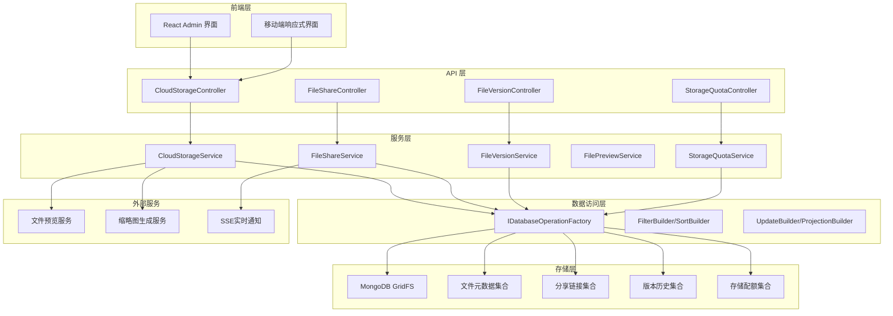
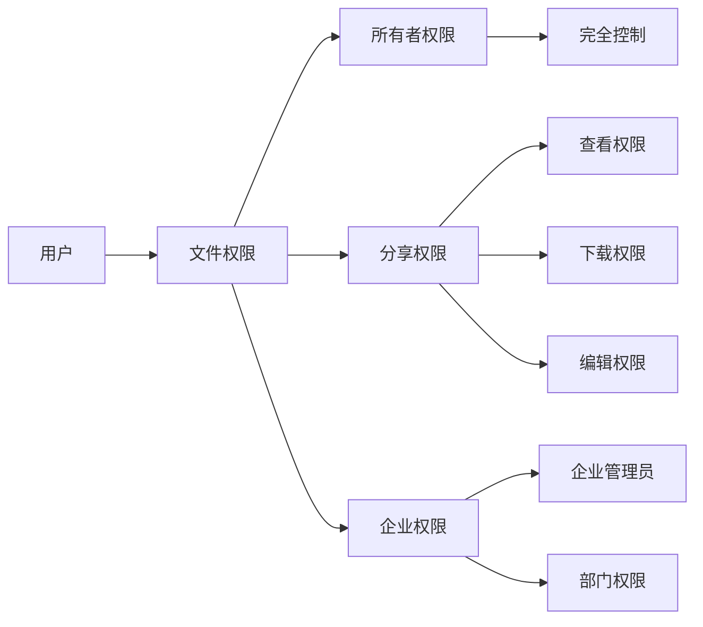

# 网盘功能设计文档

## 概述

网盘功能是一个基于 ASP.NET Core 和 MongoDB 的企业级云存储解决方案，采用多租户架构，为用户提供安全、高效的文件存储、管理和协作服务。系统设计参考 OneDrive 的用户体验，结合企业级安全和权限管理需求，支持完整的文件生命周期管理，包括上传、下载、分享、版本控制、在线预览、存储配额管理、回收站管理、搜索筛选、操作审计和移动端适配等功能。

## 架构设计

### 系统架构图



### 技术栈

- **服务管理**: Aspire 13.1
- **启动项目**: Platform.AppHost
- **后端**: ASP.NET Core 10, MongoDB, GridFS
- **前端**: React, Ant Design, TypeScript (管理后台), React Native/Expo (移动端)
- **文件存储**: MongoDB GridFS
- **文件预览**: 自研预览服务 + 第三方预览组件
- **权限管理**: 基于菜单的权限控制系统 (RequireMenu)
- **多租户**: 基于 CompanyId 的数据隔离，通过 ITenantContext 获取
- **数据操作**: 使用 IDatabaseOperationFactory 和构建器模式，提供基本的 CRUD 操作
- **实时通信**: SSE (Server-Sent Events) 用于实时通知和文件操作状态推送
- **审计日志**: 通过 ActivityLogMiddleware 自动记录所有文件操作

## 组件和接口设计

### 核心实体设计

#### FileItem 实体
```csharp
public class FileItem : MultiTenantEntity
{
    public string Name { get; set; } = string.Empty;
    public string Path { get; set; } = string.Empty;
    public string ParentId { get; set; } = string.Empty;
    public FileItemType Type { get; set; } // File, Folder
    public long Size { get; set; }
    public string MimeType { get; set; } = string.Empty;
    public string GridFSId { get; set; } = string.Empty; // GridFS 文件ID
    public string Hash { get; set; } = string.Empty; // 文件哈希值，用于去重
    public FileStatus Status { get; set; } = FileStatus.Active;
    public Dictionary<string, object> Metadata { get; set; } = new();
    public List<string> Tags { get; set; } = new();
    public DateTime? LastAccessedAt { get; set; }
    public int DownloadCount { get; set; }
    public string ThumbnailGridFSId { get; set; } = string.Empty; // 缩略图ID
    public string OriginalPath { get; set; } = string.Empty; // 回收站恢复时的原始路径
    public DateTime? DeletedFromPath { get; set; } // 从原始路径删除的时间
}

[BsonCollectionName("file_items")]
public enum FileItemType
{
    File,
    Folder
}

public enum FileStatus
{
    Active,
    InRecycleBin,
    Deleted
}
```

#### FileShare 实体
```csharp
[BsonCollectionName("file_shares")]
public class FileShare : MultiTenantEntity
{
    public string FileItemId { get; set; } = string.Empty;
    public string ShareToken { get; set; } = string.Empty; // 分享令牌
    public ShareType Type { get; set; } = ShareType.Link;
    public SharePermission Permission { get; set; } = SharePermission.View;
    public DateTime? ExpiresAt { get; set; }
    public string Password { get; set; } = string.Empty; // 分享密码
    public bool IsActive { get; set; } = true;
    public List<string> AllowedUserIds { get; set; } = new(); // 内部分享的用户列表
    public int AccessCount { get; set; }
    public DateTime? LastAccessedAt { get; set; }
    public Dictionary<string, object> Settings { get; set; } = new();
    public string AccessorInfo { get; set; } = string.Empty; // 访问者信息记录
}

public enum ShareType
{
    Link,      // 链接分享
    Internal,  // 企业内部分享
    Public     // 公开分享
}

public enum SharePermission
{
    View,      // 仅查看
    Download,  // 查看和下载
    Edit,      // 编辑权限
    Full       // 完全控制
}
```

#### FileVersion 实体
```csharp
[BsonCollectionName("file_versions")]
public class FileVersion : MultiTenantEntity
{
    public string FileItemId { get; set; } = string.Empty;
    public int VersionNumber { get; set; }
    public string GridFSId { get; set; } = string.Empty;
    public long Size { get; set; }
    public string Hash { get; set; } = string.Empty;
    public string Comment { get; set; } = string.Empty; // 版本说明
    public bool IsCurrentVersion { get; set; }
    public Dictionary<string, object> Metadata { get; set; } = new();
    public string RestoredFromVersionId { get; set; } = string.Empty; // 恢复来源版本ID
}
```

#### StorageQuota 实体
```csharp
[BsonCollectionName("storage_quotas")]
public class StorageQuota : MultiTenantEntity
{
    public string UserId { get; set; } = string.Empty;
    public long TotalQuota { get; set; } // 总配额（字节）
    public long UsedSpace { get; set; } // 已使用空间
    public long FileCount { get; set; } // 文件数量
    public DateTime LastCalculatedAt { get; set; }
    public Dictionary<string, long> TypeUsage { get; set; } = new(); // 按文件类型统计使用量
    public bool WarningNotificationSent { get; set; } // 是否已发送警告通知
    public DateTime? LastWarningAt { get; set; } // 最后警告时间
}
```

### 服务接口设计

#### ICloudStorageService
```csharp
public interface ICloudStorageService
{
    // 文件和文件夹管理
    Task<FileItem> CreateFolderAsync(string name, string parentId);
    Task<FileItem> UploadFileAsync(IFormFile file, string parentId, bool overwrite = false);
    Task<List<FileItem>> UploadMultipleFilesAsync(IList<IFormFile> files, string parentId, FileConflictResolution conflictResolution = FileConflictResolution.Rename);
    Task<FileItem> GetFileItemAsync(string id);
    Task<PagedResult<FileItem>> GetFileItemsAsync(string parentId, FileListQuery query);
    Task<FileItem> RenameFileItemAsync(string id, string newName);
    Task<FileItem> MoveFileItemAsync(string id, string newParentId);
    Task<FileItem> CopyFileItemAsync(string id, string newParentId, string? newName = null);
    Task DeleteFileItemAsync(string id); // 移动到回收站
    Task PermanentDeleteFileItemAsync(string id); // 永久删除
    Task RestoreFileItemAsync(string id, string? newParentId = null);
    
    // 文件下载和预览
    Task<Stream> DownloadFileAsync(string id);
    Task<Stream> DownloadFolderAsZipAsync(string id); // 文件夹打包下载
    Task<Stream> GetThumbnailAsync(string id);
    Task<FilePreviewInfo> GetPreviewInfoAsync(string id);
    Task<bool> SupportsBatchUploadAsync(); // 检查是否支持批量上传
    Task<bool> SupportsResumeUploadAsync(); // 检查是否支持断点续传
    
    // 搜索和筛选
    Task<PagedResult<FileItem>> SearchFilesAsync(FileSearchQuery query);
    Task<List<FileItem>> GetRecentFilesAsync(int count = 10);
    Task<PagedResult<FileItem>> SearchByContentAsync(string keyword, FileContentSearchQuery query);
    
    // 回收站管理
    Task<PagedResult<FileItem>> GetRecycleBinItemsAsync(RecycleBinQuery query);
    Task EmptyRecycleBinAsync();
    Task CleanupExpiredRecycleBinItemsAsync(); // 自动清理过期文件
    
    // 存储统计
    Task<StorageUsageInfo> GetStorageUsageAsync(string? userId = null);
    Task<StorageUsageInfo> GetStorageUsageByTypeAsync(string? userId = null);
    
    // 批量操作
    Task<BatchOperationResult> BatchDeleteAsync(List<string> fileIds);
    Task<BatchOperationResult> BatchMoveAsync(List<string> fileIds, string targetParentId);
    Task<BatchOperationResult> BatchCopyAsync(List<string> fileIds, string targetParentId);
}

public enum FileConflictResolution
{
    Overwrite,  // 覆盖
    Rename,     // 重命名
    Skip        // 跳过
}

public class BatchOperationResult
{
    public int SuccessCount { get; set; }
    public int FailureCount { get; set; }
    public List<string> FailedItems { get; set; } = new();
    public List<string> ErrorMessages { get; set; } = new();
}
```

#### IFileShareService
```csharp
public interface IFileShareService
{
    Task<FileShare> CreateShareAsync(string fileItemId, CreateShareRequest request);
    Task<FileShare> GetShareAsync(string shareToken);
    Task<FileShare> UpdateShareAsync(string id, UpdateShareRequest request);
    Task DeleteShareAsync(string id);
    Task<PagedResult<FileShare>> GetMySharesAsync(ShareListQuery query);
    Task<PagedResult<FileShare>> GetSharedWithMeAsync(ShareListQuery query);
    Task<bool> ValidateShareAccessAsync(string shareToken, string? password = null);
    Task RecordShareAccessAsync(string shareToken, string? accessorInfo = null);
    Task<List<FileShare>> GetInternalSharesAsync(string fileItemId); // 企业内部分享
    Task NotifyInternalShareAsync(string shareId, List<string> userIds); // 通知内部用户
    Task CancelAllSharesAsync(string fileItemId); // 取消所有分享
    Task<bool> CheckSharePermissionAsync(string shareToken, SharePermission requiredPermission);
    Task<FileShare> GetShareByIdAsync(string id); // 根据ID获取分享信息
}
```

#### IFileVersionService
```csharp
public interface IFileVersionService
{
    Task<FileVersion> CreateVersionAsync(string fileItemId, IFormFile file, string? comment = null);
    Task<List<FileVersion>> GetVersionHistoryAsync(string fileItemId);
    Task<FileVersion> RestoreVersionAsync(string fileItemId, int versionNumber);
    Task DeleteVersionAsync(string versionId);
    Task<Stream> DownloadVersionAsync(string versionId);
    Task<FileVersionComparison> CompareVersionsAsync(string versionId1, string versionId2);
    Task CleanupOldVersionsAsync(string fileItemId, int maxVersions); // 自动清理旧版本
}
```

#### IStorageQuotaService
```csharp
public interface IStorageQuotaService
{
    Task<StorageQuota> GetUserQuotaAsync(string userId);
    Task<StorageQuota> SetUserQuotaAsync(string userId, long totalQuota);
    Task<bool> CheckQuotaAvailableAsync(string userId, long requiredSpace);
    Task UpdateUsageAsync(string userId, long sizeChange, string fileType);
    Task<List<StorageQuota>> GetQuotaWarningsAsync(); // 获取接近配额限制的用户
    Task<StorageUsageInfo> GetCompanyUsageAsync();
    Task RecalculateUserUsageAsync(string userId); // 重新计算用户使用量
    Task SendQuotaWarningAsync(string userId); // 发送配额警告通知
    Task<bool> IsQuotaExceededAsync(string userId);
}

public class StorageUsageInfo
{
    public long TotalQuota { get; set; }
    public long UsedSpace { get; set; }
    public long AvailableSpace { get; set; }
    public long FileCount { get; set; }
    public Dictionary<string, long> TypeUsage { get; set; } = new();
    public double UsagePercentage { get; set; }
}

#### IFilePreviewService
```csharp
public interface IFilePreviewService
{
    Task<FilePreviewInfo> GetPreviewInfoAsync(string fileItemId);
    Task<Stream> GetPreviewStreamAsync(string fileItemId, PreviewType previewType);
    Task<bool> SupportsPreviewAsync(string mimeType);
    Task<Stream> GenerateThumbnailAsync(string fileItemId);
    Task<PreviewCapabilities> GetPreviewCapabilitiesAsync(string mimeType);
    Task<bool> SupportsSyntaxHighlightAsync(string mimeType);
    Task<string> GetPreviewContentAsync(string fileItemId); // 获取文本内容用于预览
}

public enum PreviewType
{
    Image,      // 图片预览
    Pdf,        // PDF预览
    Office,     // Office文档预览
    Video,      // 视频预览
    Audio,      // 音频预览
    Text        // 文本预览
}

public class PreviewCapabilities
{
    public bool SupportsImagePreview { get; set; }
    public bool SupportsPdfPreview { get; set; }
    public bool SupportsOfficePreview { get; set; }
    public bool SupportsVideoPreview { get; set; }
    public bool SupportsAudioPreview { get; set; }
    public bool SupportsTextPreview { get; set; }
    public bool SupportsSyntaxHighlight { get; set; }
}

public class FilePreviewInfo
{
    public string FileId { get; set; } = string.Empty;
    public string FileName { get; set; } = string.Empty;
    public string MimeType { get; set; } = string.Empty;
    public long Size { get; set; }
    public PreviewCapabilities Capabilities { get; set; } = new();
    public string PreviewUrl { get; set; } = string.Empty;
    public string ThumbnailUrl { get; set; } = string.Empty;
}
```

### API 控制器设计

#### CloudStorageController
```csharp
[ApiController]
[Route("api/cloud-storage")]
[RequireMenu("cloud-storage:access")]
public class CloudStorageController : BaseApiController
{
    [HttpPost("folders")]
    [RequireMenu("cloud-storage:create")]
    public async Task<IActionResult> CreateFolder([FromBody] CreateFolderRequest request);
    
    [HttpPost("upload")]
    [RequireMenu("cloud-storage:upload")]
    public async Task<IActionResult> UploadFile([FromForm] UploadFileRequest request);
    
    [HttpPost("upload/multiple")]
    [RequireMenu("cloud-storage:upload")]
    public async Task<IActionResult> UploadMultipleFiles([FromForm] UploadMultipleFilesRequest request);
    
    [HttpGet("{id}")]
    [RequireMenu("cloud-storage:view")]
    public async Task<IActionResult> GetFileItem(string id);
    
    [HttpGet("list")]
    [RequireMenu("cloud-storage:list")]
    public async Task<IActionResult> GetFileItems([FromQuery] FileListQuery query);
    
    [HttpPut("{id}/rename")]
    [RequireMenu("cloud-storage:edit")]
    public async Task<IActionResult> RenameFileItem(string id, [FromBody] RenameRequest request);
    
    [HttpPut("{id}/move")]
    [RequireMenu("cloud-storage:edit")]
    public async Task<IActionResult> MoveFileItem(string id, [FromBody] MoveRequest request);
    
    [HttpPost("{id}/copy")]
    [RequireMenu("cloud-storage:edit")]
    public async Task<IActionResult> CopyFileItem(string id, [FromBody] CopyRequest request);
    
    [HttpDelete("{id}")]
    [RequireMenu("cloud-storage:delete")]
    public async Task<IActionResult> DeleteFileItem(string id);
    
    [HttpGet("{id}/download")]
    [RequireMenu("cloud-storage:download")]
    public async Task<IActionResult> DownloadFile(string id);
    
    [HttpGet("{id}/download-folder")]
    [RequireMenu("cloud-storage:download")]
    public async Task<IActionResult> DownloadFolder(string id);
    
    [HttpGet("{id}/preview")]
    [RequireMenu("cloud-storage:view")]
    public async Task<IActionResult> PreviewFile(string id);
    
    [HttpGet("{id}/thumbnail")]
    [RequireMenu("cloud-storage:view")]
    public async Task<IActionResult> GetThumbnail(string id);
    
    [HttpGet("search")]
    [RequireMenu("cloud-storage:search")]
    public async Task<IActionResult> SearchFiles([FromQuery] FileSearchQuery query);
    
    [HttpGet("search/content")]
    [RequireMenu("cloud-storage:search")]
    public async Task<IActionResult> SearchFileContent([FromQuery] FileContentSearchQuery query);
    
    [HttpGet("recent")]
    [RequireMenu("cloud-storage:view")]
    public async Task<IActionResult> GetRecentFiles([FromQuery] int count = 10);
    
    // 回收站管理
    [HttpGet("recycle-bin")]
    [RequireMenu("cloud-storage:recycle")]
    public async Task<IActionResult> GetRecycleBinItems([FromQuery] RecycleBinQuery query);
    
    [HttpPost("{id}/restore")]
    [RequireMenu("cloud-storage:restore")]
    public async Task<IActionResult> RestoreFileItem(string id, [FromBody] RestoreRequest request);
    
    [HttpDelete("{id}/permanent")]
    [RequireMenu("cloud-storage:permanent-delete")]
    public async Task<IActionResult> PermanentDeleteFileItem(string id);
    
    [HttpDelete("recycle-bin/empty")]
    [RequireMenu("cloud-storage:permanent-delete")]
    public async Task<IActionResult> EmptyRecycleBin();
    
    // 存储统计
    [HttpGet("storage/usage")]
    [RequireMenu("cloud-storage:view")]
    public async Task<IActionResult> GetStorageUsage([FromQuery] string? userId = null);
    
    [HttpGet("storage/usage/by-type")]
    [RequireMenu("cloud-storage:view")]
    public async Task<IActionResult> GetStorageUsageByType([FromQuery] string? userId = null);
    
    // 批量操作
    [HttpPost("batch/delete")]
    [RequireMenu("cloud-storage:delete")]
    public async Task<IActionResult> BatchDelete([FromBody] BatchOperationRequest request);
    
    [HttpPost("batch/move")]
    [RequireMenu("cloud-storage:edit")]
    public async Task<IActionResult> BatchMove([FromBody] BatchMoveRequest request);
    
    [HttpPost("batch/copy")]
    [RequireMenu("cloud-storage:edit")]
    public async Task<IActionResult> BatchCopy([FromBody] BatchCopyRequest request);
}
```

#### FileShareController
```csharp
[ApiController]
[Route("api/file-share")]
public class FileShareController : BaseApiController
{
    [HttpPost]
    [RequireMenu("cloud-storage:share")]
    public async Task<IActionResult> CreateShare([FromBody] CreateShareRequest request);
    
    [HttpGet("{id}")]
    [RequireMenu("cloud-storage:share")]
    public async Task<IActionResult> GetShare(string id);
    
    [HttpPut("{id}")]
    [RequireMenu("cloud-storage:share")]
    public async Task<IActionResult> UpdateShare(string id, [FromBody] UpdateShareRequest request);
    
    [HttpDelete("{id}")]
    [RequireMenu("cloud-storage:share")]
    public async Task<IActionResult> DeleteShare(string id);
    
    [HttpGet("my-shares")]
    [RequireMenu("cloud-storage:share")]
    public async Task<IActionResult> GetMyShares([FromQuery] ShareListQuery query);
    
    [HttpGet("shared-with-me")]
    [RequireMenu("cloud-storage:share")]
    public async Task<IActionResult> GetSharedWithMe([FromQuery] ShareListQuery query);
    
    [HttpPost("internal")]
    [RequireMenu("cloud-storage:share")]
    public async Task<IActionResult> CreateInternalShare([FromBody] CreateInternalShareRequest request);
    
    [HttpDelete("file/{fileId}/all")]
    [RequireMenu("cloud-storage:share")]
    public async Task<IActionResult> CancelAllShares(string fileId);
    
    // 公开访问端点（无需认证）
    [HttpGet("public/{shareToken}")]
    [AllowAnonymous]
    public async Task<IActionResult> AccessPublicShare(string shareToken, [FromQuery] string? password = null);
    
    [HttpGet("public/{shareToken}/download")]
    [AllowAnonymous]
    public async Task<IActionResult> DownloadSharedFile(string shareToken, [FromQuery] string? password = null);
    
    [HttpGet("public/{shareToken}/preview")]
    [AllowAnonymous]
    public async Task<IActionResult> PreviewSharedFile(string shareToken, [FromQuery] string? password = null);
}
```

#### FileVersionController
```csharp
[ApiController]
[Route("api/file-version")]
[RequireMenu("cloud-storage:version")]
public class FileVersionController : BaseApiController
{
    [HttpPost("{fileId}/versions")]
    public async Task<IActionResult> CreateVersion(string fileId, [FromForm] CreateVersionRequest request);
    
    [HttpGet("{fileId}/versions")]
    public async Task<IActionResult> GetVersionHistory(string fileId);
    
    [HttpPost("{fileId}/versions/{versionNumber}/restore")]
    public async Task<IActionResult> RestoreVersion(string fileId, int versionNumber);
    
    [HttpDelete("versions/{versionId}")]
    public async Task<IActionResult> DeleteVersion(string versionId);
    
    [HttpGet("versions/{versionId}/download")]
    public async Task<IActionResult> DownloadVersion(string versionId);
    
    [HttpGet("versions/{versionId1}/compare/{versionId2}")]
    public async Task<IActionResult> CompareVersions(string versionId1, string versionId2);
}
```

#### StorageQuotaController
```csharp
[ApiController]
[Route("api/storage-quota")]
[RequireMenu("cloud-storage:quota")]
public class StorageQuotaController : BaseApiController
{
    [HttpGet("user/{userId}")]
    public async Task<IActionResult> GetUserQuota(string userId);
    
    [HttpPut("user/{userId}")]
    [RequireMenu("cloud-storage:quota-manage")]
    public async Task<IActionResult> SetUserQuota(string userId, [FromBody] SetQuotaRequest request);
    
    [HttpGet("warnings")]
    [RequireMenu("cloud-storage:quota-manage")]
    public async Task<IActionResult> GetQuotaWarnings();
    
    [HttpGet("company/usage")]
    [RequireMenu("cloud-storage:quota-manage")]
    public async Task<IActionResult> GetCompanyUsage();
}
```

## 数据模型设计

### 文件存储策略

1. **GridFS 存储**: 使用 MongoDB GridFS 存储文件内容，支持大文件和流式传输
2. **文件去重**: 基于文件哈希值实现去重，相同内容的文件共享存储空间
3. **缩略图生成**: 自动为图片、视频、PDF 等文件生成缩略图
4. **分块上传**: 支持大文件分块上传和断点续传
5. **批量操作**: 支持批量文件上传、下载、删除等操作
6. **文件压缩**: 支持文件夹打包为ZIP格式下载

### 数据访问模式

系统严格遵循项目的数据访问规范：

1. **工厂模式**: 所有数据访问通过 `IDatabaseOperationFactory<T>` 进行，禁止直接使用 `IMongoCollection<T>`
2. **构建器模式**: 使用 `FilterBuilder<T>`、`SortBuilder<T>`、`UpdateBuilder<T>` 构建查询条件
3. **多租户隔离**: 实体继承 `MultiTenantEntity`，自动附加 `CompanyId` 过滤
4. **审计字段**: 创建、更新、删除操作的审计字段由工厂自动维护
5. **软删除**: 使用 `FindOneAndSoftDeleteAsync` 实现软删除，保留数据完整性

### 权限模型



### 文件路径设计

- **根路径**: `/` (用户根目录)
- **文件夹路径**: `/Documents/Projects/` 
- **回收站路径**: `/.recycle/`
- **共享文件夹**: `/Shared/`

### 移动端适配策略

1. **响应式界面**: 前端使用响应式设计，适配不同屏幕尺寸
2. **触摸优化**: 操作界面针对触摸交互进行优化
3. **离线缓存**: 支持文件离线缓存，提升移动端体验
4. **网络优化**: 针对移动网络进行传输优化
5. **文件选择**: 支持从相册、相机、文件管理器选择文件上传

### 索引设计

为了优化查询性能，需要为以下字段创建索引：

```csharp
// FileItem 集合索引
CreateIndex(x => x.CompanyId); // 多租户过滤
CreateIndex(x => new { x.CompanyId, x.ParentId }); // 文件夹内容查询
CreateIndex(x => new { x.CompanyId, x.Status }); // 状态筛选
CreateIndex(x => new { x.CompanyId, x.Name }); // 文件名搜索
CreateIndex(x => new { x.CompanyId, x.Hash }); // 文件去重
CreateIndex(x => new { x.CompanyId, x.CreatedBy, x.CreatedAt }); // 用户文件时间排序

// FileShare 集合索引
CreateIndex(x => x.ShareToken); // 分享链接访问
CreateIndex(x => new { x.CompanyId, x.CreatedBy }); // 我的分享
CreateIndex(x => new { x.CompanyId, x.IsActive, x.ExpiresAt }); // 有效分享

// FileVersion 集合索引
CreateIndex(x => new { x.CompanyId, x.FileItemId, x.VersionNumber }); // 版本查询
CreateIndex(x => new { x.CompanyId, x.FileItemId, x.IsCurrentVersion }); // 当前版本

// StorageQuota 集合索引
CreateIndex(x => new { x.CompanyId, x.UserId }); // 用户配额查询
```

## 错误处理策略

### 常见错误类型

1. **存储配额超限**: `STORAGE_QUOTA_EXCEEDED`
2. **文件不存在**: `FILE_NOT_FOUND`
3. **权限不足**: `INSUFFICIENT_PERMISSION`
4. **文件名冲突**: `FILE_NAME_CONFLICT`
5. **文件类型不支持**: `UNSUPPORTED_FILE_TYPE`
6. **上传失败**: `UPLOAD_FAILED`
7. **分享链接无效**: `INVALID_SHARE_LINK`
8. **分享链接已过期**: `SHARE_LINK_EXPIRED`
9. **分享密码错误**: `INVALID_SHARE_PASSWORD`
10. **文件版本不存在**: `FILE_VERSION_NOT_FOUND`
11. **预览不支持**: `PREVIEW_NOT_SUPPORTED`
12. **网络中断**: `NETWORK_INTERRUPTED`
13. **文件大小超限**: `FILE_SIZE_EXCEEDED`
14. **批量操作部分失败**: `BATCH_OPERATION_PARTIAL_FAILURE`
15. **断点续传失败**: `RESUME_UPLOAD_FAILED`
16. **文件内容搜索失败**: `CONTENT_SEARCH_FAILED`
17. **回收站操作失败**: `RECYCLE_BIN_OPERATION_FAILED`

### 错误处理机制

系统遵循项目统一的错误处理规范：

```csharp
// 使用 BaseApiController 的统一错误方法
public class CloudStorageController : BaseApiController
{
    public async Task<IActionResult> UploadFile(UploadFileRequest request)
    {
        try
        {
            // 业务逻辑
            var result = await _cloudStorageService.UploadFileAsync(request.File, request.ParentId);
            return Success(result);
        }
        catch (ArgumentException ex)
        {
            return ValidationError(ex.Message);
        }
        catch (UnauthorizedAccessException ex)
        {
            return ForbiddenError(ex.Message);
        }
        catch (FileNotFoundException ex)
        {
            return NotFoundError("文件", request.File.FileName);
        }
        catch (Exception ex)
        {
            // 记录详细错误日志但不暴露给前端
            _logger.LogError(ex, "文件上传失败: {FileName}", request.File.FileName);
            return ServerError("文件上传失败，请稍后重试");
        }
    }
}

// 自定义业务异常
public class CloudStorageException : Exception
{
    public string ErrorCode { get; }
    public Dictionary<string, object> ErrorData { get; }
    
    public CloudStorageException(string errorCode, string message, Dictionary<string, object>? errorData = null)
        : base(message)
    {
        ErrorCode = errorCode;
        ErrorData = errorData ?? new Dictionary<string, object>();
    }
}
```

## 正确性属性

*属性是一个特征或行为，应该在系统的所有有效执行中保持为真——本质上是关于系统应该做什么的正式声明。属性作为人类可读规范和机器可验证正确性保证之间的桥梁。*

### 属性反思

在生成正确性属性之前，我对验收标准进行了分析，识别出以下可测试的属性，并消除了冗余：

- 将文件上传和下载相关的属性合并为文件上传完整性属性
- 将多个搜索和筛选相关的属性合并为搜索准确性属性  
- 将版本控制相关的多个属性保持独立，因为它们验证不同的功能点
- 将分享功能的多个属性保持独立，因为它们涵盖不同的权限和生命周期管理
- 将存储配额的多个属性合并为配额强制执行和统计准确性两个核心属性
- 将回收站相关的属性合并为回收站管理完整性属性
- 将审计日志相关的属性合并为操作审计完整性属性

### 属性 1: 文件上传完整性
*对于任何*有效文件，上传后应该能够下载到与原文件内容完全相同的文件，且文件元数据（名称、大小、类型、哈希值）应该正确记录
**验证需求: 需求 1.1, 2.1, 2.4**

### 属性 2: 文件夹操作一致性  
*对于任何*文件夹创建、重命名、移动操作，操作后文件夹的路径结构应该与预期一致，且包含的文件关系和权限设置保持不变
**验证需求: 需求 1.2, 1.4, 1.5**

### 属性 3: 软删除和恢复往返
*对于任何*被删除的文件，删除后应该出现在回收站中保留原始路径信息，恢复后应该回到原始位置或指定位置且内容不变
**验证需求: 需求 1.3, 7.1, 7.3**

### 属性 4: 文件复制独立性
*对于任何*文件复制操作，复制后的文件应该与原文件内容相同但具有独立的标识和路径，对复制文件的修改不应影响原文件
**验证需求: 需求 1.6**

### 属性 5: 批量上传原子性
*对于任何*批量文件上传操作，每个文件的上传状态应该独立跟踪，部分失败时应该提供明确的每个文件状态和错误信息
**验证需求: 需求 2.2**

### 属性 6: 文件名冲突处理
*对于任何*同名文件上传，系统应该提供覆盖、重命名或跳过选项，且用户选择后的结果应该符合预期的冲突解决策略
**验证需求: 需求 2.7**

### 属性 7: 文件夹打包完整性
*对于任何*文件夹下载，生成的ZIP包应该包含文件夹中的所有文件和子文件夹，且解压后的文件内容与原文件相同，目录结构保持一致
**验证需求: 需求 2.5**

### 属性 8: 断点续传一致性
*对于任何*中断的文件上传，恢复上传后的文件内容应该与一次性上传的文件内容完全相同
**验证需求: 需求 2.6**

### 属性 9: 分享链接唯一性和权限
*对于任何*文件分享，生成的分享链接应该是全局唯一的，且访问权限应该严格按照设置的权限级别（查看、下载、编辑）执行
**验证需求: 需求 3.1, 3.2, 3.3**

### 属性 10: 分享过期自动失效
*对于任何*设置了有效期的分享链接，过期后应该自动失效且无法访问文件，访问时应该返回适当的过期错误信息
**验证需求: 需求 3.4**

### 属性 11: 分享取消立即生效
*对于任何*被取消的分享，所有相关的分享链接应该立即失效且无法再次访问，包括已经打开的分享页面
**验证需求: 需求 3.5**

### 属性 12: 分享访问审计
*对于任何*通过分享链接的文件访问，应该记录完整的访问日志（访问时间、IP地址、用户代理等）且权限验证应该正确执行
**验证需求: 需求 3.6**

### 属性 13: 内部分享通知
*对于任何*企业内部分享，目标用户应该收到分享通知，且共享文件应该在其网盘界面中正确显示
**验证需求: 需求 3.7**

### 属性 14: 版本创建和历史维护
*对于任何*同名文件的重复上传，应该创建新版本并保留完整的版本历史记录，包括创建时间、大小、修改者等元数据
**验证需求: 需求 4.1, 4.2**

### 属性 15: 版本恢复一致性
*对于任何*历史版本的恢复操作，恢复后的文件内容应该与该版本的原始内容完全相同，且创建恢复记录
**验证需求: 需求 4.3**

### 属性 16: 版本删除安全性
*对于任何*版本删除操作，应该只删除指定的历史版本而保留当前版本和其他历史版本，且不影响文件的正常访问
**验证需求: 需求 4.4**

### 属性 17: 版本数量限制自动管理
*对于任何*文件，当版本数量超过系统限制时，应该自动删除最旧的版本而保留最新的版本和用户指定的重要版本
**验证需求: 需求 4.5**

### 属性 18: 版本差异比较准确性
*对于任何*两个文本文件版本，比较功能应该准确显示内容差异且差异信息应该完整，包括添加、删除、修改的行
**验证需求: 需求 4.6**

### 属性 19: 文件预览支持检测
*对于任何*文件类型，预览引擎应该正确识别是否支持预览，支持的文件类型应该能够正确生成预览内容，不支持的应该提供下载选项
**验证需求: 需求 5.6, 5.7**

### 属性 20: 存储配额强制执行
*对于任何*用户，当存储使用量达到或超过配额时，应该阻止新文件上传且配额调整应该立即生效，接近配额时应该发送警告通知
**验证需求: 需求 6.1, 6.2, 6.3, 6.6**

### 属性 21: 存储统计准确性
*对于任何*文件操作（上传、删除、移动），存储使用统计应该实时准确更新且反映真实的存储使用情况，包括按文件类型的统计
**验证需求: 需求 6.4, 6.5**

### 属性 22: 回收站管理完整性
*对于任何*回收站操作，回收站应该正确显示所有已删除文件及其删除时间和原始路径，且过期文件（超过30天）应该自动清理
**验证需求: 需求 7.2, 7.5**

### 属性 23: 永久删除不可恢复性
*对于任何*彻底删除或清空回收站操作，被永久删除的文件应该无法通过任何方式恢复或访问，包括直接数据库查询
**验证需求: 需求 7.4, 7.6**

### 属性 24: 搜索和筛选准确性
*对于任何*搜索条件（文件名、类型、时间、大小、内容）和筛选条件的组合，搜索结果应该只包含符合所有指定条件的文件，且结果完整无遗漏
**验证需求: 需求 1.7, 8.1, 8.2, 8.3, 8.4, 8.5, 8.6**

### 属性 25: 操作审计完整性
*对于任何*文件操作，应该记录完整的审计日志（操作类型、时间、用户、文件信息、IP地址、用户代理等安全信息），且日志应该准确反映实际操作并支持导出
**验证需求: 需求 9.1, 9.2, 9.3, 9.4, 9.5, 9.6**

## 测试策略

### 双重测试方法
- **单元测试**: 验证具体示例、边界条件和错误情况
- **基于属性的测试**: 验证所有输入的通用属性
- 两者互补且都是全面覆盖所必需的

### 基于属性的测试配置
- 每个属性测试最少运行 100 次迭代（由于随机化）
- 每个属性测试必须引用其设计文档属性
- 标签格式: **功能: cloud-storage, 属性 {编号}: {属性文本}**
- 使用 C# 的 FsCheck 或类似的基于属性的测试库

### 单元测试覆盖

1. **文件操作测试**: 上传、下载、删除、重命名、移动、复制的具体示例和边界条件
2. **权限验证测试**: 各种权限场景的访问控制边界条件和错误情况
3. **分享功能测试**: 分享链接生成、权限验证、过期处理、密码验证的错误情况
4. **版本控制测试**: 版本创建、恢复、比较、自动清理的边界条件
5. **存储配额测试**: 配额计算、超限处理、警告通知的边界值和错误情况
6. **搜索功能测试**: 各种搜索条件和筛选的特殊情况和边界值
7. **回收站测试**: 软删除、恢复、永久删除、自动清理的边界条件
8. **预览功能测试**: 各种文件类型的预览支持和不支持的情况
9. **批量操作测试**: 批量上传、删除的部分失败和错误处理情况
10. **移动端适配测试**: 移动端特定功能的具体示例（文件选择、网络优化等）
11. **断点续传测试**: 网络中断和恢复场景的具体示例
12. **文件去重测试**: 相同内容文件的去重处理边界条件

### 性能测试

1. **大文件上传测试**: 测试 GB 级文件上传性能和断点续传
2. **并发访问测试**: 多用户同时访问文件的性能和数据一致性
3. **搜索性能测试**: 大量文件情况下的搜索响应时间和内容搜索性能
4. **缩略图生成测试**: 批量缩略图生成性能和缓存机制
5. **批量操作性能**: 大量文件的批量上传、下载、删除性能
6. **版本控制性能**: 大量版本历史的查询和比较性能
7. **存储统计性能**: 大量文件的存储使用统计计算性能
8. **GridFS性能测试**: 大文件存储和检索的性能基准测试

### 安全测试

1. **文件访问权限测试**: 确保用户只能访问有权限的文件，包括跨租户隔离
2. **分享链接安全测试**: 防止分享链接被恶意利用和暴力破解
3. **文件上传安全测试**: 防止恶意文件上传和文件类型验证
4. **路径遍历攻击测试**: 防止通过路径操作访问系统文件
5. **存储配额绕过测试**: 防止用户绕过存储配额限制
6. **审计日志完整性测试**: 确保所有操作都被正确记录且日志不可篡改
7. **分享密码安全测试**: 分享密码的强度验证和防暴力破解
8. **文件内容安全扫描**: 上传文件的病毒扫描和恶意内容检测
9. **多租户数据隔离测试**: 确保企业间数据完全隔离，防止数据泄露