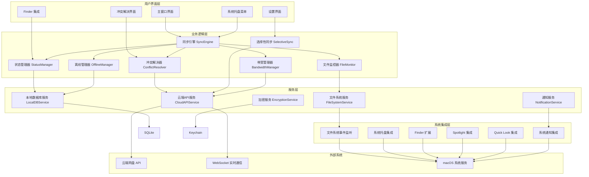

# macOS 同步客户端设计文档

## 概述

macOS 同步客户端是一个原生 macOS 应用程序，采用 Swift 和 SwiftUI 开发，为用户提供与云端网盘的无缝双向文件同步体验。该客户端参考 OneDrive 的设计理念，集成了实时文件监控、智能冲突解决、选择性同步、离线访问等核心功能，并与 macOS 系统深度集成，提供原生的用户体验。

系统采用模块化架构设计，包含文件监控、同步引擎、状态管理、冲突解决、离线管理等核心模块，通过事件驱动的方式实现各模块间的松耦合通信。客户端与现有的云端网盘系统通过 RESTful API 和 WebSocket 进行通信，确保数据的实时性和一致性。

## 架构设计

### 系统架构图



### 技术栈

- **开发语言**: Swift 5.9+
- **UI 框架**: SwiftUI + AppKit (混合使用)
- **数据库**: SQLite (本地同步状态存储)
- **网络通信**: URLSession + WebSocket
- **文件监控**: FileSystemEvents API
- **系统集成**: Finder Sync Extension, System Tray, Spotlight
- **加密**: CryptoKit (端到端加密)
- **身份验证**: OAuth 2.0 + JWT
- **日志**: OSLog (系统日志框架)
- **测试**: XCTest + Quick/Nimble (BDD测试)
- **包管理**: Swift Package Manager
- **部署**: macOS 12.0+ (支持 Intel 和 Apple Silicon)

## 组件和接口设计

### 核心数据模型

#### SyncItem 模型
```swift
struct SyncItem: Codable, Identifiable {
    let id: UUID
    let cloudId: String
    let localPath: String
    let cloudPath: String
    let name: String
    let type: ItemType
    let size: Int64
    let modifiedDate: Date
    let syncState: SyncState
    let hash: String
    let parentId: UUID?
    let isSelected: Bool // 选择性同步
    let isOfflineAvailable: Bool
    let lastSyncDate: Date?
    let conflictInfo: ConflictInfo?
    
    enum ItemType: String, Codable {
        case file, folder
    }
    
    enum SyncState: String, Codable {
        case synced          // 已同步
        case uploading       // 上传中
        case downloading     // 下载中
        case localOnly       // 仅本地
        case cloudOnly       // 仅云端
        case conflict        // 冲突
        case error           // 错误
        case paused          // 暂停
    }
}

struct ConflictInfo: Codable {
    let conflictType: ConflictType
    let localModifiedDate: Date
    let cloudModifiedDate: Date
    let localSize: Int64
    let cloudSize: Int64
    let resolutionOptions: [ResolutionOption]
    
    enum ConflictType: String, Codable {
        case contentConflict    // 内容冲突
        case nameConflict      // 名称冲突
        case typeConflict      // 类型冲突 (文件vs文件夹)
    }
    
    enum ResolutionOption: String, Codable {
        case keepLocal         // 保留本地版本
        case keepCloud         // 保留云端版本
        case keepBoth          // 保留两个版本
        case merge             // 合并 (仅文件夹)
    }
}
```

#### SyncConfiguration 模型
```swift
struct SyncConfiguration: Codable {
    var syncRootPath: String
    var selectedFolders: Set<String>
    var excludePatterns: [String]
    var bandwidthLimits: BandwidthLimits
    var conflictResolution: ConflictResolutionStrategy
    var offlineSettings: OfflineSettings
    var securitySettings: SecuritySettings
    
    struct BandwidthLimits: Codable {
        var uploadLimit: Int64? // bytes per second
        var downloadLimit: Int64?
        var enableAutoThrottling: Bool
        var pauseOnMeteredConnection: Bool
    }
    
    enum ConflictResolutionStrategy: String, Codable {
        case askUser           // 询问用户
        case keepLocal         // 总是保留本地
        case keepCloud         // 总是保留云端
        case keepBoth          // 总是保留两个版本
    }
    
    struct OfflineSettings: Codable {
        var maxCacheSize: Int64
        var autoCleanupEnabled: Bool
        var cleanupThreshold: Double // 0.0-1.0
    }
    
    struct SecuritySettings: Codable {
        var enableEncryption: Bool
        var requireTwoFactor: Bool
        var autoLockTimeout: TimeInterval
    }
}
```

### 核心服务接口

#### SyncEngine 接口
```swift
protocol SyncEngineProtocol {
    // 同步控制
    func startSync() async throws
    func pauseSync() async
    func resumeSync() async throws
    func stopSync() async
    
    // 文件操作
    func syncFile(at path: String) async throws
    func syncFolder(at path: String, recursive: Bool) async throws
    func deleteItem(at path: String) async throws
    func moveItem(from: String, to: String) async throws
    func renameItem(at path: String, to newName: String) async throws
    
    // 状态查询
    func getSyncState() -> SyncEngineState
    func getItemState(at path: String) -> SyncState?
    func getSyncProgress() -> SyncProgress
    
    // 事件监听
    var stateChanges: AsyncStream<SyncEngineState> { get }
    var itemChanges: AsyncStream<SyncItemChange> { get }
    var progressUpdates: AsyncStream<SyncProgress> { get }
}

enum SyncEngineState {
    case idle
    case syncing
    case paused
    case error(Error)
}

struct SyncProgress {
    let totalItems: Int
    let completedItems: Int
    let totalBytes: Int64
    let transferredBytes: Int64
    let currentOperation: String?
    let estimatedTimeRemaining: TimeInterval?
}

struct SyncItemChange {
    let item: SyncItem
    let changeType: ChangeType
    
    enum ChangeType {
        case added, modified, deleted, stateChanged
    }
}
```

#### FileMonitor 接口
```swift
protocol FileMonitorProtocol {
    func startMonitoring(path: String) throws
    func stopMonitoring()
    func addExcludePattern(_ pattern: String)
    func removeExcludePattern(_ pattern: String)
    
    var fileEvents: AsyncStream<FileEvent> { get }
}

struct FileEvent {
    let path: String
    let eventType: EventType
    let timestamp: Date
    
    enum EventType {
        case created, modified, deleted, moved(from: String), renamed(from: String)
    }
}
```

#### ConflictResolver 接口
```swift
protocol ConflictResolverProtocol {
    func detectConflicts() async -> [ConflictInfo]
    func resolveConflict(_ conflict: ConflictInfo, 
                        resolution: ConflictInfo.ResolutionOption) async throws
    func resolveAllConflicts(strategy: ConflictResolutionStrategy) async throws
    func createConflictCopy(for item: SyncItem) async throws -> SyncItem
    
    var conflictDetected: AsyncStream<ConflictInfo> { get }
}
```

#### SelectiveSync 接口
```swift
protocol SelectiveSyncProtocol {
    func getFolderTree() async throws -> FolderNode
    func selectFolder(_ path: String, selected: Bool) async throws
    func getSelectedFolders() -> Set<String>
    func applySelectionChanges() async throws
    func estimateDownloadSize(for paths: [String]) async throws -> Int64
    
    var selectionChanges: AsyncStream<SelectionChange> { get }
}

struct FolderNode {
    let path: String
    let name: String
    let isSelected: Bool
    let size: Int64
    let children: [FolderNode]
}

struct SelectionChange {
    let path: String
    let isSelected: Bool
    let affectedSize: Int64
}
```

#### OfflineManager 接口
```swift
protocol OfflineManagerProtocol {
    func makeAvailableOffline(_ path: String) async throws
    func removeFromOffline(_ path: String) async throws
    func getOfflineItems() -> [SyncItem]
    func getCacheUsage() -> CacheUsage
    func cleanupCache(threshold: Double) async throws
    func isAvailableOffline(_ path: String) -> Bool
    
    var cacheUpdates: AsyncStream<CacheUpdate> { get }
}

struct CacheUsage {
    let totalSize: Int64
    let usedSize: Int64
    let itemCount: Int
    let lastCleanup: Date?
}

struct CacheUpdate {
    let path: String
    let updateType: UpdateType
    let size: Int64
    
    enum UpdateType {
        case cached, removed, updated
    }
}
```

### 用户界面组件

#### 主窗口界面
```swift
struct MainWindow: View {
    @StateObject private var syncEngine: SyncEngine
    @StateObject private var statusManager: StatusManager
    @State private var selectedTab: TabType = .files
    
    var body: some View {
        NavigationSplitView {
            SidebarView(selectedTab: $selectedTab)
        } detail: {
            switch selectedTab {
            case .files:
                FileListView()
            case .activity:
                ActivityView()
            case .conflicts:
                ConflictView()
            case .settings:
                SettingsView()
            }
        }
        .toolbar {
            ToolbarItemGroup(placement: .primaryAction) {
                SyncStatusButton()
                SettingsButton()
            }
        }
    }
    
    enum TabType: String, CaseIterable {
        case files = "Files"
        case activity = "Activity"
        case conflicts = "Conflicts"
        case settings = "Settings"
    }
}
```

#### 系统托盘菜单
```swift
class SystemTrayManager: ObservableObject {
    private var statusItem: NSStatusItem?
    private let syncEngine: SyncEngine
    
    func setupTrayMenu() {
        statusItem = NSStatusBar.system.statusItem(withLength: NSStatusItem.variableLength)
        statusItem?.button?.image = NSImage(systemSymbolName: "cloud", accessibilityDescription: "Sync Status")
        
        let menu = NSMenu()
        menu.addItem(NSMenuItem(title: "Open Sync Folder", action: #selector(openSyncFolder), keyEquivalent: ""))
        menu.addItem(NSMenuItem(title: "Pause Sync", action: #selector(toggleSync), keyEquivalent: ""))
        menu.addItem(NSMenuItem.separator())
        menu.addItem(NSMenuItem(title: "Settings", action: #selector(openSettings), keyEquivalent: ""))
        menu.addItem(NSMenuItem(title: "Quit", action: #selector(quitApp), keyEquivalent: "q"))
        
        statusItem?.menu = menu
    }
    
    func updateTrayIcon(state: SyncEngineState) {
        let iconName = switch state {
        case .idle: "cloud"
        case .syncing: "cloud.fill"
        case .paused: "pause.circle"
        case .error: "exclamationmark.triangle"
        }
        
        statusItem?.button?.image = NSImage(systemSymbolName: iconName, accessibilityDescription: "Sync Status")
    }
}
```

## 数据模型设计

### 本地数据库设计

使用 SQLite 存储同步状态和元数据：

```sql
-- 同步项目表
CREATE TABLE sync_items (
    id TEXT PRIMARY KEY,
    cloud_id TEXT NOT NULL,
    local_path TEXT NOT NULL,
    cloud_path TEXT NOT NULL,
    name TEXT NOT NULL,
    type TEXT NOT NULL CHECK (type IN ('file', 'folder')),
    size INTEGER NOT NULL DEFAULT 0,
    modified_date INTEGER NOT NULL,
    sync_state TEXT NOT NULL CHECK (sync_state IN ('synced', 'uploading', 'downloading', 'localOnly', 'cloudOnly', 'conflict', 'error', 'paused')),
    hash TEXT,
    parent_id TEXT,
    is_selected BOOLEAN NOT NULL DEFAULT 1,
    is_offline_available BOOLEAN NOT NULL DEFAULT 0,
    last_sync_date INTEGER,
    created_at INTEGER NOT NULL DEFAULT (strftime('%s', 'now')),
    updated_at INTEGER NOT NULL DEFAULT (strftime('%s', 'now')),
    FOREIGN KEY (parent_id) REFERENCES sync_items(id)
);

-- 冲突信息表
CREATE TABLE conflict_info (
    id TEXT PRIMARY KEY,
    sync_item_id TEXT NOT NULL,
    conflict_type TEXT NOT NULL CHECK (conflict_type IN ('contentConflict', 'nameConflict', 'typeConflict')),
    local_modified_date INTEGER NOT NULL,
    cloud_modified_date INTEGER NOT NULL,
    local_size INTEGER NOT NULL,
    cloud_size INTEGER NOT NULL,
    resolution_options TEXT NOT NULL, -- JSON array
    created_at INTEGER NOT NULL DEFAULT (strftime('%s', 'now')),
    FOREIGN KEY (sync_item_id) REFERENCES sync_items(id) ON DELETE CASCADE
);

-- 同步配置表
CREATE TABLE sync_configuration (
    id INTEGER PRIMARY KEY CHECK (id = 1), -- 单例配置
    sync_root_path TEXT NOT NULL,
    selected_folders TEXT NOT NULL, -- JSON array
    exclude_patterns TEXT NOT NULL, -- JSON array
    bandwidth_limits TEXT NOT NULL, -- JSON object
    conflict_resolution TEXT NOT NULL,
    offline_settings TEXT NOT NULL, -- JSON object
    security_settings TEXT NOT NULL, -- JSON object
    updated_at INTEGER NOT NULL DEFAULT (strftime('%s', 'now'))
);

-- 同步活动日志表
CREATE TABLE sync_activities (
    id INTEGER PRIMARY KEY AUTOINCREMENT,
    sync_item_id TEXT,
    activity_type TEXT NOT NULL CHECK (activity_type IN ('upload', 'download', 'delete', 'conflict', 'error')),
    status TEXT NOT NULL CHECK (status IN ('started', 'completed', 'failed', 'cancelled')),
    message TEXT,
    bytes_transferred INTEGER DEFAULT 0,
    total_bytes INTEGER DEFAULT 0,
    error_code TEXT,
    created_at INTEGER NOT NULL DEFAULT (strftime('%s', 'now')),
    completed_at INTEGER,
    FOREIGN KEY (sync_item_id) REFERENCES sync_items(id)
);

-- 离线缓存表
CREATE TABLE offline_cache (
    id TEXT PRIMARY KEY,
    sync_item_id TEXT NOT NULL,
    cache_path TEXT NOT NULL,
    cache_size INTEGER NOT NULL,
    last_accessed INTEGER NOT NULL DEFAULT (strftime('%s', 'now')),
    created_at INTEGER NOT NULL DEFAULT (strftime('%s', 'now')),
    FOREIGN KEY (sync_item_id) REFERENCES sync_items(id) ON DELETE CASCADE
);

-- 索引
CREATE INDEX idx_sync_items_local_path ON sync_items(local_path);
CREATE INDEX idx_sync_items_cloud_path ON sync_items(cloud_path);
CREATE INDEX idx_sync_items_parent_id ON sync_items(parent_id);
CREATE INDEX idx_sync_items_sync_state ON sync_items(sync_state);
CREATE INDEX idx_sync_activities_created_at ON sync_activities(created_at);
CREATE INDEX idx_offline_cache_last_accessed ON offline_cache(last_accessed);
```

### 云端 API 集成

与现有云端网盘系统的 API 集成：

```swift
protocol CloudAPIServiceProtocol {
    // 认证
    func authenticate(credentials: AuthCredentials) async throws -> AuthToken
    func refreshToken(_ token: AuthToken) async throws -> AuthToken
    func logout() async throws
    
    // 文件操作
    func uploadFile(at localPath: String, to cloudPath: String, 
                   progressHandler: @escaping (Double) -> Void) async throws -> CloudFile
    func downloadFile(from cloudPath: String, to localPath: String,
                     progressHandler: @escaping (Double) -> Void) async throws
    func deleteFile(at cloudPath: String) async throws
    func moveFile(from: String, to: String) async throws -> CloudFile
    func copyFile(from: String, to: String) async throws -> CloudFile
    
    // 文件夹操作
    func createFolder(at cloudPath: String) async throws -> CloudFolder
    func listFolder(at cloudPath: String) async throws -> [CloudItem]
    func deleteFolder(at cloudPath: String) async throws
    
    // 元数据
    func getFileInfo(at cloudPath: String) async throws -> CloudFile
    func getFolderInfo(at cloudPath: String) async throws -> CloudFolder
    func getChanges(since cursor: String?) async throws -> ChangeSet
    
    // 实时通信
    func connectWebSocket() async throws -> WebSocketConnection
    func subscribeToChanges(paths: [String]) async throws
}

struct CloudFile {
    let id: String
    let name: String
    let path: String
    let size: Int64
    let modifiedDate: Date
    let hash: String
    let mimeType: String
}

struct CloudFolder {
    let id: String
    let name: String
    let path: String
    let modifiedDate: Date
    let itemCount: Int
}

struct ChangeSet {
    let changes: [Change]
    let cursor: String
    let hasMore: Bool
    
    struct Change {
        let path: String
        let changeType: ChangeType
        let item: CloudItem?
        
        enum ChangeType {
            case created, modified, deleted, moved(from: String)
        }
    }
}
```

## 正确性属性

*属性是一个特征或行为，应该在系统的所有有效执行中保持为真——本质上是关于系统应该做什么的正式声明。属性作为人类可读规范和机器可验证正确性保证之间的桥梁。*

基于预工作分析，我识别出以下核心正确性属性，并消除了冗余：

### 属性 1: 双向同步一致性
*对于任何*本地文件系统操作（创建、修改、删除、重命名、移动），操作完成后云端应该反映相同的变化，且文件内容和元数据保持一致
**验证需求: 需求 1.1, 1.2, 1.3, 1.4, 1.5, 1.6, 1.7**

### 属性 2: 文件监控完整性
*对于任何*本地文件系统变化，文件监控器应该及时检测到变化并通知同步引擎，且批量变化应该被正确处理而不遗漏
**验证需求: 需求 2.1, 2.2, 2.3, 2.4, 2.5**

### 属性 3: 监控服务恢复性
*对于任何*监控服务异常或系统休眠唤醒情况，监控服务应该自动恢复并执行完整性检查以确保不遗漏任何变化
**验证需求: 需求 2.6, 2.7**

### 属性 4: 状态指示准确性
*对于任何*文件或文件夹，其显示的同步状态图标和详细信息应该准确反映当前的实际同步状态
**验证需求: 需求 3.1, 3.2, 3.3, 3.4, 3.5, 3.6, 3.7**

### 属性 5: 选择性同步一致性
*对于任何*选择性同步设置的变化，本地文件夹结构应该立即反映新的同步策略，且父子文件夹的选择关系应该保持逻辑一致
**验证需求: 需求 4.2, 4.3, 4.4, 4.5, 4.6, 4.7**

### 属性 6: 冲突检测和解决完整性
*对于任何*同步冲突情况，系统应该正确检测冲突、通知用户、提供解决选项，且冲突解决后应该保持数据完整性
**验证需求: 需求 5.1, 5.2, 5.3, 5.4, 5.5, 5.6, 5.7**

### 属性 7: 离线访问一致性
*对于任何*标记为离线可用的文件，在网络断开时应该可以访问，离线修改应该在网络恢复后正确同步
**验证需求: 需求 6.1, 6.2, 6.3, 6.4, 6.7**

### 属性 8: 离线缓存管理
*对于任何*离线缓存操作，系统应该智能管理存储空间，准确显示缓存使用情况，并在空间不足时智能清理
**验证需求: 需求 6.5, 6.6**

### 属性 9: 系统集成响应性
*对于任何*用户与系统托盘、Finder集成、系统通知的交互，系统应该及时响应并提供正确的功能和信息
**验证需求: 需求 7.2, 7.3, 7.4, 7.5, 7.6, 7.7, 10.2, 10.3, 10.4, 10.5, 10.6, 10.7**

### 属性 10: 带宽管理有效性
*对于任何*带宽限制和网络条件变化，系统应该严格遵守设定的带宽限制，并根据网络状况和用户设置智能调整同步行为
**验证需求: 需求 8.1, 8.2, 8.3, 8.4, 8.5, 8.6, 8.7**

### 属性 11: 安全保护完整性
*对于任何*文件传输和本地存储，系统应该使用端到端加密保护数据，安全存储凭据，并在检测到可疑活动时采取保护措施
**验证需求: 需求 9.1, 9.2, 9.3, 9.4, 9.5, 9.6, 9.7**

### 属性 12: 错误恢复健壮性
*对于任何*网络中断、服务不可用、磁盘空间不足、权限问题、数据损坏等错误情况，系统应该优雅处理并提供恢复机制
**验证需求: 需求 11.1, 11.2, 11.3, 11.4, 11.5, 11.6, 11.7**

### 属性 13: 多账户隔离性
*对于任何*多账户使用场景，系统应该为每个账户维护独立的同步环境，正确处理账户切换，并严格执行企业策略
**验证需求: 需求 12.1, 12.2, 12.3, 12.4, 12.5, 12.6, 12.7**

## 错误处理策略

### 错误分类和处理

```swift
enum SyncError: Error, LocalizedError {
    // 网络错误
    case networkUnavailable
    case connectionTimeout
    case serverError(Int)
    case authenticationFailed
    case rateLimitExceeded
    
    // 文件系统错误
    case fileNotFound(String)
    case permissionDenied(String)
    case diskSpaceInsufficient
    case fileInUse(String)
    case pathTooLong(String)
    
    // 同步错误
    case conflictDetected(ConflictInfo)
    case syncDatabaseCorrupted
    case checksumMismatch(String)
    case versionMismatch
    
    // 配置错误
    case invalidConfiguration
    case unsupportedFileType(String)
    case quotaExceeded
    
    var errorDescription: String? {
        switch self {
        case .networkUnavailable:
            return "Network connection is unavailable"
        case .connectionTimeout:
            return "Connection timed out"
        case .serverError(let code):
            return "Server error: \(code)"
        case .authenticationFailed:
            return "Authentication failed"
        case .rateLimitExceeded:
            return "Rate limit exceeded"
        case .fileNotFound(let path):
            return "File not found: \(path)"
        case .permissionDenied(let path):
            return "Permission denied: \(path)"
        case .diskSpaceInsufficient:
            return "Insufficient disk space"
        case .fileInUse(let path):
            return "File is in use: \(path)"
        case .pathTooLong(let path):
            return "Path too long: \(path)"
        case .conflictDetected(let conflict):
            return "Sync conflict detected: \(conflict.conflictType)"
        case .syncDatabaseCorrupted:
            return "Sync database is corrupted"
        case .checksumMismatch(let path):
            return "Checksum mismatch: \(path)"
        case .versionMismatch:
            return "Version mismatch"
        case .invalidConfiguration:
            return "Invalid configuration"
        case .unsupportedFileType(let type):
            return "Unsupported file type: \(type)"
        case .quotaExceeded:
            return "Storage quota exceeded"
        }
    }
    
    var recoverySuggestion: String? {
        switch self {
        case .networkUnavailable:
            return "Check your internet connection and try again"
        case .connectionTimeout:
            return "Check your network connection and retry"
        case .authenticationFailed:
            return "Please sign in again"
        case .diskSpaceInsufficient:
            return "Free up disk space and try again"
        case .syncDatabaseCorrupted:
            return "The sync database will be rebuilt automatically"
        case .quotaExceeded:
            return "Upgrade your storage plan or free up space"
        default:
            return "Please try again or contact support if the problem persists"
        }
    }
}
```

### 错误恢复机制

```swift
class ErrorRecoveryManager {
    private let maxRetryAttempts = 3
    private let retryDelays: [TimeInterval] = [1, 5, 15] // 指数退避
    
    func handleError(_ error: SyncError, for operation: SyncOperation) async {
        switch error {
        case .networkUnavailable, .connectionTimeout:
            await scheduleRetry(operation, after: retryDelays[operation.retryCount])
            
        case .authenticationFailed:
            await requestReauthentication()
            
        case .syncDatabaseCorrupted:
            await rebuildSyncDatabase()
            
        case .conflictDetected(let conflict):
            await notifyUserOfConflict(conflict)
            
        case .diskSpaceInsufficient:
            await pauseSyncAndNotifyUser(reason: .diskSpaceFull)
            
        case .permissionDenied(let path):
            await requestPermission(for: path)
            
        default:
            await logError(error, for: operation)
            if operation.retryCount < maxRetryAttempts {
                await scheduleRetry(operation, after: retryDelays[operation.retryCount])
            } else {
                await markOperationAsFailed(operation, error: error)
            }
        }
    }
    
    private func scheduleRetry(_ operation: SyncOperation, after delay: TimeInterval) async {
        operation.retryCount += 1
        try? await Task.sleep(nanoseconds: UInt64(delay * 1_000_000_000))
        await operation.retry()
    }
}
```

## 测试策略

### 双重测试方法
- **单元测试**: 验证具体示例、边界条件和错误情况
- **基于属性的测试**: 验证所有输入的通用属性
- 两者互补且都是全面覆盖所必需的

### 基于属性的测试配置
- 每个属性测试最少运行 100 次迭代（由于随机化）
- 每个属性测试必须引用其设计文档属性
- 标签格式: **功能: macos-sync-client, 属性 {编号}: {属性文本}**
- 使用 Swift 的 SwiftCheck 或类似的基于属性的测试库

### 测试框架配置

```swift
import XCTest
import SwiftCheck

class SyncEnginePropertyTests: XCTestCase {
    
    // 属性 1: 双向同步一致性测试
    func testBidirectionalSyncConsistency() {
        property("For any file operation, cloud should reflect the same change") <- forAll { (operation: FileOperation) in
            let syncEngine = TestSyncEngine()
            let initialState = syncEngine.getCurrentState()
            
            // 执行本地操作
            syncEngine.performLocalOperation(operation)
            syncEngine.waitForSync()
            
            // 验证云端状态
            let cloudState = syncEngine.getCloudState()
            let localState = syncEngine.getLocalState()
            
            return cloudState.isConsistentWith(localState)
        }
        .tag("功能: macos-sync-client, 属性 1: 双向同步一致性")
    }
    
    // 属性 6: 冲突检测和解决完整性测试
    func testConflictDetectionAndResolution() {
        property("For any conflict situation, system should detect, notify and resolve correctly") <- forAll { (conflictScenario: ConflictScenario) in
            let syncEngine = TestSyncEngine()
            let conflictResolver = TestConflictResolver()
            
            // 创建冲突情况
            syncEngine.createConflictSituation(conflictScenario)
            
            // 验证冲突检测
            let detectedConflicts = conflictResolver.detectConflicts()
            guard !detectedConflicts.isEmpty else { return false }
            
            // 验证冲突解决
            let resolution = conflictScenario.preferredResolution
            try? conflictResolver.resolveConflict(detectedConflicts.first!, resolution: resolution)
            
            // 验证数据完整性
            return syncEngine.verifyDataIntegrity()
        }
        .tag("功能: macos-sync-client, 属性 6: 冲突检测和解决完整性")
    }
}

// 测试数据生成器
extension FileOperation: Arbitrary {
    public static var arbitrary: Gen<FileOperation> {
        return Gen.one(of: [
            Gen.pure(.create(path: String.arbitrary.generate, content: Data.arbitrary.generate)),
            Gen.pure(.modify(path: String.arbitrary.generate, newContent: Data.arbitrary.generate)),
            Gen.pure(.delete(path: String.arbitrary.generate)),
            Gen.pure(.rename(from: String.arbitrary.generate, to: String.arbitrary.generate)),
            Gen.pure(.move(from: String.arbitrary.generate, to: String.arbitrary.generate))
        ])
    }
}
```

### 单元测试覆盖

1. **同步引擎测试**: 文件上传、下载、删除、重命名、移动的具体场景和边界条件
2. **文件监控测试**: 各种文件系统事件的检测和批量处理边界条件
3. **冲突解决测试**: 各种冲突类型的检测和解决策略边界条件
4. **选择性同步测试**: 文件夹选择和取消选择的层级关系边界条件
5. **离线管理测试**: 缓存管理、空间清理、离线访问的边界条件
6. **状态管理测试**: 各种同步状态的转换和显示边界条件
7. **带宽管理测试**: 带宽限制、网络检测、传输控制的边界条件
8. **安全功能测试**: 加密、认证、权限验证的边界条件和错误情况
9. **错误处理测试**: 各种错误情况的处理和恢复机制边界条件
10. **系统集成测试**: Finder集成、托盘菜单、通知系统的具体交互场景
11. **多账户测试**: 账户切换、数据隔离、企业策略的边界条件
12. **性能测试**: 大文件同步、大量文件处理、内存使用的性能边界

### 集成测试

```swift
class SyncIntegrationTests: XCTestCase {
    
    func testEndToEndFileSync() async throws {
        // 设置测试环境
        let testEnvironment = TestEnvironment()
        let syncEngine = SyncEngine(configuration: testEnvironment.configuration)
        
        // 创建测试文件
        let testFile = testEnvironment.createTestFile()
        
        // 启动同步
        try await syncEngine.startSync()
        
        // 等待同步完成
        await syncEngine.waitForSyncCompletion()
        
        // 验证文件已上传到云端
        let cloudFile = try await testEnvironment.cloudAPI.getFile(at: testFile.cloudPath)
        XCTAssertEqual(cloudFile.hash, testFile.hash)
        
        // 验证本地状态
        let localItem = syncEngine.getItem(at: testFile.localPath)
        XCTAssertEqual(localItem?.syncState, .synced)
    }
    
    func testConflictResolutionWorkflow() async throws {
        // 创建冲突场景
        let conflictScenario = ConflictScenario.simultaneousEdit
        let testEnvironment = TestEnvironment()
        
        // 模拟冲突
        try await testEnvironment.createConflict(conflictScenario)
        
        // 启动同步引擎
        let syncEngine = SyncEngine(configuration: testEnvironment.configuration)
        try await syncEngine.startSync()
        
        // 等待冲突检测
        let conflicts = await syncEngine.waitForConflictDetection()
        XCTAssertFalse(conflicts.isEmpty)
        
        // 解决冲突
        let conflict = conflicts.first!
        try await syncEngine.resolveConflict(conflict, resolution: .keepBoth)
        
        // 验证解决结果
        let resolvedItems = syncEngine.getItemsAt(conflict.path)
        XCTAssertEqual(resolvedItems.count, 2) // 原文件 + 冲突副本
    }
}
```

### 性能测试

```swift
class SyncPerformanceTests: XCTestCase {
    
    func testLargeFileSyncPerformance() {
        measure {
            let largeFile = TestFile.createLargeFile(size: 100 * 1024 * 1024) // 100MB
            let syncEngine = SyncEngine()
            
            let expectation = XCTestExpectation(description: "Large file sync")
            
            syncEngine.syncFile(largeFile.path) { result in
                switch result {
                case .success:
                    expectation.fulfill()
                case .failure(let error):
                    XCTFail("Sync failed: \(error)")
                }
            }
            
            wait(for: [expectation], timeout: 60.0)
        }
    }
    
    func testManySmallFilesSyncPerformance() {
        measure {
            let testFiles = (1...1000).map { TestFile.createSmallFile(name: "file\($0).txt") }
            let syncEngine = SyncEngine()
            
            let expectation = XCTestExpectation(description: "Many files sync")
            expectation.expectedFulfillmentCount = testFiles.count
            
            for file in testFiles {
                syncEngine.syncFile(file.path) { result in
                    expectation.fulfill()
                }
            }
            
            wait(for: [expectation], timeout: 120.0)
        }
    }
}
```

### 安全测试

```swift
class SyncSecurityTests: XCTestCase {
    
    func testEncryptionIntegrity() async throws {
        let syncEngine = SyncEngine()
        let testFile = TestFile.createWithSensitiveContent()
        
        // 上传文件
        try await syncEngine.uploadFile(testFile)
        
        // 验证云端文件已加密
        let cloudData = try await TestCloudAPI.getRawFileData(testFile.cloudPath)
        XCTAssertNotEqual(cloudData, testFile.originalData)
        
        // 下载并解密
        let downloadedFile = try await syncEngine.downloadFile(testFile.cloudPath)
        XCTAssertEqual(downloadedFile.data, testFile.originalData)
    }
    
    func testAuthenticationSecurity() async throws {
        let syncEngine = SyncEngine()
        
        // 测试无效凭据
        do {
            try await syncEngine.authenticate(credentials: .invalid)
            XCTFail("Should have failed with invalid credentials")
        } catch SyncError.authenticationFailed {
            // 预期的错误
        }
        
        // 测试有效凭据
        try await syncEngine.authenticate(credentials: .valid)
        XCTAssertTrue(syncEngine.isAuthenticated)
        
        // 测试令牌过期处理
        syncEngine.expireToken()
        let result = try await syncEngine.performAuthenticatedOperation()
        XCTAssertTrue(result.tokenWasRefreshed)
    }
}
```

这个设计文档提供了 macOS 同步客户端的完整技术架构，包括核心组件设计、数据模型、API接口、错误处理策略和全面的测试策略。设计遵循了现代 Swift 开发最佳实践，并与 macOS 系统深度集成，为用户提供原生的文件同步体验。