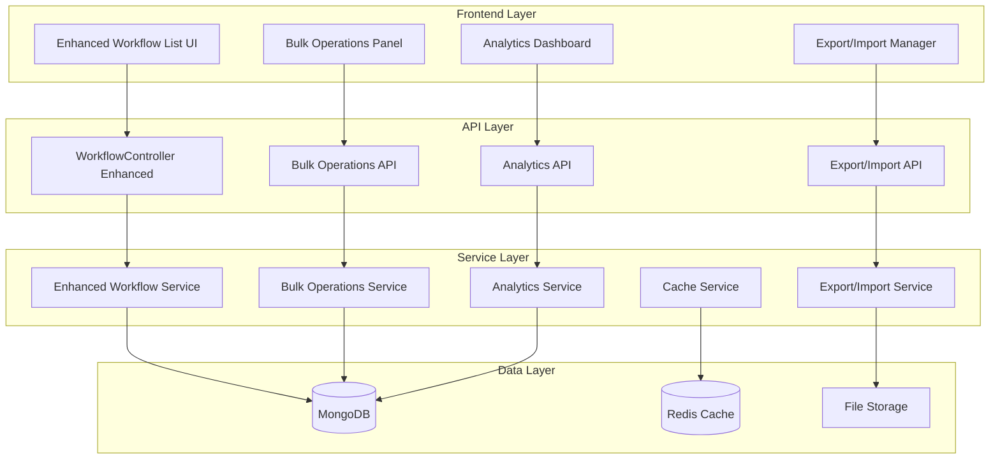

# 设计文档

## 概述

本设计文档概述了升级工作流列表功能的架构和实现方法。升级将通过高级搜索功能、批量操作、性能优化和改进的用户体验来增强现有的工作流管理系统，同时保持与当前系统的向后兼容性。

设计遵循现有平台架构，使用 .NET Core API 后端配合 MongoDB，React/TypeScript 前端配合 Ant Design，并维护已建立的多租户、身份验证和数据访问模式。

## 架构

### 高层架构



### Component Integration

The enhanced workflow list will integrate with existing platform components:

- **Authentication**: Uses existing JWT-based authentication and ITenantContext for multi-tenancy
- **Database Access**: Leverages IDatabaseOperationFactory<T> pattern for consistent data operations
- **UI Framework**: Extends existing Ant Design components and DataTable implementation
- **API Standards**: Follows established ApiResponse<T> format and BaseApiController patterns

## Components and Interfaces

### Backend Components

#### Enhanced WorkflowController

Extends the existing WorkflowController with new endpoints:

```csharp
[ApiController]
[Route("api/workflows")]
public class WorkflowController : BaseApiController
{
    // Existing methods...
    
    [HttpPost("bulk-operations")]
    [RequireMenu("workflow-list")]
    public async Task<IActionResult> ExecuteBulkOperation([FromBody] BulkOperationRequest request);
    
    [HttpGet("analytics")]
    [RequireMenu("workflow-list")]
    public async Task<IActionResult> GetWorkflowAnalytics([FromQuery] AnalyticsRequest request);
    
    [HttpPost("export")]
    [RequireMenu("workflow-list")]
    public async Task<IActionResult> ExportWorkflows([FromBody] ExportRequest request);
    
    [HttpPost("import")]
    [RequireMenu("workflow-list")]
    public async Task<IActionResult> ImportWorkflows([FromForm] ImportRequest request);
    
    [HttpGet("templates")]
    [RequireMenu("workflow-list")]
    public async Task<IActionResult> GetWorkflowTemplates([FromQuery] TemplateQueryRequest request);
}
```

#### Bulk Operations Service

```csharp
public interface IBulkOperationService
{
    Task<BulkOperationResult> ExecuteBulkActivationAsync(List<string> workflowIds);
    Task<BulkOperationResult> ExecuteBulkDeactivationAsync(List<string> workflowIds);
    Task<BulkOperationResult> ExecuteBulkDeletionAsync(List<string> workflowIds);
    Task<BulkOperationResult> ExecuteBulkCategoryUpdateAsync(List<string> workflowIds, string category);
    Task<BulkOperationProgress> GetBulkOperationProgressAsync(string operationId);
}
```

#### Analytics Service

```csharp
public interface IWorkflowAnalyticsService
{
    Task<WorkflowAnalytics> GetWorkflowUsageAnalyticsAsync(string workflowId, TimeRange timeRange);
    Task<List<WorkflowUsageSummary>> GetWorkflowUsageSummaryAsync(AnalyticsFilter filter);
    Task<PerformanceMetrics> GetPerformanceMetricsAsync(List<string> workflowIds);
    Task<TrendData> GetUsageTrendsAsync(TimeRange timeRange);
}
```

#### Export/Import Service

```csharp
public interface IWorkflowExportImportService
{
    Task<ExportResult> ExportWorkflowsAsync(List<string> workflowIds, ExportFormat format);
    Task<ImportResult> ImportWorkflowsAsync(Stream fileStream, ImportOptions options);
    Task<ValidationResult> ValidateImportFileAsync(Stream fileStream);
    Task<List<WorkflowTemplate>> GetWorkflowTemplatesAsync(TemplateFilter filter);
}
```

### Frontend Components

#### Enhanced Workflow List Component

```typescript
interface EnhancedWorkflowListProps {
  enableBulkOperations?: boolean;
  enableAnalytics?: boolean;
  enableExportImport?: boolean;
  customFilters?: FilterConfig[];
}

const EnhancedWorkflowList: React.FC<EnhancedWorkflowListProps> = ({
  enableBulkOperations = true,
  enableAnalytics = true,
  enableExportImport = true,
  customFilters = []
}) => {
  // Component implementation
};
```

#### Advanced Search Component

```typescript
interface AdvancedSearchProps {
  onSearch: (filters: SearchFilters) => void;
  onSaveFilter: (filter: SavedFilter) => void;
  savedFilters: SavedFilter[];
  loading?: boolean;
}

const AdvancedSearch: React.FC<AdvancedSearchProps> = ({
  onSearch,
  onSaveFilter,
  savedFilters,
  loading
}) => {
  // Advanced search implementation with multiple criteria
};
```

#### Bulk Operations Panel

```typescript
interface BulkOperationsPanelProps {
  selectedItems: string[];
  onBulkOperation: (operation: BulkOperation) => Promise<void>;
  availableOperations: BulkOperationType[];
}

const BulkOperationsPanel: React.FC<BulkOperationsPanelProps> = ({
  selectedItems,
  onBulkOperation,
  availableOperations
}) => {
  // Bulk operations UI implementation
};
```

## Data Models

### Enhanced Workflow Models

```csharp
// Extended workflow definition with analytics
public class WorkflowDefinitionWithAnalytics : WorkflowDefinition
{
    public WorkflowUsageStats UsageStats { get; set; } = new();
    public PerformanceMetrics Performance { get; set; } = new();
    public List<string> Tags { get; set; } = new();
}

// Workflow usage statistics
public class WorkflowUsageStats
{
    public int TotalInstances { get; set; }
    public int CompletedInstances { get; set; }
    public int FailedInstances { get; set; }
    public double CompletionRate { get; set; }
    public TimeSpan AverageProcessingTime { get; set; }
    public DateTime LastUsed { get; set; }
    public TrendData UsageTrend { get; set; } = new();
}

// Performance metrics
public class PerformanceMetrics
{
    public TimeSpan AverageExecutionTime { get; set; }
    public int ErrorCount { get; set; }
    public double ErrorRate { get; set; }
    public List<PerformanceIssue> Issues { get; set; } = new();
}

// Bulk operation models
public class BulkOperationRequest
{
    public BulkOperationType Operation { get; set; }
    public List<string> WorkflowIds { get; set; } = new();
    public Dictionary<string, object> Parameters { get; set; } = new();
}

public class BulkOperationResult
{
    public string OperationId { get; set; } = string.Empty;
    public BulkOperationStatus Status { get; set; }
    public int TotalItems { get; set; }
    public int ProcessedItems { get; set; }
    public int SuccessfulItems { get; set; }
    public int FailedItems { get; set; }
    public List<BulkOperationError> Errors { get; set; } = new();
    public DateTime StartedAt { get; set; }
    public DateTime? CompletedAt { get; set; }
}

// Export/Import models
public class ExportRequest
{
    public List<string> WorkflowIds { get; set; } = new();
    public ExportFormat Format { get; set; } = ExportFormat.JSON;
    public bool IncludeAnalytics { get; set; } = false;
    public bool IncludeDependencies { get; set; } = true;
}

public class ImportRequest
{
    public IFormFile File { get; set; } = null!;
    public ImportMode Mode { get; set; } = ImportMode.CreateNew;
    public bool ValidateOnly { get; set; } = false;
    public ConflictResolution ConflictResolution { get; set; } = ConflictResolution.Prompt;
}

// Workflow template models
public class WorkflowTemplate
{
    public string Id { get; set; } = string.Empty;
    public string Name { get; set; } = string.Empty;
    public string Description { get; set; } = string.Empty;
    public string Category { get; set; } = string.Empty;
    public WorkflowGraph Template { get; set; } = new();
    public List<TemplateParameter> Parameters { get; set; } = new();
    public int UsageCount { get; set; }
    public DateTime CreatedAt { get; set; }
    public string CreatedBy { get; set; } = string.Empty;
}
```

### Frontend Type Definitions

```typescript
// Enhanced search filters
interface SearchFilters {
  keyword?: string;
  categories?: string[];
  statuses?: WorkflowStatus[];
  dateRange?: {
    start: string;
    end: string;
    field: 'createdAt' | 'updatedAt' | 'lastUsed';
  };
  usageRange?: {
    min: number;
    max: number;
  };
  tags?: string[];
  createdBy?: string[];
}

// Saved filter configuration
interface SavedFilter {
  id: string;
  name: string;
  filters: SearchFilters;
  isDefault?: boolean;
  createdAt: string;
}

// Bulk operation types
enum BulkOperationType {
  Activate = 'activate',
  Deactivate = 'deactivate',
  Delete = 'delete',
  UpdateCategory = 'updateCategory',
  AddTags = 'addTags',
  RemoveTags = 'removeTags',
  Export = 'export'
}

// Analytics data structures
interface WorkflowAnalytics {
  usageStats: WorkflowUsageStats;
  performanceMetrics: PerformanceMetrics;
  trendData: TrendData;
  comparisonData?: ComparisonData;
}

interface WorkflowUsageStats {
  totalInstances: number;
  completedInstances: number;
  failedInstances: number;
  completionRate: number;
  averageProcessingTime: number;
  lastUsed: string;
}
```

## Correctness Properties

*A property is a characteristic or behavior that should hold true across all valid executions of a system-essentially, a formal statement about what the system should do. Properties serve as the bridge between human-readable specifications and machine-verifiable correctness guarantees.*

<function_calls>
<invoke name="prework">
<parameter name="featureName">workflow-list-upgrade

### Property Reflection

After analyzing all acceptance criteria, I identified several areas where properties can be consolidated:

**Search and Filtering Properties (1.1-1.4)** can be combined into comprehensive search properties that test multiple criteria simultaneously rather than individual field searches.

**Bulk Operation Properties (2.2-2.5)** follow similar patterns and can be consolidated into a general bulk operation property that tests the operation type as a parameter.

**Export Properties (3.1-3.2, 3.6)** can be combined into a comprehensive export completeness property.

**Import Properties (3.3-3.5)** can be consolidated into import validation and error handling properties.

**Analytics Properties (5.1-5.3, 5.5)** can be combined into comprehensive analytics calculation properties.

**Template Properties (7.1-7.2, 7.4-7.6)** can be consolidated into template lifecycle properties.

**Validation Properties (8.1-8.6)** can be combined into comprehensive workflow validation properties.

### Converting EARS to Properties

Based on the prework analysis, here are the key correctness properties:

**Property 1: Multi-field search consistency**
*For any* workflow dataset and search terms, searching across name, description, and category fields should return workflows where at least one field contains at least one search term
**Validates: Requirements 1.1**

**Property 2: Date range filtering accuracy**
*For any* workflow dataset and date range, filtering by creation date, modification date, or last used date should return only workflows with dates within the specified range
**Validates: Requirements 1.2**

**Property 3: Category filtering completeness**
*For any* workflow dataset and selected categories, the results should contain all workflows that belong to any of the selected categories and no workflows from unselected categories
**Validates: Requirements 1.3**

**Property 4: Status filtering correctness**
*For any* workflow dataset and status filters, the results should contain only workflows matching the selected statuses
**Validates: Requirements 1.4**

**Property 5: Filter preference persistence**
*For any* saved filter preferences, after session restart the preferences should be restored exactly as they were saved
**Validates: Requirements 1.5**

**Property 6: Virtual scrolling activation**
*For any* workflow dataset exceeding 1000 items, the system should automatically enable virtual scrolling for optimal performance
**Validates: Requirements 1.6**

**Property 7: Bulk operation state consistency**
*For any* bulk operation (activate, deactivate, delete, category update), all selected workflows should have their state updated consistently and atomically
**Validates: Requirements 2.2, 2.3, 2.4, 2.5**

**Property 8: Export completeness**
*For any* selected workflows, the exported data should contain complete workflow definitions including graphs, form bindings, and all metadata
**Validates: Requirements 3.1, 3.2, 3.6**

**Property 9: Import validation accuracy**
*For any* imported workflow file, the validation should correctly identify structural issues, dependency problems, and provide specific error locations
**Validates: Requirements 3.3, 3.5**

**Property 10: Import conflict resolution**
*For any* imported workflows with naming conflicts, the system should provide appropriate resolution options and apply them consistently
**Validates: Requirements 3.4**

**Property 11: Pagination consistency**
*For any* large workflow dataset and page size configuration, pagination should return non-overlapping subsets that together contain all workflows
**Validates: Requirements 4.2**

**Property 12: Search result caching**
*For any* search query, subsequent identical queries should return cached results until cache invalidation occurs
**Validates: Requirements 4.6**

**Property 13: Analytics calculation accuracy**
*For any* workflow with known instance data, the calculated usage statistics, completion rates, and processing times should match the actual historical data
**Validates: Requirements 5.1, 5.2, 5.3**

**Property 14: Performance issue detection**
*For any* workflow with high failure rates or long processing times, the system should correctly identify and highlight it as having performance issues
**Validates: Requirements 5.4**

**Property 15: Usage ranking correctness**
*For any* set of workflows with different usage patterns, the ranking of most and least used workflows should accurately reflect their actual usage frequency
**Validates: Requirements 5.5**

**Property 16: Analytics export inclusion**
*For any* workflow export that includes analytics, the exported data should contain all usage statistics and performance metrics
**Validates: Requirements 5.6**

**Property 17: Navigation state preservation**
*For any* page navigation with active filters and scroll position, returning to the page should restore the exact previous state
**Validates: Requirements 6.5**

**Property 18: Keyboard shortcut functionality**
*For any* supported keyboard shortcut, the corresponding action should be triggered correctly regardless of current UI state
**Validates: Requirements 6.6**

**Property 19: Template application consistency**
*For any* workflow template with parameters, applying the template should generate workflows that match the template structure with customized parameter values
**Validates: Requirements 7.1, 7.2**

**Property 20: Template update propagation**
*For any* template update, the system should correctly identify existing workflows based on the template and provide appropriate update options
**Validates: Requirements 7.3**

**Property 21: Template export completeness**
*For any* exported template, the package should include all dependencies, documentation, and metadata required for successful import
**Validates: Requirements 7.6**

**Property 22: Workflow validation completeness**
*For any* workflow definition, validation should identify all structural issues, missing dependencies, and configuration problems
**Validates: Requirements 8.1, 8.3, 8.4, 8.5**

**Property 23: Validation error reporting**
*For any* workflow with validation errors, the system should provide specific error descriptions that identify the problematic elements and their issues
**Validates: Requirements 8.2**

**Property 24: Activation validation enforcement**
*For any* workflow with validation errors, the system should prevent activation and require error resolution before allowing activation
**Validates: Requirements 8.6**

## Error Handling

### Error Categories

1. **Validation Errors**: Invalid workflow structures, missing dependencies, configuration issues
2. **Performance Errors**: Timeout issues, memory constraints, large dataset handling
3. **Concurrency Errors**: Bulk operation conflicts, simultaneous modifications
4. **Import/Export Errors**: File format issues, corruption, version incompatibilities
5. **Analytics Errors**: Calculation failures, missing data, aggregation issues

### Error Handling Strategy

```csharp
// Centralized error handling for workflow operations
public class WorkflowErrorHandler
{
    public async Task<ApiResponse<T>> HandleWorkflowOperationAsync<T>(
        Func<Task<T>> operation,
        string operationName,
        string? resourceId = null)
    {
        try
        {
            var result = await operation();
            return Success(result);
        }
        catch (WorkflowValidationException ex)
        {
            return ValidationError($"{operationName} validation failed: {ex.Message}");
        }
        catch (BulkOperationException ex)
        {
            return Error("BULK_OPERATION_FAILED", 
                $"Bulk operation failed: {ex.ProcessedCount}/{ex.TotalCount} items processed. {ex.Message}");
        }
        catch (ImportExportException ex)
        {
            return Error("IMPORT_EXPORT_FAILED", 
                $"Import/Export operation failed at line {ex.LineNumber}: {ex.Message}");
        }
        catch (PerformanceException ex)
        {
            return Error("PERFORMANCE_ISSUE", 
                $"Operation exceeded performance limits: {ex.Message}");
        }
        catch (Exception ex)
        {
            _logger.LogError(ex, "Unexpected error in {OperationName} for resource {ResourceId}", 
                operationName, resourceId);
            return ServerError($"{operationName} failed due to an unexpected error");
        }
    }
}
```

### Frontend Error Handling

```typescript
// Enhanced error handling for workflow operations
class WorkflowErrorHandler {
  static handleWorkflowError(error: any, operation: string): string {
    if (error.response?.data?.errorCode) {
      switch (error.response.data.errorCode) {
        case 'VALIDATION_ERROR':
          return `Validation failed: ${error.response.data.errorMessage}`;
        case 'BULK_OPERATION_FAILED':
          return `Bulk operation partially failed: ${error.response.data.errorMessage}`;
        case 'IMPORT_EXPORT_FAILED':
          return `Import/Export error: ${error.response.data.errorMessage}`;
        case 'PERFORMANCE_ISSUE':
          return `Performance limit exceeded: ${error.response.data.errorMessage}`;
        default:
          return `${operation} failed: ${error.response.data.errorMessage}`;
      }
    }
    return `${operation} failed due to an unexpected error`;
  }
}
```

## Testing Strategy

### Dual Testing Approach

The testing strategy employs both unit tests and property-based tests to ensure comprehensive coverage:

**Unit Tests** focus on:
- Specific workflow scenarios and edge cases
- Integration points between components
- Error conditions and exception handling
- UI component behavior and interactions

**Property-Based Tests** focus on:
- Universal properties that hold across all inputs
- Comprehensive input coverage through randomization
- Data consistency and integrity validation
- Performance characteristics under various loads

### Property-Based Testing Configuration

All property-based tests will:
- Run minimum 100 iterations per test due to randomization
- Use appropriate data generators for workflow structures
- Reference specific design document properties
- Include performance bounds where applicable

**Property Test Framework**: Use FsCheck for .NET backend and fast-check for TypeScript frontend

**Test Tagging Format**: Each property test must include a comment referencing its design property:
```csharp
// Feature: workflow-list-upgrade, Property 1: Multi-field search consistency
[Property]
public Property MultiFieldSearchConsistency() => 
    Prop.ForAll(workflowDatasetGen, searchTermsGen, (workflows, terms) => {
        // Property implementation
    });
```

### Unit Testing Balance

Unit tests complement property-based tests by:
- Testing specific examples that demonstrate correct behavior
- Validating integration between workflow components
- Testing error conditions and edge cases
- Ensuring UI components render and behave correctly

Property-based tests handle comprehensive input coverage, while unit tests focus on specific scenarios and integration points.

### Performance Testing

Performance tests will validate:
- Initial page load times under 2 seconds
- Search response times under 500ms for datasets up to 10,000 workflows
- Bulk operation progress tracking and cancellation
- Virtual scrolling performance with large datasets
- Cache effectiveness and invalidation timing

### Integration Testing

Integration tests will cover:
- End-to-end workflow management scenarios
- Export/import round-trip operations
- Multi-user bulk operation scenarios
- Analytics calculation accuracy with real data
- Template application and update workflows