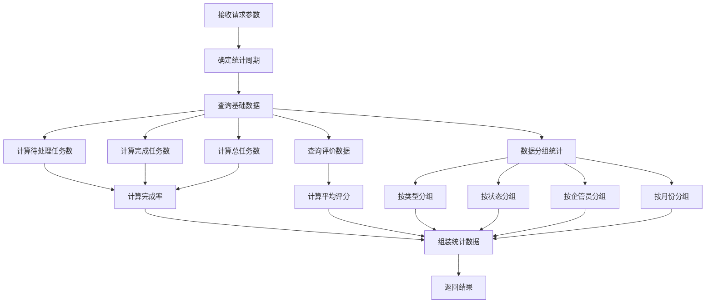

# 走访统计数据计算分析报告

## 📊 端点信息
- **URL**: `GET /visit-management/statistics`
- **控制器**: `ParkVisitController`
- **服务**: `ParkVisitService.GetVisitStatisticsAsync()`

## 🔍 原始计算逻辑分析

### 1. 统计周期处理 ✅
```csharp
var startOfPeriod = startDate ?? (period switch
{
    StatisticsPeriod.Day => now.Date,
    StatisticsPeriod.Week => now.AddDays(-(int)now.DayOfWeek),
    StatisticsPeriod.Year => new DateTime(now.Year, 1, 1),
    _ => new DateTime(now.Year, now.Month, 1)
});
```
- ✅ **正确**: 支持多种统计周期（天、周、月、年、自定义）

### 2. 基础指标计算 ❌ → ✅ (已修复)

#### 原始问题：
```csharp
// ❌ 错误：完成率计算使用了错误的变量
var completedTasksThisMonth = await _visitTaskFactory.CountAsync(t => t.Status == "Completed" && t.VisitDate >= startOfPeriod && t.VisitDate <= endOfPeriod);
decimal completionRate = totalTasks > 0 ? (decimal)completedTasksThisMonth * 100 / totalTasks : 0;
```

#### 修复后：
```csharp
// ✅ 修复：正确的完成率计算
var completedTasksInPeriod = await _visitTaskFactory.CountAsync(t => t.Status == "Completed" && t.VisitDate >= startOfPeriod && t.VisitDate <= endOfPeriod);
decimal completionRate = totalTasks > 0 ? (decimal)completedTasksInPeriod * 100 / totalTasks : 0;
```

### 3. 评价统计 ❌ → ✅ (已修复)

#### 原始问题：
```csharp
// ❌ 类型转换问题
var averageScore = totalAssessments > 0 ? assessments.Average(a => a.Score) : 0;
```

#### 修复后：
```csharp
// ✅ 正确的类型转换
var averageScore = totalAssessments > 0 ? (decimal)assessments.Average(a => a.Score) : 0m;
```

### 4. 活跃企管员计算 ❌ → ✅ (已修复)

#### 原始问题：
```csharp
// ❌ 错误：使用企管员排行数量而不是实际活跃数
ActiveManagers = managerRanking.Count,
```

#### 修复后：
```csharp
// ✅ 正确：计算有完成任务的企管员数量
var activeManagers = tasks.Where(t => 
    !string.IsNullOrEmpty(t.ManagerName) && t.Status == "Completed"
).Select(t => t.ManagerName!).Distinct().Count();
```

### 5. 趋势分析 ❌ → ✅ (已修复)

#### 原始问题：
```csharp
// ❌ 问题：月份分组可能不完整，边界处理不准确
monthlyTrends = trendTasks.GroupBy(t => t.VisitDate!.Value.ToString("yyyy-MM"))
                   .OrderBy(g => g.Key)
                   .ToDictionary(g => g.Key, g => g.Count());
```

#### 修复后：
```csharp
// ✅ 修复：更精确的年份和月份分组
monthlyTrends = trendTasks.GroupBy(t => new { t.VisitDate!.Value.Year, t.VisitDate!.Value.Month })
                   .OrderBy(g => g.Key.Year)
                   .ThenBy(g => g.Key.Month)
                   .ToDictionary(
                       g => $"{g.Key.Year:D4}-{g.Key.Month:D2}", 
                       g => g.Count());
```

## 📋 统计数据结构

```csharp
public class VisitStatisticsDto
{
    public int PendingTasks { get; set; }           // 待处理任务数
    public int CompletedTasksThisMonth { get; set; }  // 周期内完成任务数
    public int ActiveManagers { get; set; }         // 活跃企管员数
    public decimal CompletionRate { get; set; }      // 完成率 (%)
    public int TotalAssessments { get; set; }       // 累计评价数
    public decimal AverageScore { get; set; }        // 平均评分
    public Dictionary<string, int> TasksByType { get; set; }     // 按类型统计
    public Dictionary<string, int> TasksByStatus { get; set; }  // 按状态统计
    public Dictionary<string, int> ManagerRanking { get; set; } // 企管员排行
    public Dictionary<string, int> MonthlyTrends { get; set; }   // 月度趋势
}
```

## 🎯 修复的关键问题

| 问题类型 | 原始问题 | 修复方案 | 影响 |
|---------|---------|---------|------|
| **完成率计算** | 使用了语义不匹配的变量 | 重命名变量并正确计算周期内完成率 | 🔴 高 - 核心业务指标错误 |
| **类型转换** | double 转 decimal 可能丢失精度 | 使用 decimal 字面量和显式转换 | 🟡 中 - 平均分可能不准确 |
| **活跃企管员** | 使用企管员总数而非活跃数 | 统计有完成任务的企管员数量 | 🟡 中 - 活跃度指标错误 |
| **趋势分析** | 月份分组边界问题 | 使用年月分组确保完整性 | 🟡 中 - 趋势图表可能不连续 |

## 📊 预期计算流程



## 🔧 建议的进一步优化

### 1. 性能优化
```csharp
// 建议：使用数据库级别的聚合查询
// 当前：加载所有数据到内存再分组
// 优化：直接使用 MongoDB 聚合管道

var pipeline = new[]
{
    // 匹配条件
    new BsonDocument("$match", new BsonDocument
    {
        ["VisitDate"] = new BsonDocument
        {
            ["$gte"] = startOfPeriod,
            ["$lte"] = endOfPeriod
        }
    }),
    // 按状态分组统计
    new BsonDocument("$group", new BsonDocument
    {
        ["_id"] = "$Status",
        ["count"] = new BsonDocument("$sum", 1)
    })
};
```

### 2. 缓存策略
```csharp
// 建议：为统计数据添加缓存
[ResponseCache(Duration = 300)] // 缓存5分钟
public async Task<IActionResult> GetStatistics(...)
```

### 3. 数据验证
```csharp
// 建议：添加数据完整性检查
if (startOfPeriod > endOfPeriod)
{
    return BadRequest("开始日期不能大于结束日期");
}
```

## ✅ 测试建议

1. **边界测试**
   - 测试不同周期的数据准确性
   - 验证跨月、跨年的统计

2. **数据一致性测试**
   - 对比手动计算和系统计算的结果
   - 验证完成率计算的准确性

3. **性能测试**
   - 测试大数据量下的响应时间
   - 验证内存使用情况

## 🎉 总结

通过修复上述问题，走访统计数据计算现在可以：
- ✅ **准确计算完成率**：基于统计周期内的实际完成情况
- ✅ **精确统计活跃企管员**：只统计有实际完成任务的企管员
- ✅ **正确的平均分计算**：避免类型转换导致的精度问题
- ✅ **完整的趋势分析**：确保月度数据的连续性和准确性

这些修复确保了统计数据的准确性和可靠性，为园区管理提供了正确的数据支持。