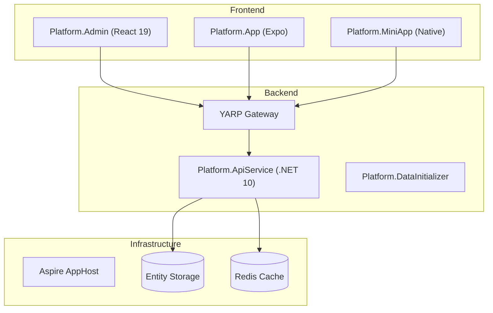

# Aspire Admin Platform

基于 **.NET 10** 与 **.NET Aspire** 构建的多租户企业管理平台。项目旨在通过声明式的服务编排、统一的数据抽象层与跨端协同架构，为企业提供覆盖办公协同、资产管理、IoT 监控与 AI 智能助手的全栈闭环解决方案。

## ✨ 关键特性

- **国际化与本地化 (i18n & L10n)**
  - 系统内置 **18 种语言支持**：中文（简/繁）、英语、日语、韩语、阿拉伯语、波斯语、孟加拉语、德语、西班牙语、法语、印尼语、意大利语、葡萄牙语、俄语、泰语、土耳其语、越南语。
  - 支持自动检测浏览器语言并平滑切换。
  - 特别适配 RTL 布局（如阿拉伯语、波斯语），确保全球化体验。
- **现代化数据模型 (IDataFactory)**
  - 核心逻辑基于 **IDataFactory<T>** 接口，完全屏蔽底层数据库 API（如 MongoDB 驱动）。
  - 全面支持 **LINQ 表达式**，实现业务逻辑在内存与数据库间的透明映射。
  - **Security & Efficiency**：内置多租户隔离、软删除、字段级自动审计（CreatedAt/By, UpdatedAt/By）及原子化 Lambda 更新。
- **自研高性能工作流引擎**
  - **可视化设计**：支持拖拽式流程设计与工作流快照，支持复杂的分支条件与状态流转。
  - **表单绑定**：支持 `Document` 与 `Variable` 两种数据绑定模式，实现“公文-流程”与“全自动流程”的解耦。
  - **闭环管理**：涵盖流程定义版本管理、任务拾取、驳回撤回及多维度的审批历史追溯。
- **统一通知体系 (Unified Notification)**
  - 集成 **WebSocket** 与 **SSE** 服务，支持系统公告、站内信、业务提醒等多渠道推送。
  - 适配管理后台 (Web)、移动端 (App) 与小程序 (MiniApp) 的全端通知触达。
- **企业级云硬盘协作**
  - 基于分布式文件系统（GridFS+IDataFactory），支持秒传、大文件多版本管理。
  - **深度管理**：包含回收站自动清理策略（如 30 天自动抹除）、精细化的存储配额控制及外链审计分析。
- **全栈 AI 协同 (Xiaoke AI)**
  - 内置 **小科管理** AI 助手，基于 SSE 连接提供流式回复体验。
  - **MCP (Model Context Protocol)**：开放标准接口协议，支持 AI 自动化审批工作流、设备状态实时分析及企业级数据检索。
- **IoT 物联网平台**
  - **四位一体管理**：网关管理、设备状态监控、数据点实时采集与事件告警闭环。
  - 支持复杂场景下的设备关联关系维护与物联网监控仪表盘。
- **全端协同体验 (Multi-terminal)**
  - **Platform.App (iOS/Android)**：基于 Expo 54 打造的高性能跨端 App，内置实时通知推送与地理位置服务。
  - **Platform.MiniApp (微信小程序)**：深度集成的轻量级入口，包含完整的园区管理（招商、资产、合同、走访）业务闭环。

## 🛠️ 技术栈 (Technology Stack)

| 层次 | 核心技术 | 描述 |
| :--- | :--- | :--- |
| **后端** | **.NET 10 + Aspire** | 最新代 C# 开发框架，支持云原生编排与服务治理。 |
| **数据库** | **MongoDB + EF Core** | 采用 `MongoDB.EntityFrameworkCore` 实现强类型的 NoSQL 访问。 |
| **管理端** | **React 19 + Ant Design 6 + UmiJS 4** | 面向未来的 Web 开发架构，极致的渲染性能与 UI 细节。 |
| **移动端** | **Expo 54 + React Native 0.83** | 跨平台原生体验，支持 Reanimated 超流畅动画方案。 |
| **小程序** | **Native WeChat** | 适配微信原生生态，确保低延时与高兼容性。 |
| **观测性** | **OpenTelemetry** | 集成指标、日志与链路追踪，全链路健康监控。 |
| **AI** | **OpenAI / MCP** | 对接全球顶级大模型与标准化模型上下文协议。 |

## 🏗 架构总览



- **Platform.AppHost**：负责服务发现、容器编排、数据库（MongoDB/Redis）自动拉起。
- **Platform.ApiService**：核心业务逻辑承载者，采用 Clean Architecture 风格。
- **Platform.Admin**：基于 Ant Design 6 打造，强调原生体验与高性能操作视图。
- **Platform.MiniApp**：涵盖园区全生命周期管理的轻量化业务端。
- **Platform.App**：提供一致性的原生移动端访问与消息触达。

## 📂 项目结构 (Project Structure)

```text
aspire-admin
├── Platform.AppHost           # .NET Aspire 编排项目，管理所有微服务与资源
│   ├── AppHost.cs            # 主编排配置（服务发现、路由、健康检查）
│   ├── appsettings.json      # 配置文件（JWT、OpenAI、副本数等）
│   └── mongo-init/           # MongoDB 初始化脚本
├── Platform.ApiService        # 核心业务 API (Workflow, IoT, AI, Park, Storage)
│   ├── Controllers/          # API 控制器
│   ├── Services/             # 业务服务层
│   │   ├── McpService.cs    # MCP 服务（简化版本）
│   │   └── Mcp/             # MCP 工具处理器（15+ Handlers）
│   ├── Models/               # 数据模型
│   ├── Options/              # 配置选项类
│   └── docs/                 # 服务文档
├── Platform.ServiceDefaults   # 通用弹性配置、服务目录与公共实体定义
│   ├── Services/             # 数据工厂、数据库上下文
│   └── Models/               # 基础实体、接口定义
├── Platform.DataInitializer   # 数据库索引初始化与基础数据种子填充
├── Platform.Admin             # 管理后台 (React 19 + Ant Design 6 + UmiJS 4)
│   ├── src/
│   │   ├── pages/           # 页面组件
│   │   ├── components/      # 通用组件
│   │   ├── services/        # API 服务
│   │   └── locales/         # 18 种语言国际化
│   └── config/              # UmiJS 配置
├── Platform.App               # 移动端应用 (Expo 54 + React Native 0.83)
│   ├── app/                 # Expo Router 页面
│   ├── components/          # 组件库
│   └── services/            # API 服务
├── Platform.MiniApp           # 微信小程序 (Native)
│   ├── pages/               # 小程序页面
│   ├── components/          # 小程序组件
│   └── utils/               # 工具函数
└── docs                       # 详细设计文档、MCP 协议规范与业务手册
```

## 🔙 后端服务 (Platform.ApiService)

- **多租户安全**：通过 EF Core 全局查询过滤器自动注入 `CompanyId`，确保物理或逻辑层的数据严格隔离。
- **高性能 SSE**：支持单向长连接推送，用于向客户端推送 AI 生成内容、实时通知及心跳状态（30s 间隔）。
- **Security & Crypto**：采用 AES-256-GCM 高强度加密用户密码本，支持动态密钥管理与强度审计。
- **交互式文档**：内置 **Scalar/OpenAPI** 预览，支持在线调试与 SDK 自动生成。
- **健康检查**：提供 `/health` 端点，支持 Aspire 自动健康监控。
- **分布式追踪**：集成 OpenTelemetry，全链路日志、指标与追踪。

## 🖥 管理后台 (Platform.Admin)

- **极致 UI**：基于 React 19、Ant Design 6 与 UmiJS 4，全面采用原生变量与高性能组件。
- **核心中心化模块**：
  - **协同中心**：融合公文（Document）管理与工作流，支持任务看板依赖链与全局进度统计。
  - **资产中心**：涵盖园区房源画像、招商线索库及租户合同全生命周期监控。
  - **智能中心**：管理 AI 连接配置、历史会话存档与 MCP 规则链路。
  - **物联网中心**：网关管理、设备监控、数据点采集与事件告警。
  - **系统管理**：用户、角色、菜单、权限、组织架构等基础配置。

## 🧩 MCP 服务 (Model Context Protocol)

本项目深度集成了 **MCP 协议**，使 AI 助手能够安全地访问企业内部的核心业务逻辑。

### 架构优化

经过简化重构，MCP 服务从过度设计的 8 个独立服务合并为单一的 `McpService` 类，保留所有核心功能的同时大幅提升了可维护性：

- ✅ **缓存优化**：使用 `IMemoryCache` 缓存工具列表（10 分钟过期）
- ✅ **安全验证**：防 SQL/NoSQL 注入、XSS 攻击、参数长度限制
- ✅ **审计日志**：记录所有工具执行（用户、工具名、参数、结果、耗时）
- ✅ **配置化**：通过 `McpScoringOptions` 支持灵活配置
- ✅ **性能优化**：倒排索引实现 O(1) 关键词查找
- ✅ **并行执行**：使用 `Task.WhenAll` 并行执行多个工具

### 核心工具集 (15+ Handlers)

- **工作流自动化 (Workflow)**
  - 🔍 **查询**：检索流程定义、跟踪运行中的实例
  - 🛠️ **操作**：AI 可直接执行审批、驳回、退回或转办操作
  - 📑 **追溯**：获取完整的审批历史轨迹
  
- **物联网交互 (IoT)**
  - 📡 **网关通信**：查询在线网关与关联设备
  - 📈 **数据点观测**：拉取传感器最新的实时数据点观测值，自动生成报表
  - 🔔 **事件告警**：实时监控设备状态与异常事件
  
- **园区管理 (Park)**
  - 🏢 **资产管理**：房源画像、楼铺信息、租赁状态
  - 🤝 **招商管理**：线索跟进、商机转化、合同签订
  - 👥 **租户服务**：租户档案、走访记录、企业服务
  
- **企业级协作**
  - **用户/组织**：跨租户身份检索与详细 Profile 查询
  - **任务/项目**：自动化创建、指派负责人、更新进度看板
  - **公文/表单**：文档管理、表单定义、审批流程
  - **云硬盘/通知**：文件管理、版本控制、通知推送
  
- **系统管理**
  - **菜单/权限**：动态菜单配置、角色权限管理
  - **规则引擎**：动态规则配置、资源管理、提示词模板
  - **加入申请**：企业加入审批、成员邀请

### 实时资源与专家提示词 (Resources & Prompts)

- **实时资源映射 (URI)**
  - `rule://{id}`: 动态规则配置快照
  - `workflow://{id}`: 流程定义与运行状态
  - `iot://{id}`: 设备健康度与统计数据
  
- **智能提示词 (Smart Prompts)**
  - 内置 `workflow_analysis`、`device_monitoring` 等专家级模板
  - 减少 Prompt Engineering 成本
  - 显著提升 AI 在专业业务场景下的推理深度

## 🚀 快速开始

### 1. 软件环境
- **Runtime**: [.NET 10 SDK](https://dotnet.microsoft.com/download/dotnet/10.0), Node.js 20+
- **Infrastructure**: Docker Desktop（或其他容器引擎）

### 2. 初始化与运行

```bash
# 1. 克隆项目并进入目录
git clone <repository-url>
cd aspire-admin

# 2. 安装前端依赖（可选，Aspire 会自动安装）
cd Platform.Admin && npm install && cd ..
cd Platform.App && npm install && cd ..
cd Platform.MiniApp && npm install && cd ..

# 3. 启动并编排服务（Aspire 会自动拉起 MongoDB、Redis 等基础设施）
dotnet run --project Platform.AppHost
```

### 3. 访问服务

启动成功后，可以通过以下地址访问各个服务：

- **Aspire Dashboard**: <http://localhost:17091> - 查看所有服务的实时日志、指标与分布式追踪
- **API Gateway**: <http://localhost:15000> - YARP 网关统一入口
- **管理后台 (Admin)**: <http://localhost:15001> - React 管理界面
- **移动端预览 (Expo Web)**: <http://localhost:15002> - Expo Web 预览
- **小程序预览**: <http://localhost:15003> - 微信小程序静态资源
- **API 文档 (Scalar)**: 通过 Aspire Dashboard 对应的服务入口点击跳转

### 4. 可选配置

在 `Platform.AppHost/appsettings.json` 或 `appsettings.Development.json` 中配置：

- **OpenAI/Azure OpenAI**：配置 `Parameters:openai-openai-endpoint` 以解锁完整 AI 能力
- **JWT 密钥**：配置 `Jwt:SecretKey` 用于身份认证
- **服务副本数**：配置 `ApiService:Replicas` 调整 API 服务实例数量（默认 3，dotnet watch 模式强制为 1）
- **SSL/HTTPS**：支持自定义证书注入以满足生产安全需求

## 💡 核心设计理念 (Core Design)

### 1. 声明式数据工厂 (IDataFactory)

本项目核心逻辑完全解耦于具体的数据库驱动。通过 `IDataFactory<T>`，开发者仅需关注业务模型。该层级自动处理：

- **多租户透明过滤**：根据操作上下文自动追加 `CompanyId` 过滤（通过 EF Core 全局查询过滤器）
- **审计追踪**：全自动记录实体创建、修改的时间与人员（CreatedAt/By, UpdatedAt/By）
- **软删除**：支持逻辑删除，自动过滤已删除数据
- **原子化更新**：集成性能极佳的 Lambda 表达式更新，降低数据库并发冲突
- **LINQ 支持**：完全支持 LINQ 表达式，实现业务逻辑在内存与数据库间的透明映射

### 2. 闭环工作流引擎

不同于传统的线性审批，本项目支持：

- **动态节点跳转**：基于条件表达式的自动分支
- **可视化设计**：支持拖拽式流程设计与工作流快照
- **表单绑定**：支持 `Document` 与 `Variable` 两种数据绑定模式
- **业务数据联动**：流程状态变更可实时触发表单数据更新、通知推送及第三方 Webhook 回调
- **版本管理**：流程定义支持版本管理，支持回滚与对比

### 3. 多端实时同步

利用 **SSE (Server-Sent Events)** 实现后端到多端的极速状态同步：

- 管理端操作后，小程序及 App 能在秒级收到通知或状态更新
- 支持心跳检测（30s 间隔），自动重连机制
- AI 流式回复实时推送，提升用户体验

### 4. MCP 服务简化架构

经过重构优化，MCP 服务采用简化架构：

- **单一职责**：从 8 个独立服务合并为单个 `McpService` 类
- **保留核心功能**：缓存、验证、审计、配置化、性能优化
- **易于维护**：代码集中，逻辑清晰，降低维护成本
- **高性能**：倒排索引、并行执行、智能缓存

## 🔐 安全与合规 (Security)

- **身份认证**：基于 **JWT (JSON Web Token)** 的无状态认证，配合双令牌刷新机制，平衡安全性与用户体验。
- **多租户隔离**：通过 EF Core 全局查询过滤器自动注入 `CompanyId`，确保数据严格隔离。
- **存储安全**：
  - **GridFS** 分片存储，文件碎片化分布，增强数据隐私。
  - **AES-256-GCM** 加密应用于密码本（Password Book）等极敏感数据。
- **传输安全**：原生支持全链路 HTTPS，自动适配 .NET Aspire 的开发/生产安全策略。
- **输入验证**：MCP 服务内置防 SQL/NoSQL 注入、XSS 攻击检测。
- **审计日志**：所有敏感操作自动记录审计日志，包含操作人、时间、参数、结果。

---

项目致力于提供最前沿的企业级应用开发模版，结合了 .NET 生态最新的编排能力与现代前端的最佳实践。

## 🤝 参与贡献 (Contribution)

欢迎通过提交 Issue 或 Pull Request 来协助优化此项目。在提交代码前，请确保：

- 遵循 **Clean Architecture** 架构规范
- UI 变更符合项目的 **高品质设计准则**
- 后端逻辑优先考虑 **多租户隔离** 与 **IDataFactory 兼容性**
- 代码通过编译且无警告
- 添加必要的单元测试
- 更新相关文档

## 📚 相关文档

- [MCP 服务设计问题分析报告](Platform.ApiService/docs/MCP服务设计问题分析报告.md)
- [MCP 服务简化版本说明](Platform.ApiService/docs/MCP服务简化版本说明.md)
- [Ant Design 6 迁移总结](Platform.Admin/docs/ANTD_MIGRATION_SUMMARY.md)

## 📄 开源协议 (License)

基于 [MIT License](LICENSE) 开源。
