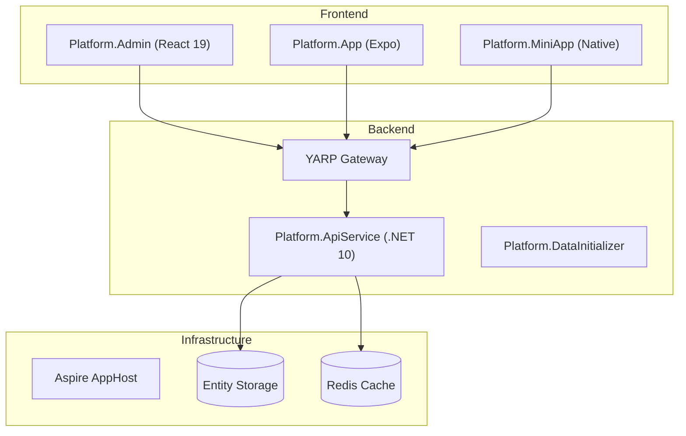

# Aspire Admin Platform

基于 **.NET 10** 与 **.NET Aspire** 构建的多租户企业管理平台。项目旨在通过声明式的服务编排、统一的数据抽象层与跨端协同架构，为企业提供覆盖办公协同、资产管理、IoT 监控与 AI 智能助手的全栈闭环解决方案。

## ✨ 关键特性

- **国际化与本地化 (i18n & L10n)**
  - 系统内置 **18 种语言支持**，支持自动检测浏览器语言并平滑切换。
  - 特别适配 RTL 布局（如阿拉伯语、波斯语），确保全球化体验。
- **现代化数据模型 (IDataFactory)**
  - 核心逻辑基于 **IDataFactory<T>** 接口，完全屏蔽底层数据库 API（如 MongoDB 驱动）。
  - 全面支持 **LINQ 表达式**，实现业务逻辑在内存与数据库间的透明映射。
  - **Security & Efficiency**：内置多租户隔离、软删除、字段级自动审计（CreatedAt/By, UpdatedAt/By）及原子化 Lambda 更新。
- **自研高性能工作流引擎**
  - **可视化设计**：支持拖拽式流程设计与工作流快照，支持复杂的分支条件与状态流转。
  - **表单绑定**：支持 `Document` 与 `Variable` 两种数据绑定模式，实现“公文-流程”与“全自动流程”的解耦。
  - **闭环管理**：涵盖流程定义版本管理、任务拾取、驳回撤回及多维度的审批历史追溯。
- **统一通知体系 (Unified Notification)**
  - 集成 **WebSocket** 与 **SSE** 服务，支持系统公告、站内信、业务提醒等多渠道推送。
  - 适配管理后台 (Web)、移动端 (App) 与小程序 (MiniApp) 的全端通知触达。
- **企业级云硬盘协作**
  - 基于分布式文件系统（GridFS+IDataFactory），支持秒传、大文件多版本管理。
  - **深度管理**：包含回收站自动清理策略（如 30 天自动抹除）、精细化的存储配额控制及外链审计分析。
- **全栈 AI 协同 (Xiaoke AI)**
  - 内置 **小科管理** AI 助手，基于 SSE 连接提供流式回复体验。
  - **MCP (Model Context Protocol)**：开放标准接口协议，支持 AI 自动化审批工作流、设备状态实时分析及企业级数据检索。
- **IoT 物联网平台**
  - **四位一体管理**：网关管理、设备状态监控、数据点实时采集与事件告警闭环。
  - 支持复杂场景下的设备关联关系维护与物联网监控仪表盘。

## 🏗 架构总览



- **Platform.AppHost**：负责服务发现、容器编排、数据库（MongoDB/Redis）自动拉起。
- **Platform.ApiService**：核心业务逻辑承载者，采用 Clean Architecture 风格。
- **Platform.Admin**：基于 Ant Design 6 打造，强调原生体验与高性能操作视图。

## 🔙 后端服务 (Platform.ApiService)

- **多租户安全**：通过过滤器自动注入 `CompanyId`，确保物理或逻辑层的数据严格隔离。
- **高性能 SSE**：支持单向长连接推送，用于向客户端推送 AI 生成内容、实时通知及心跳状态（30s 间隔）。
- **Security & Crypto**：采用 AES-256-GCM 高强度加密用户密码本，支持动态密钥管理与强度审计。
- **交互式文档**：内置 **Scalar/OpenAPI** 预览，支持在线调试与 SDK 自动生成。

## 🖥 管理后台 (Platform.Admin)

- **极致 UI**：基于 React 19 与 Ant Design 6，全面采用原生变量与高性能组件。
- **核心中心化模块**：
  - **协同中心**：融合公文（Document）管理与工作流，支持任务看板依赖链与全局进度统计。
  - **资产中心**：涵盖园区房源画像、招商线索库及租户合同全生命周期监控。
  - **智能中心**：管理 AI 连接配置、历史会话存档与 MCP 规则链路。

## 🧩 MCP 服务 (Model Context Protocol)

本项目深度集成了 **MCP 协议**，使 AI 代理（Agent）能够安全地访问企业内部的核心业务逻辑。

### 核心工具集 (Toolsets)

- **工作流自动化 (Workflow)**
  - 🔍 **查询**：检索流程定义、跟踪运行中的实例。
  - 🛠️ **操作**：AI 可直接执行审批、驳回、退回或转办操作。
  - 📑 **追溯**：获取完整的审批历史轨迹。
- **物联网交互 (IoT)**
  - 📡 **网关通信**：查询在线网关与关联设备。
  - 📈 **数据点观测**：拉取传感器最新的实时数据点观测值，自动生成报表。
- **企业级协作协同**
  - **用户/组织**：跨租户身份检索与详细 Profile 查询。
  - **任务/项目**：自动化创建、指派负责人、更新进度看板。
  - **云硬盘/通知**：管理存储配额、批量处理系统通知。

### 实时资源与专家提示词 (Resources & Prompts)

- **实时资源映射 (URI)**
  - `workflow://{id}`: 动态序列化流程快照，支持 AI 深度分析。
  - `iot://{id}`: 实时反映物理设备健康度与统计数据。
- **智能提示词 (Smart Prompts)**
  - 内置 `workflow_analysis` 等专家级模板，减少 Prompt Engineering 成本，显著提升 AI 在专业业务场景下的推理深度。

## 🚀 快速开始

### 1. 软件环境
- **Runtime**: [.NET 10 SDK](https://dotnet.microsoft.com/download/dotnet/10.0), Node.js 20+
- **Infrastructure**: Docker Desktop (或容器引擎)

### 2. 初始化与运行

```bash
# 1. 克隆项目并进入目录
git clone <repository-url>
cd aspire-admin

# 2. 安装前端依赖
# 支持直接使用根目录脚本或以下手动命令
(cd Platform.Admin && npm install)
(cd Platform.App && npm install)
(cd Platform.MiniApp && npm install)

# 3. 启动并编排服务
dotnet run --project Platform.AppHost
```

### 3. 可选配置
- **OpenAI/Azure OpenAI**：在 `AppHost` 环境变量中配置密钥以解锁完整 AI 能力。
- **SSL/HTTPS**：支持自定义证书注入以满足生产安全需求。

## 📂 基础设施访问

- **Aspire Dashboard**: <http://localhost:17091> (查看所有服务的实时日志、指标与分布式追踪)
- **管理后台 (Admin)**: <http://localhost:15001>
- **移动端预览 (Expo Web)**: <http://localhost:15002>
- **API 定义 (Swagger/Scalar)**: 通过 Aspire 仪表盘对应的服务入口点击跳转。

---

项目致力于提供最前沿的企业级应用开发模版，结合了 .NET 生态最新的编排能力与现代前端的最佳实践。
