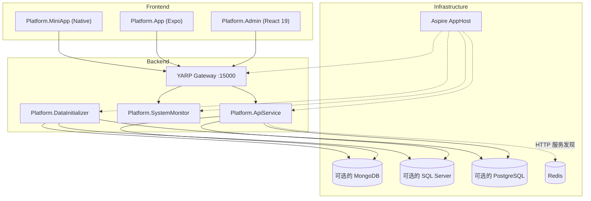

# Aspire Admin Platform

基于 **.NET 10** 与 **.NET Aspire** 构建的**多租户闭环管理系统**。项目通过声明式服务编排、统一数据抽象层与跨端协同架构，为企业提供覆盖**协同办公、资产管理、IoT 监控、AI 智能助手**的全栈闭环解决方案。

## 🎯 系统能做什么

本系统是一个**企业级多租户管理平台**，旨在帮助企业解决以下核心问题：

### 1. 统一工作台
- **任务管理**：任务创建、分配、跟踪、进度看板、任务统计
- **项目管理**：项目立项、成员协作、里程碑跟踪、项目统计
- **公文管理**：公文创建、审批、签发、归档全流程闭环
- **知识库**：知识库管理、文档沉淀、全文检索
- **工作流引擎**：可视化流程设计、审批流转、流程监控

### 2. 园区资产管理
- **资产管理**：楼宇/房源画像、楼铺信息、租赁状态监控
- **招商管理**：线索库、商机转化、招商项目跟进
- **租户服务**：租户档案、走访记录、合同管理
- **企业服务**：服务申请、报修处理、企业需求响应
- **数据统计**：园区运营数据、出租率分析、收益统计

### 3. IoT 物联网
- **网关管理**：网关配置、在线状态监控、远程配置
- **设备管理**：设备注册、关联关系维护、设备孪生
- **数据采集**：传感器数据实时采集、历史报表、数据点管理
- **事件告警**：异常事件监控、告警推送、实时数据观测
- **设备控制**：远程命令下发、期望属性配置

### 4. AI 智能助手（小科）
- **智能对话**：基于 OpenAI 的自然语言交互，支持流式回复
- **MCP 工具**：20个业务领域处理器，AI 可直接调用企业业务逻辑
- **工具能力**：工作流审批、设备控制、数据查询、任务管理、园区运营等
- **配置管理**：AI 模型配置、会话管理、历史记录存档

### 5. 云盘协作
- **文件管理**：GridFS 分布式存储、秒传、大文件支持、文件夹管理
- **版本管理**：文件多版本、历史追溯、版本恢复
- **共享协作**：外链分享、密码保护、过期时间设置、权限控制
- **存储配额**：用户/企业级存储限制、使用统计

### 6. 通知中心
- **实时推送**：SSE 推送，未读数实时更新
- **多端同步**：管理端、移动端、小程序同步已读状态
- **分类筛选**：按分类筛选、按已读/未读筛选

## ✨ 关键特性

- **多租户隔离**：基于 DbContext 自动过滤 CompanyId，数据严格隔离
- **LINQ 数据访问**：全面支持 LINQ 表达式，业务逻辑透明映射
- **审计追踪**：自动记录 CreatedAt/UpdatedAt/CreatedBy/UpdatedBy
- **软删除**：逻辑删除，数据可恢复

- **工作流引擎**
  - 可视化拖拽式流程设计，支持复杂分支条件
  - 流程版本管理，支持回滚与对比
  - 审批历史全程追溯，支持审批意见
  - 支持 Document 与 Variable 两种数据绑定模式

- **实时通知**
  - SSE 推送，未读数实时更新（30s 心跳机制）
  - 多端同步（Web/App/小程序）
  - 支持分类筛选（System/Work/Social/Security）、按已读/未读筛选

- **国密算法支持**
  - SM2 非对称加密、SM3 带盐哈希、SM4 对称加密
  - 数据完整性校验 (SM3-HMAC)
  - 符合国产密码合规要求

- **AI 智能助手（小科）**
  - 基于 OpenAI 流式回复实时推送
  - MCP 协议支持 AI 调用 20 个业务领域工具
  - 智能提示词模板与实时资源映射

- **IoT 物联网**
  - 网关/设备全生命周期管理
  - 实时数据采集与数据点观测
  - 事件告警与远程设备控制

- **云盘协作**
  - GridFS 分布式存储、大文件、秒传
  - 多版本管理、外链分享、存储配额控制

- **系统监控**
  - 实时系统资源监控（CPU/内存/磁盘）
  - 跨平台支持（Windows/Linux/macOS）

- **多端体验**
  - Admin (React 19 + Ant Design 6) 管理后台
  - App (Expo 55 + React Native 0.85) 移动端
  - MiniApp (微信原生) 微信小程序

## 🛠️ 技术栈 (Technology Stack)

| 层次 | 核心技术 | 描述 |
| :--- | :--- | :--- |
| **后端** | **.NET 10 + Aspire 13.2.4** | 最新代 C# 开发框架，支持云原生编排与服务治理。 |
| **数据库** | **EF Core 多数据库支持** | 通过配置动态切换 MongoDB / SQL Server / PostgreSQL，Provider-Agnostic 设计。 |
| **管理端** | **React 19.2.5 + Ant Design 6.3.7 + UmiJS 4** | 面向未来的 Web 开发架构，极致的渲染性能与 UI 细节。 |
| **移动端** | **Expo 55.0 + React Native 0.85.2** | 跨平台原生体验，支持 Reanimated 超流畅动画方案。 |
| **小程序** | **Native WeChat** | 适配微信原生生态，确保低延时与高兼容性。 |
| **观测性** | **OpenTelemetry** | 集成指标、日志与链路追踪，全链路健康监控。 |
| **国密安全** | **BouncyCastle (C#) / sm-crypto (JS)** | 实现 SM2/SM3/SM4 算法，符合国产密码合规要求。 |
| **AI** | **OpenAI / MCP** | 对接全球顶级大模型与标准化模型上下文协议。 |

## 🏗 架构总览

业务 API 以 **Platform.ApiService** 为主（模块化单体），集成文件存储接口；**Platform.SystemMonitor** 提供主机资源监控。两者经 **YARP**（`:15000`）按路径前缀转发。详细路由、分库与卫星服务认证见 [**微服务拆分开发指南**](docs/guides/MICROSERVICE-GUIDE.md)。


```mermaid
graph TD
    subgraph Frontend
        Admin["Platform.Admin (React 19)"]
        App["Platform.App (Expo)"]
        MiniApp["Platform.MiniApp (Native)"]
    end

    subgraph Backend
        Gateway["YARP Gateway :15000"]
        ApiService["Platform.ApiService"]
        SysMonitor["Platform.SystemMonitor"]
        DataInit["Platform.DataInitializer"]
    end

    subgraph Infrastructure
        Aspire["Aspire AppHost"]
        MongoMain[(可选的 MongoDB)]
        SqlServer[(可选的 SQL Server)]
        Postgres[(可选的 PostgreSQL)]
        Redis[(Redis)]
    end

    Admin & App & MiniApp --> Gateway
    Gateway --> ApiService
    Gateway --> SysMonitor
    ApiService --> MongoMain
    ApiService --> SqlServer
    ApiService --> Postgres
    ApiService -.->|HTTP 服务发现| Redis
    Aspire -.-> Gateway
    Aspire -.-> ApiService
    Aspire -.-> SysMonitor
    Aspire -.-> DataInit
    DataInit --> MongoMain
    DataInit --> SqlServer
    DataInit --> Postgres
```

- **Platform.AppHost**：Aspire 编排入口；默认拉起 **多数据库支持**（MongoDB/SQL Server/PostgreSQL）、**OpenAI（可选）** 及各 .NET 项目。通过 `Database:Provider` 配置切换。
- **Platform.ApiService**：核心业务 API（45个控制器，涵盖工作流、IoT、园区、AI、云盘等业务逻辑）。
- **Platform.SystemMonitor**：进程级 CPU/内存/磁盘等指标；**不连接业务库**。
- **Platform.Admin**：基于 Ant Design 6 打造的管理后台（23个主要功能模块），强调原生体验与高性能操作视图。
- **Platform.MiniApp**：涵盖园区全生命周期管理的轻量化微信小程序端。
- **Platform.App**：基于 Expo 的跨平台原生移动端应用，提供一致性的移动访问与消息触达。

## 📂 项目结构 (Project Structure)

```text
aspire-admin
├── Platform.AppHost           # .NET Aspire 编排项目，管理所有微服务与资源
│   ├── AppHost.cs            # 主编排配置（服务发现、YARP 路由、健康检查、环境变量注入）
│   ├── appsettings.json      # 配置文件（JWT、OpenAI、SMTP、InternalService 密钥等）
│   └── mongo-init/           # MongoDB 初始化脚本
├── Platform.ApiService        # 核心业务 API（45个控制器，涵盖工作流、IoT、园区、AI、云盘等业务逻辑）
│   ├── Controllers/          # API 控制器（45个控制器）
│   ├── Services/             # 业务服务层
│   │   ├── McpService.cs    # MCP 服务
│   │   └── Mcp/             # MCP 工具处理器（20个 Handlers）
│   ├── Models/               # 数据模型
│   ├── Options/              # 配置选项类
│   └── docs/                 # 服务文档
├── Platform.SystemMonitor    # 系统资源监控服务（无业务数据库）
├── Platform.ServiceDefaults   # 通用弹性配置、服务目录与公共实体定义
│   ├── Services/             # 数据库上下文 (PlatformDbContext)
│   └── Models/               # 基础实体、接口定义
├── Platform.DataInitializer   # 数据库索引初始化与基础数据种子填充
├── Platform.Admin             # 管理后台 (React 19 + Ant Design 6 + UmiJS 4)
│   ├── src/
│   │   ├── pages/           # 页面组件
│   │   ├── components/      # 通用组件
│   │   ├── services/        # API 服务
│   │   └── locales/         # 18 种语言国际化
│   └── config/              # UmiJS 配置
├── Platform.App               # 移动端应用 (Expo 54 + React Native 0.83)
│   ├── app/                 # Expo Router 页面
│   ├── components/          # 组件库
│   └── services/            # API 服务
├── Platform.MiniApp           # 微信小程序 (Native)
│   ├── pages/               # 小程序页面
│   ├── components/          # 小程序组件
│   └── utils/               # 工具函数
└── docs                       # 详细设计文档、MCP 协议规范与业务手册
```

## 🔙 后端服务 (Platform.ApiService)

- **多租户安全**：通过 EF Core 全局查询过滤器自动注入 `CompanyId`，确保物理或逻辑层的数据严格隔离。
- **高性能 SSE**：支持单向长连接推送，用于向客户端推送 AI 生成内容、实时通知及心跳状态（30s 间隔）。
- **Security & Crypto**：采用 AES-256-GCM 高强度加密用户密码本，支持动态密钥管理与强度审计。
- **交互式文档**：内置 **Scalar/OpenAPI** 预览，支持在线调试与 SDK 自动生成。
- **健康检查**：提供 `/health` 端点，支持 Aspire 自动健康监控。
- **分布式追踪**：集成 OpenTelemetry，全链路日志、指标与追踪。
- **多数据库支持**：通过 Aspire 配置（`Database:Provider`）动态切换 MongoDB / SQL Server / PostgreSQL，PlatformDbContext 完全 Provider-Agnostic。

## 🖥 管理后台 (Platform.Admin)

- **极致 UI**：基于 React 19、Ant Design 6 与 UmiJS 4，全面采用原生变量与高性能组件。
- **核心功能模块**（23个主要模块）：
  - **协同中心**：任务管理、项目管理、公文管理、工作流审批
  - **资产中心**：园区资产管理、招商管理、租户服务、企业服务
  - **智能中心**：AI 对话、小科配置、MCP 规则链路
  - **物联网中心**：网关管理、设备监控、数据点采集、事件告警
  - **文件存储**：云盘管理、文件分享、版本控制、存储配额
  - **系统管理**：用户管理、角色权限、菜单配置、组织架构、系统监控
  - **知识管理**：知识库、文档管理、知识检索
  - **数据看板**：仪表盘、统计报表、数据可视化

## 🧩 MCP 服务 (Model Context Protocol)

本项目深度集成了 **MCP 协议**，使 AI 助手能够安全地访问企业内部的核心业务逻辑。

### 架构优化

经过简化重构，MCP 服务从过度设计的 8 个独立服务合并为单一的 `McpService` 类，保留所有核心功能的同时大幅提升了可维护性：

- ✅ **缓存优化**：使用 `IMemoryCache` 缓存工具列表（10 分钟过期）
- ✅ **安全验证**：防 SQL/NoSQL 注入、XSS 攻击、参数长度限制
- ✅ **审计日志**：记录所有工具执行（用户、工具名、参数、结果、耗时）
- ✅ **配置化**：通过 `McpScoringOptions` 支持灵活配置
- ✅ **性能优化**：倒排索引实现 O(1) 关键词查找
- ✅ **并行执行**：使用 `Task.WhenAll` 并行执行多个工具
- ✅ **多租户继承**：业务实体 **必须** 继承 `MultiTenantEntity` 以实现自动隔离

### 核心工具集 (20 Handlers)

- **工作流自动化 (Workflow)**
  - 🔍 **查询**：检索流程定义、跟踪运行中的实例
  - 🛠️ **操作**：AI 可直接执行审批、驳回、退回或转办操作
  - 📑 **追溯**：获取完整的审批历史轨迹

- **物联网交互 (IoT)**
  - 📡 **网关通信**：查询在线网关与关联设备
  - 📈 **数据点观测**：拉取传感器最新的实时数据点观测值，自动生成报表
  - 🔔 **事件告警**：实时监控设备状态与异常事件

- **园区管理 (Park)**
  - 🏢 **资产管理**：房源画像、楼铺信息、租赁状态
  - 🤝 **招商管理**：线索跟进、商机转化、合同签订
  - 👥 **租户服务**：租户档案、走访记录、企业服务

- **企业级协作**
  - **用户/组织**：跨租户身份检索与详细 Profile 查询
  - **任务/项目**：自动化创建、指派负责人、更新进度看板
  - **公文/表单**：文档管理、表单定义、审批流程
  - **云硬盘/通知**：文件管理、版本控制、通知推送

- **系统管理**
  - **菜单/权限**：动态菜单配置、角色权限管理
  - **规则引擎**：动态规则配置、资源管理、提示词模板
  - **加入申请**：企业加入审批、成员邀请

### 实时资源与专家提示词 (Resources & Prompts)

- **实时资源映射 (URI)**
  - `rule://{id}`: 动态规则配置快照
  - `workflow://{id}`: 流程定义与运行状态
  - `iot://{id}`: 设备健康度与统计数据

- **智能提示词 (Smart Prompts)**
  - 内置 `workflow_analysis`、`device_monitoring` 等专家级模板
  - 减少 Prompt Engineering 成本
  - 显著提升 AI 在专业业务场景下的推理深度

## 🚀 快速开始

### 1. 软件环境
- **Runtime**: [.NET 10 SDK](https://dotnet.microsoft.com/download/dotnet/10.0), Node.js 20+
- **Infrastructure**: Docker Desktop（或其他容器引擎）

### 2. 初始化与运行

```bash
# 1. 克隆项目并进入目录
git clone <repository-url>
cd aspire-admin

# 2. 安装前端依赖（可选，Aspire 会自动安装）
cd Platform.Admin && npm install && cd ..
cd Platform.App && npm install && cd ..
cd Platform.MiniApp && npm install && cd ..

# 3. 启动并编排服务（Aspire 会拉起 MongoDB 与各后端项目；默认不含 Redis）
dotnet run --project Platform.AppHost
```

### 3. 访问服务

启动成功后，可以通过以下地址访问各个服务：

| 服务 | 地址 | 说明 |
|------|------|------|
| **Aspire Dashboard** | <http://localhost:17091> | 查看所有服务的实时日志、指标与分布式追踪 |
| **API Gateway** | <http://localhost:15000> | YARP 网关统一入口 |
| **管理后台 (Admin)** | <http://localhost:15000> | React 管理界面（23个功能模块） |
| **移动端预览 (Expo Web)** | <http://localhost:15002> | Expo Web 预览 |
| **小程序预览** | <http://localhost:15003> | 微信小程序静态资源 |
| **API 文档 (Scalar)** | <http://localhost:17091> | 通过 Aspire Dashboard 对应服务入口访问 |

### 4. 可选配置

在 `Platform.AppHost/appsettings.json` 或 `appsettings.Development.json` 中配置：

- **数据库提供者**：配置 `Database:Provider` 切换数据库类型（`mongodb` / `sqlserver` / `postgresql`）
- **OpenAI/Azure OpenAI**：配置 `Parameters:openai-openai-endpoint` 以解锁完整 AI 能力
- **JWT 密钥**：配置 `Jwt:SecretKey` 用于身份认证（ApiService 与卫星服务需一致，通常由 AppHost 注入）
- **服务间密钥**：可选配置 `InternalService:ApiKey`；未配置时 AppHost 会生成随机值并注入 ApiService
- **微服务与网关路径**：见 [docs/guides/MICROSERVICE-GUIDE.md](docs/guides/MICROSERVICE-GUIDE.md)
- **服务副本数**：配置 `ApiService:Replicas` 调整 API 服务实例数量（默认 3，dotnet watch 模式强制为 1）
- **SSL/HTTPS**：支持自定义证书注入以满足生产安全需求

## 💡 核心设计理念 (Core Design)

### 1. 声明式数据访问 (PlatformDbContext)

本项目核心逻辑基于 `PlatformDbContext` (EF Core)。开发者仅需直接注入 `DbContext` 即可。该层级自动处理：

- **多租户透明过滤**：根据操作上下文自动追加 `CompanyId` 过滤（通过 EF Core 全局查询过滤器）
- **审计追踪**：全自动记录实体创建、修改的时间与人员（CreatedAt/By, UpdatedAt/By）
- **软删除**：支持逻辑删除，自动过滤已删除数据
- **LINQ 支持**：完全支持 LINQ 表达式，实现业务逻辑在内存与数据库间的透明映射
- **多数据库兼容**：PlatformDbContext 完全 Provider-Agnostic，支持 MongoDB / SQL Server / PostgreSQL 等 EF Core 提供者

### 2. 闭环工作流引擎

不同于传统的线性审批，本项目支持：

- **动态节点跳转**：基于条件表达式的自动分支
- **可视化设计**：支持拖拽式流程设计与工作流快照
- **表单绑定**：支持 `Document` 与 `Variable` 两种数据绑定模式
- **业务数据联动**：流程状态变更可实时触发表单数据更新、通知推送及第三方 Webhook 回调
- **版本管理**：流程定义支持版本管理，支持回滚与对比

### 3. 多端实时同步

利用 **SSE (Server-Sent Events)** 实现后端到多端的极速状态同步：

- 管理端操作后，小程序及 App 能在秒级收到通知或状态更新
- 支持心跳检测（30s 间隔），自动重连机制
- AI 流式回复实时推送，提升用户体验

### 4. MCP 服务简化架构

经过重构优化，MCP 服务采用简化架构：

- **单一职责**：从 8 个独立服务合并为单个 `McpService` 类
- **保留核心功能**：缓存、验证、审计、配置化、性能优化
- **易于维护**：代码集中，逻辑清晰，降低维护成本
- **高性能**：倒排索引、并行执行、智能缓存

## 🔐 安全与合规 (Security)

- **国密合规 (Guomi Compliance)**：
  - **身份认证**：基于 SM2 非对称加密传输 + SM3 带盐哈希存储，替代传统 RSA/BCrypt。
  - **数据存储**：支持基于 SM4 的字段级透明加密保护，增强数据机密性。
  - **完整性保护**：关键审计日志与业务表内置基于 SM3-HMAC 的防篡改指纹校验。
- **存储安全**：
  - **GridFS** 分片存储，文件碎片化分布，增强数据隐私。
- **多租户隔离**：通过 EF Core 全局查询过滤器自动注入 `CompanyId`，确保数据严格隔离。
- **传输安全**：原生支持全链路 HTTPS，自动适配 .NET Aspire 的开发/生产安全策略。
- **输入验证**：MCP 服务内置防 SQL/NoSQL 注入、XSS 攻击检测。
- **审计日志**：所有敏感操作自动记录审计日志，包含操作人、时间、参数、结果。

---

项目致力于提供最前沿的企业级应用开发模版，结合了 .NET 生态最新的编排能力与现代前端的最佳实践。

## 🤝 参与贡献 (Contribution)

欢迎通过提交 Issue 或 Pull Request 来协助优化此项目。在提交代码前，请确保：

- 遵循 **Clean Architecture** 架构规范
- UI 变更符合项目的 **高品质设计准则**
- 后端逻辑优先考虑 **多租户隔离**（业务实体必须继承 `MultiTenantEntity`） 与 **DbContext 兼容性**
- 代码通过编译且无警告
- 添加必要的单元测试

## 📊 附录：完整控制器列表

| 模块 | 控制器 | 功能说明 |
|------|--------|----------|
| **认证** | AuthController | 用户登录、注册、Token 刷新 |
| **用户** | UserController, AvatarController | 用户管理、个人资料、头像管理 |
| **角色权限** | RoleController, MenuController | 角色管理、菜单权限配置 |
| **任务项目** | TaskController, ProjectController, ProjectStatisticsController | 任务管理、项目管理、项目统计 |
| **公文** | DocumentController | 公文创建、审批、签发、归档 |
| **工作流** | WorkflowController | 流程定义、流程实例、审批操作 |
| **IoT** | IoTController | 网关管理、设备管理、数据采集 |
| **园区** | ParkAssetController, ParkTenantController, ParkVisitController, ParkInvestmentController, ParkEnterpriseServiceController, ParkStatisticsController | 资产、租户、走访、招商、企业服务 |
| **文件存储** | CloudStorageController, FileShareController, FileVersionController, FileStorageController | 云盘、分享、版本、存储管理 |
| **知识库** | KnowledgeBaseController, KnowledgeDocumentController | 知识库、文档管理 |
| **AI** | ChatAiController, ChatSessionsController, ChatHistoryController, ChatMessagesController, XiaokeConfigController | AI对话、会话、配置 |
| **系统** | SystemMonitorController, DashboardController, DashboardVersionController | 系统监控、仪表盘 |
| **其他** | WebScraperController, FormController, RuleController, OrganizationController, SocialController, NotificationController, McpController, CompanyController, StorageQuotaController, QuotaController, StreamController, PublicController | 爬虫、表单、规则、组织、社交、通知、MCP、企业、配额、流、公共接口 |

## 📄 开源协议

基于 [MIT License](LICENSE) 开源。
