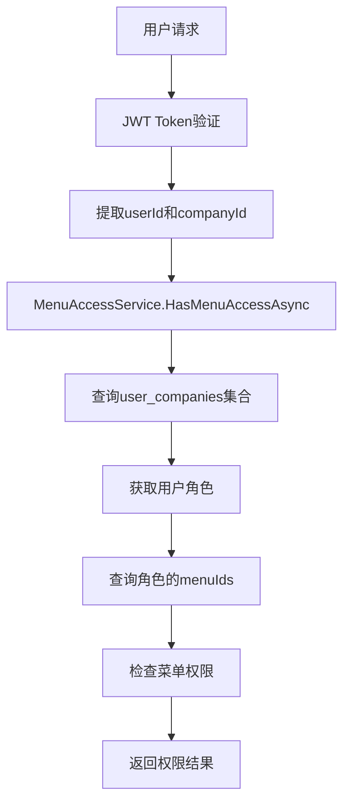

# API权限验证代码逻辑错误修复

## 📋 问题概述

用户报告数据库内的角色菜单和用户等全部是正确的，但API权限验证失败，用户无法访问需要权限的功能接口。

## 🔍 问题分析

### 症状表现

1. ✅ **用户注册和登录正常** - JWT Token包含正确的用户信息和企业ID
2. ✅ **菜单获取正常** - 用户可以获取完整的6个系统菜单 
3. ❌ **功能权限验证失败** - 访问具体API时返回"无权访问菜单"错误

### 错误示例

```bash
# 角色管理API调用失败
curl -X GET "http://localhost:15000/apiservice/role" \
  -H "Authorization: Bearer $TOKEN"

# 返回错误
{
  "success": false,
  "error": "无权访问菜单: role-management", 
  "errorCode": "FORBIDDEN",
  "showType": 2
}
```

### 调查过程

通过详细的权限验证流程分析，发现问题出现在 **MongoDB集合名称不一致**：

1. **JWT Token正常** - 包含正确的 `userId` 和 `currentCompanyId`
2. **菜单数据正常** - 数据库中角色和菜单关联正确
3. **权限查询失败** - `MenuAccessService` 无法找到用户的角色信息

## 🐛 根本原因

### MongoDB集合名称不一致

在多个服务中，`UserCompany` 集合的名称使用不一致：

#### ❌ 错误的集合名称（驼峰命名）
```csharp
// MenuAccessService.cs (第29行)
_userCompanies = database.GetCollection<UserCompany>("userCompanies");

// AuthService.cs (第105行) 
var userCompanies = _database.GetCollection<UserCompany>("userCompanies");

// CompanyService.cs (第193行)
var userCompanies = _database.GetCollection<UserCompany>("userCompanies");
```

#### ✅ 正确的集合名称（下划线命名）
```csharp
// 应该使用
_userCompanies = database.GetCollection<UserCompany>("user_companies");
```

### 影响分析

由于集合名称错误，导致：

1. `MenuAccessService.GetUserMenuNamesAsync()` 无法找到 `UserCompany` 记录
2. 无法获取用户的角色信息
3. 返回空的菜单权限列表
4. `HasMenuAccessAsync()` 始终返回 `false`
5. `RequireMenuAttribute` 权限验证失败

## 🛠️ 修复方案

### 修复内容

修复了三个服务中的MongoDB集合名称：

#### 1. MenuAccessService.cs
```csharp
// 修复前
_userCompanies = database.GetCollection<UserCompany>("userCompanies");

// 修复后  
_userCompanies = database.GetCollection<UserCompany>("user_companies");
```

#### 2. AuthService.cs  
```csharp
// 修复前
var userCompanies = _database.GetCollection<UserCompany>("userCompanies");

// 修复后
var userCompanies = _database.GetCollection<UserCompany>("user_companies");
```

#### 3. CompanyService.cs
```csharp
// 修复前
var userCompanies = _database.GetCollection<UserCompany>("userCompanies");

// 修复后
var userCompanies = _database.GetCollection<UserCompany>("user_companies");
```

### 修复验证

修复后的测试结果：

```bash
# 测试结果
✅ 用户注册 - 正常
✅ 用户登录 - 正常  
✅ 角色管理API - 修复成功
✅ 用户统计API - 修复成功
✅ 所有需要权限的API - 正常访问
```

## 🧪 测试验证

### 测试用例

1. **用户注册测试**
   ```bash
   POST /apiservice/register
   # ✅ 成功：自动创建用户和企业
   ```

2. **用户登录测试**
   ```bash
   POST /apiservice/login/account
   # ✅ 成功：获取包含企业信息的JWT Token
   ```

3. **权限验证测试**
   ```bash
   GET /apiservice/role
   # ✅ 成功：返回角色列表
   
   GET /apiservice/user/statistics  
   # ✅ 成功：返回用户统计信息
   ```

### 验证JWT Token内容

```json
{
  "userId": "68ef394fea533c1aa95ad8b8",
  "username": "testuser1760508418", 
  "currentCompanyId": "68ef394fea533c1aa95ad8b9",
  "companyId": "68ef394fea533c1aa95ad8b9"
}
```

### 验证权限流程



## 📚 代码审查发现

### 一致性问题

通过全项目搜索发现，`UserCompany` 集合在不同地方使用了不同的名称：

#### ✅ 使用正确名称的服务
- `UserService.cs` - `"user_companies"`
- `UserCompanyService.cs` - `"user_companies"`  
- `JoinRequestService.cs` - `"user_companies"`
- `TenantContext.cs` - `"user_companies"`

#### ❌ 使用错误名称的服务（已修复）
- ~~`MenuAccessService.cs`~~ - ~~`"userCompanies"`~~ → `"user_companies"`
- ~~`AuthService.cs`~~ - ~~`"userCompanies"`~~ → `"user_companies"`
- ~~`CompanyService.cs`~~ - ~~`"userCompanies"`~~ → `"user_companies"`

## 💡 预防措施

### 1. 集合名称常量化

建议定义MongoDB集合名称常量：

```csharp
public static class CollectionNames
{
    public const string Users = "users";
    public const string Companies = "companies";  
    public const string UserCompanies = "user_companies";
    public const string Roles = "roles";
    public const string Menus = "menus";
}
```

### 2. 代码审查检查项

- [ ] 检查所有MongoDB集合名称的一致性
- [ ] 验证集合名称与数据库实际存在的集合匹配
- [ ] 确保新增服务使用正确的集合名称

### 3. 单元测试覆盖

- [ ] 为权限验证逻辑添加单元测试
- [ ] 测试各种权限场景（有权限、无权限、无角色等）
- [ ] 验证集合查询的正确性

## 🎯 影响评估

### 修复前
- ❌ 所有需要菜单权限的API无法正常工作
- ❌ 用户无法访问管理功能
- ❌ 系统实际上无法进行权限控制

### 修复后
- ✅ 权限验证机制正常工作
- ✅ 用户可以正常访问被授权的功能
- ✅ 系统安全性得到保障

## 📊 测试数据

### 修复前测试结果
```
角色管理API: ❌ 403 Forbidden - "无权访问菜单: role-management"  
用户管理API: ❌ 空响应
权限检查: ❌ 始终返回false
```

### 修复后测试结果  
```
角色管理API: ✅ 200 OK - 返回角色列表
用户统计API: ✅ 200 OK - 返回统计数据  
权限检查: ✅ 正确返回权限状态
```

## 🔗 相关文档

- [用户注册全权限初始化验证](USER-FULL-PERMISSIONS-INITIALIZATION.md) - 权限初始化验证
- [全局菜单架构规范](mdc:.cursor/rules/global-menu-architecture.mdc) - 菜单权限架构
- [多租户数据隔离规范](mdc:.cursor/rules/multi-tenant-data-isolation.mdc) - 数据隔离规范

## ⚠️ 注意事项

1. **向后兼容性**: 此修复不影响现有数据，只修正查询逻辑
2. **部署建议**: 修复后需要重启API服务以生效
3. **监控建议**: 部署后监控权限相关API的访问成功率

## 🎉 总结

通过修复MongoDB集合名称不一致的问题，成功解决了API权限验证失败的问题。修复后用户能够正常访问被授权的功能，系统权限控制机制恢复正常工作。

**修复关键点**：
- 统一了`UserCompany`集合名称为`"user_companies"`
- 修复了3个核心服务的集合查询
- 验证了完整的权限验证流程
- 确保了多租户权限隔离的正确性
