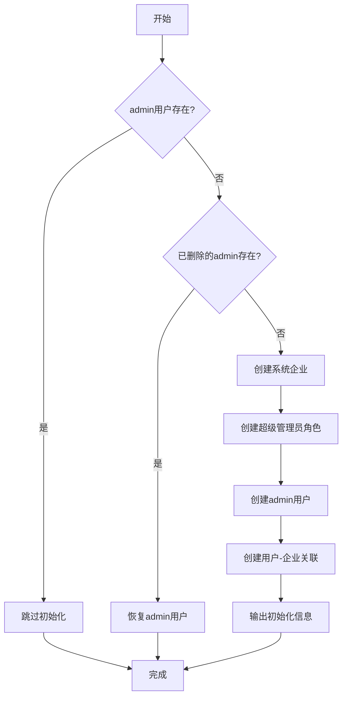

# 管理员初始化系统 v3.1

## 📋 概述

管理员初始化系统已升级到 v3.1 版本，现在支持多租户架构。初始化脚本会自动创建：

- ✅ 系统企业（Company）
- ✅ 超级管理员角色（Role）
- ✅ 管理员用户（AppUser）
- ✅ 用户-企业关联（UserCompany）

## 🎯 初始化内容

### 1. 系统企业（Company）

| 字段 | 值 | 说明 |
|-----|-----|-----|
| **名称** | 系统企业 | 默认系统企业 |
| **代码** | system | 唯一标识符 |
| **描述** | 默认系统企业，用于超级管理员 | - |
| **行业** | 系统 | - |
| **最大用户数** | 10000 | 足够容纳系统级用户 |
| **过期时间** | null | 永不过期 |
| **状态** | active | 激活状态 |

### 2. 超级管理员角色（Role）

| 字段 | 值 | 说明 |
|-----|-----|-----|
| **名称** | 超级管理员 | 系统最高权限角色 |
| **描述** | 系统超级管理员，拥有所有权限 | - |
| **菜单权限** | [] | 稍后由菜单初始化脚本填充 |
| **功能权限** | [] | 稍后由权限初始化脚本填充 |
| **状态** | active | 激活状态 |

### 3. 管理员用户（AppUser）

| 字段 | 值 | 说明 |
|-----|-----|-----|
| **用户名** | admin | 登录账号 |
| **密码** | admin123 | 默认密码（⚠️ 建议首次登录后修改） |
| **邮箱** | admin@example.com | - |
| **姓名** | 系统管理员 | 显示名称 |
| **所属企业** | system | 系统企业ID |
| **当前企业** | system | 当前选中企业 |
| **个人企业** | system | 个人企业ID |
| **状态** | active | 激活状态 |

### 4. 用户-企业关联（UserCompany）

| 字段 | 值 | 说明 |
|-----|-----|-----|
| **用户ID** | admin的ID | - |
| **企业ID** | system的ID | - |
| **角色列表** | [超级管理员ID] | 在系统企业中的角色 |
| **是否管理员** | true | 企业管理员 |
| **状态** | active | 激活状态 |

## 🔧 初始化流程



## 🚀 使用方法

### 自动初始化

系统启动时会自动执行初始化脚本：

```bash
# 启动应用（AppHost会自动运行初始化）
dotnet run --project Platform.AppHost
```

### 手动初始化

如果需要手动触发初始化，可以在 `Program.cs` 中调用：

```csharp
var adminInitializer = new CreateAdminUser(database);
await adminInitializer.CreateDefaultAdminAsync();
```

## 📊 初始化输出示例

```
✅ 创建系统企业: 系统企业 (Code: system)
✅ 创建超级管理员角色: 超级管理员
✅ 创建管理员用户: admin (密码: admin123)
✅ 创建用户-企业关联: admin ↔ 系统企业

============================================================
🎉 管理员初始化完成！
============================================================
企业名称: 系统企业
企业代码: system
管理员账号: admin
管理员密码: admin123
管理员邮箱: admin@example.com
管理员角色: 超级管理员
============================================================
```

## 🔒 默认登录凭据

| 字段 | 值 |
|-----|-----|
| **用户名** | admin |
| **密码** | admin123 |
| **企业代码** | system（v3.1不再需要输入） |

⚠️ **安全提示**：首次登录后，强烈建议立即修改默认密码！

## 🎯 多租户架构说明

### v3.1 多租户模型

```
┌─────────────────────────────────────────────────────────┐
│                      系统企业 (system)                    │
├─────────────────────────────────────────────────────────┤
│  - 用于系统级管理员                                       │
│  - 最大用户数：10000                                      │
│  - 永不过期                                              │
└─────────────────────────────────────────────────────────┘
                            ↓
                    用户-企业关联
                            ↓
┌─────────────────────────────────────────────────────────┐
│                  管理员用户 (admin)                       │
├─────────────────────────────────────────────────────────┤
│  - CompanyId: system企业ID                               │
│  - CurrentCompanyId: system企业ID                        │
│  - PersonalCompanyId: system企业ID                       │
└─────────────────────────────────────────────────────────┘
                            ↓
                  在系统企业中的角色
                            ↓
┌─────────────────────────────────────────────────────────┐
│                超级管理员角色 (超级管理员)                 │
├─────────────────────────────────────────────────────────┤
│  - 拥有所有菜单权限                                       │
│  - 拥有所有功能权限                                       │
│  - 可以管理所有企业                                       │
└─────────────────────────────────────────────────────────┘
```

### 数据关系

```typescript
// 1. Company (系统企业)
{
  id: "...",
  code: "system",
  name: "系统企业",
  maxUsers: 10000,
  expiresAt: null
}

// 2. Role (超级管理员角色)
{
  id: "...",
  name: "超级管理员",
  description: "系统超级管理员，拥有所有权限",
  menuIds: [...],
  permissionIds: [...]
}

// 3. AppUser (管理员用户)
{
  id: "...",
  username: "admin",
  companyId: "<系统企业ID>",          // 所属企业
  currentCompanyId: "<系统企业ID>",   // 当前企业
  personalCompanyId: "<系统企业ID>"   // 个人企业
}

// 4. UserCompany (用户-企业关联)
{
  userId: "<admin用户ID>",
  companyId: "<系统企业ID>",
  roleIds: ["<超级管理员角色ID>"],   // 在该企业中的角色
  isAdmin: true,                     // 企业管理员
  status: "active"                   // 状态
}
```

## 🔄 与旧版本的差异

### v2.0（已废弃）

```csharp
// ❌ 旧版本：直接在用户上存储角色
var adminUser = new AppUser
{
    Username = "admin",
    RoleIds = new List<string> { adminRoleId },  // ❌ 直接存储
    // ❌ 没有企业概念
};
```

### v3.1（当前版本）

```csharp
// ✅ 新版本：通过企业关联存储角色
var adminUser = new AppUser
{
    Username = "admin",
    CompanyId = systemCompanyId,          // ✅ 所属企业
    CurrentCompanyId = systemCompanyId,   // ✅ 当前企业
    PersonalCompanyId = systemCompanyId,  // ✅ 个人企业
};

// ✅ 角色存储在用户-企业关联中
var userCompany = new UserCompany
{
    UserId = adminUserId,
    CompanyId = systemCompanyId,
    RoleIds = new List<string> { adminRoleId },  // ✅ 通过关联表
    IsAdmin = true
};
```

## 🛠️ 维护和管理

### 检查初始化状态

```csharp
// 检查admin用户
db.users.find({ username: "admin", isDeleted: false })

// 检查系统企业
db.companies.find({ code: "system", isDeleted: false })

// 检查用户-企业关联
db.userCompanies.find({ userId: "<adminId>", isDeleted: false })
```

### 重置管理员密码

```csharp
var passwordHash = BCrypt.Net.BCrypt.HashPassword("newPassword");
db.users.updateOne(
    { username: "admin" },
    { $set: { passwordHash: passwordHash, updatedAt: new Date() } }
)
```

### 恢复已删除的管理员

初始化脚本会自动检测并恢复已软删除的 admin 用户。

## 📚 相关文档

- [多租户系统说明](../features/MULTI-TENANT-SYSTEM.md)
- [用户-企业关联设计](../features/MULTI-COMPANY-MEMBERSHIP-DESIGN.md)
- [权限系统文档](../permissions/CRUD-PERMISSION-SYSTEM.md)
- [BaseEntity 标准](../optimization/BASE-ENTITY-STANDARD.md)

## 🎯 最佳实践

1. ✅ **首次登录后立即修改密码**
2. ✅ **为不同企业创建不同的管理员**
3. ✅ **定期检查系统企业的配置**
4. ✅ **使用超级管理员角色管理其他企业**
5. ✅ **不要删除系统企业和超级管理员角色**

## ⚠️ 注意事项

1. **系统企业**：请勿删除或修改系统企业的 code（"system"）
2. **超级管理员角色**：请勿删除超级管理员角色
3. **密码安全**：生产环境请务必修改默认密码
4. **数据一致性**：请勿直接修改数据库中的关联关系

## 🔧 故障排查

### 问题：登录失败

**可能原因**：
- 密码错误
- admin 用户被删除
- 用户-企业关联缺失

**解决方法**：
```bash
# 重新运行初始化脚本
dotnet run --project Platform.AppHost

# 或者手动检查数据库
mongo
use platformdb
db.users.find({ username: "admin" })
db.userCompanies.find({ userId: "<adminId>" })
```

### 问题：权限不足

**可能原因**：
- 超级管理员角色的权限未初始化
- 菜单未初始化

**解决方法**：
```bash
# 运行权限初始化脚本
# 运行菜单初始化脚本
```

## 📝 更新日志

### v3.1.0 (当前版本)
- ✅ 支持多租户架构
- ✅ 自动创建系统企业
- ✅ 创建用户-企业关联
- ✅ 设置 CompanyId、CurrentCompanyId、PersonalCompanyId
- ✅ 角色从用户模型移到关联表

### v2.0 (已废弃)
- ❌ 单租户架构
- ❌ 角色直接存储在用户上
- ❌ 没有企业概念

---

**最后更新**: 2024-01-14  
**版本**: v3.1.0  
**状态**: ✅ 稳定

