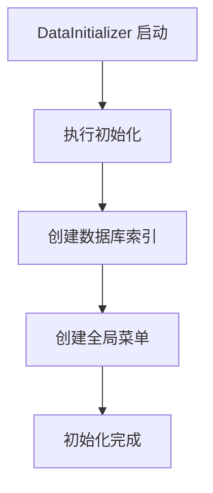

# 数据初始化微服务架构

## 📋 概述

`Platform.DataInitializer` 是一个专门负责数据初始化工作的微服务，将原本在 `Platform.ApiService` 中的数据初始化逻辑分离出来，实现更清晰的职责分离和更好的可维护性。

## ✨ 功能特性

### 核心功能
- **数据库索引创建** - 自动创建所有必要的 MongoDB 索引
- **全局菜单初始化** - 创建系统级菜单（所有企业共享）
- **单实例运行** - 确保只有一个实例执行初始化
- **幂等性保证** - 可以安全地重复执行初始化操作

### 技术特性
- **微服务架构** - 独立的 .NET 9 Web API 服务
- **Aspire 集成** - 完全集成到 .NET Aspire 生态
- **健康检查** - 提供 `/health` 端点监控服务状态
- **API 文档** - 集成 Scalar API 文档
- **日志记录** - 详细的初始化过程日志

## 🏗️ 架构设计

### 服务职责分离

```
┌─────────────────────────┐    ┌─────────────────────────┐
│   Platform.ApiService   │    │ Platform.DataInitializer│
│                         │    │                         │
│  • 用户认证            │    │  • 数据库索引创建       │
│  • 业务逻辑            │    │  • 菜单初始化           │
│  • API 接口            │    │  • 初始化状态管理       │
│  • 数据操作            │    │  • 单实例运行保证       │
└─────────────────────────┘    └─────────────────────────┘
            │                              │
            └──────────┬───────────────────┘
                       │
            ┌─────────────────────────┐
            │      MongoDB            │
            │                         │
            │  • 数据存储             │
            │  • 索引管理             │
            └─────────────────────────┘
```

### 初始化流程



## 🔧 实现细节

### 1. 数据初始化服务

```csharp
public class DataInitializerService : IDataInitializerService
{
    public async Task InitializeAsync()
    {
        // 1. 创建数据库索引
        await CreateIndexesAsync();
        
        // 2. 创建全局菜单
        await CreateSystemMenusAsync();
    }
}
```

**功能：**
- 索引创建（幂等性）
- 菜单初始化（全局资源）
- 错误处理和日志记录
- 单实例运行保证

### 2. 菜单初始化

```csharp
private async Task CreateSystemMenusAsync()
{
    // 检查是否已初始化
    var existingCount = await menus.CountDocumentsAsync(Builders<Menu>.Filter.Empty);
    if (existingCount > 0) return;
    
    // 创建全局菜单
    var welcomeMenu = new Menu { Name = "welcome", Title = "欢迎", ... };
    var systemMenu = new Menu { Name = "system", Title = "系统管理", ... };
    
    // 插入菜单和子菜单
}
```

## 🚀 部署和配置

### AppHost 配置

```csharp
// 数据初始化服务
var datainitializer = builder.AddProject<Projects.Platform_DataInitializer>("datainitializer")
    .WithReference(mongodb)
    .WithEnvironment("ASPNETCORE_ENVIRONMENT", DevelopmentEnvironment)
    .WithEnvironment("Logging__LogLevel__Platform.DataInitializer", DebugLogLevel)
    .WithHttpEndpoint()
    .WithHttpHealthCheck("/health");

// API 服务依赖数据初始化服务
var apiservice = builder.AddProject<Projects.Platform_ApiService>("apiservice")
    .WithReference(mongodb)
    .WithReference(datainitializer) // 依赖关系
    .WithHttpEndpoint().WithReplicas(3);
```

### 服务依赖关系

```
MongoDB ← DataInitializer ← ApiService
                ↓
            Admin/App (前端应用)
```

## 📊 监控和日志

### 健康检查端点

```http
GET /health
```

**响应示例：**
```json
{
  "status": "healthy",
  "service": "DataInitializer"
}
```

### 初始化端点

```http
POST /initialize
```

**功能：**
- 手动触发数据初始化
- 返回初始化状态
- 错误处理和报告

### 日志记录

```
========== 开始数据初始化 ==========
当前实例获得初始化锁，开始执行初始化...
开始创建数据库索引...
✅ 创建索引: menus.name (全局唯一)
✅ 创建索引: menus.parentId + sortOrder
开始创建全局系统菜单...
全局系统菜单创建完成，共创建 7 个菜单
所有初始化操作执行完成
========== 数据初始化完成 ==========
```

## 🔍 故障排除

### 常见问题

#### 1. 初始化失败

**现象：** 日志显示初始化失败
**原因：** MongoDB 连接问题或权限不足
**解决：** 检查 MongoDB 连接配置和权限

#### 2. 初始化重复执行

**现象：** 多次启动时重复执行初始化
**原因：** 幂等性设计，重复执行是安全的
**解决：** 无需处理，系统会检查已存在的数据

#### 3. 菜单重复创建

**现象：** 菜单数据重复
**原因：** 初始化逻辑问题
**解决：** 检查幂等性逻辑，确保正确判断已存在数据

### 调试方法

1. **查看初始化日志**
   ```bash
   # 在 Aspire Dashboard 中查看 DataInitializer 服务日志
   ```

2. **手动触发初始化**
   ```bash
   curl -X POST http://localhost:15000/datainitializer/initialize
   ```

3. **检查数据库状态**
   ```javascript
   // MongoDB 查询
   db.menus.countDocuments() // 检查菜单数量
   db.menus.getIndexes()     // 检查索引
   ```

## 🎯 最佳实践

### 1. 初始化顺序

- DataInitializer 必须在 ApiService 之前启动
- 确保 MongoDB 连接正常
- 监控初始化日志

### 2. 错误处理

- 初始化失败不应阻止应用启动
- 提供重试机制
- 记录详细的错误信息

### 3. 性能优化

- 幂等性检查避免重复初始化
- 批量操作减少数据库访问
- 单实例运行保证性能

## 📚 相关文档

- [微服务架构设计](mdc:docs/features/MICROSERVICE-ARCHITECTURE.md)
- [数据库初始化规范](mdc:.cursor/rules/database-initialization.mdc)
- [全局菜单架构](mdc:.cursor/rules/global-menu-architecture.mdc)
- [Aspire 服务编排](mdc:README.md)

## 🔄 版本历史

### v1.0.0 (2024-01-XX)
- 初始版本
- 基础数据初始化功能
- 单实例运行保证
- Aspire 集成

## 🎯 未来规划

- [ ] 支持更多数据类型的初始化
- [ ] 添加数据迁移功能
- [ ] 支持配置化的初始化脚本
- [ ] 添加初始化进度监控
- [ ] 支持回滚机制
