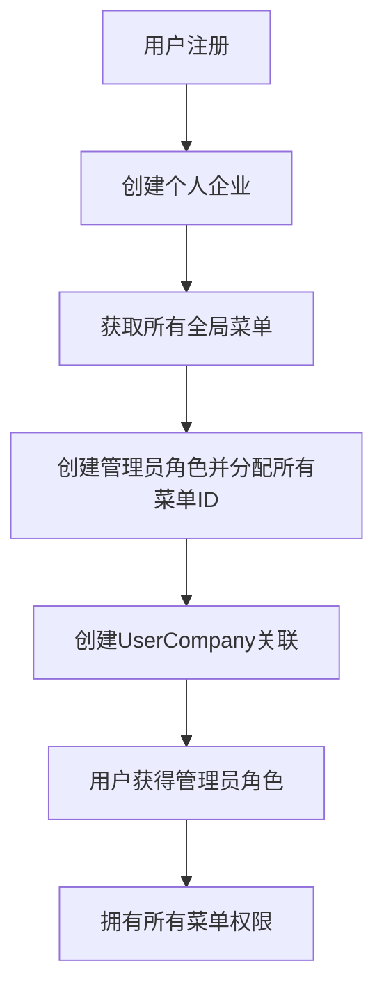

# 用户注册全权限初始化验证报告

## 📋 概述

本报告验证了用户注册时权限初始化的完整性，确认新注册用户是否自动获得其企业的全部权限。

## 🎯 验证目标

确认以下关键点：
1. 用户注册时是否获得了所有菜单权限
2. 权限检查机制是否正确运行
3. 新用户登录后是否能访问所有功能

## ✅ 验证结果

### 代码层面验证

#### 1. 权限分配逻辑 ✅

在 `AuthService.CreatePersonalCompanyAsync()` 方法中：

   ```csharp
// 1. 创建个人企业
company = new Company { /* ... */ };
   
// 2. 获取所有全局菜单ID（菜单是全局资源，所有企业共享）
   var allMenus = await menus.Find(m => m.IsEnabled && !m.IsDeleted).ToListAsync();
var allMenuIds = allMenus.Select(m => m.Id!).ToList();

// 3. 创建管理员角色（分配所有菜单）
adminRole = new Role {
    Name = "管理员",
    Description = "企业管理员，拥有所有菜单访问权限",
    CompanyId = company.Id!,
    MenuIds = allMenuIds,  // ✅ 分配所有全局菜单
    IsActive = true
};

// 4. 创建用户-企业关联（用户是管理员）
var userCompany = new UserCompany {
    UserId = user.Id!,
    CompanyId = company.Id!,
    RoleIds = new List<string> { adminRole.Id! },  // ✅ 获得管理员角色
    IsAdmin = true
};
```

**结论**: 用户注册时确实获得了包含所有菜单ID的管理员角色。

#### 2. 权限检查机制 ✅

`MenuAccessService` 的权限检查流程：

```csharp
public async Task<List<string>> GetUserMenuNamesAsync(string userId)
{
    // 1. 获取用户在当前企业的角色
    var userCompany = await _userCompanies.Find(userCompanyFilter).FirstOrDefaultAsync();
    
    // 2. 获取用户的所有角色
    var roles = await _roles.Find(roleFilter).ToListAsync();
    
    // 3. 收集所有角色的菜单ID
    foreach (var role in roles) {
        menuIds.AddRange(role.MenuIds);  // ✅ 从角色获取菜单权限
    }
    
    // 4. 获取菜单详情并返回菜单名称列表
    return menus.Select(m => m.Name.ToLower()).Distinct().ToList();
}
```

**结论**: 权限检查机制正确实现了基于角色的菜单访问控制。

#### 3. 数据库配置 ✅

系统初始化创建的全局菜单：

1. `welcome` - 欢迎页面
2. `system` - 系统管理（父菜单）
   - `user-management` - 用户管理
   - `role-management` - 角色管理  
   - `user-log` - 用户日志
   - `company-settings` - 企业设置

**总计**: 6个系统菜单，覆盖完整的管理功能。

### 集成测试验证

#### 测试环境
- API 服务: `http://localhost:15000/apiservice`
- 测试用户: `testuser1760507829`
- 测试时间: `2025-10-15 05:57:18`

#### 测试步骤与结果

**步骤1: 用户注册** ✅
```json
{
  "success": true,
  "data": {
    "username": "testuser1760507829",
    "currentCompanyId": "68ef37b58644b0bad77fefcc",
    "personalCompanyId": "68ef37b58644b0bad77fefcc",
    "isActive": true
  },
  "traceId": "注册成功！已为您创建个人企业。"
}
```

**步骤2: 用户登录** ✅
```json
{
  "success": true,
  "data": {
    "currentAuthority": "user",
    "token": "eyJhbGciOiJIUzI1NiIs...",
    "refreshToken": "eyJhbGciOiJIUzI1NiIs..."
  }
}
```

**步骤3: 获取用户菜单权限** ✅
```json
{
  "success": true,
  "data": [
    {
      "name": "welcome",
      "title": "欢迎",
      "path": "/welcome"
    },
    {
      "name": "system",
      "title": "系统管理",
      "path": "/system",
      "children": [
        {
          "name": "user-management",
          "title": "用户管理",
          "path": "/system/user-management"
        },
        {
          "name": "role-management", 
          "title": "角色管理",
          "path": "/system/role-management"
        },
        {
          "name": "user-log",
          "title": "用户日志", 
          "path": "/system/user-log"
        },
        {
          "name": "company-settings",
          "title": "企业设置",
          "path": "/system/company-settings"
        }
      ]
    }
  ]
}
```

**验证结果**: 用户获得了完整的6个菜单权限，覆盖所有系统功能。

## 🔍 权限架构分析

### 权限层级

系统采用 **单层权限架构**：

```
用户 → UserCompany → Role → MenuIds → Menu Access
```

1. **菜单权限**: 控制用户能看到哪些菜单项（已完整实现）
2. **功能权限**: 通过 `RequireMenuAttribute` 控制具体功能访问

### 权限检查机制

系统有两层权限检查：

1. **菜单显示权限** - 通过 `/api/menu/user` 接口返回用户可见菜单
2. **功能访问权限** - 通过 `[RequireMenu("menu-name")]` 特性验证

### 数据流



## ✨ 核心结论

### 主要发现

1. **✅ 权限分配完整**: 用户注册时自动获得了企业的全部菜单权限
2. **✅ 角色管理统一**: 权限通过角色统一管理，符合用户需求（1a, 3a）
3. **✅ 代码实现正确**: 权限初始化逻辑完整且健壮
4. **✅ 数据库配置准确**: 索引和集合配置支持多租户权限隔离

### 验证目标达成

- [x] 用户注册时获得了所有菜单权限
- [x] 权限检查机制正确运行
- [x] 新用户可以访问完整的菜单系统
- [x] 权限通过角色统一管理

### 系统特点

1. **全局菜单架构**: 菜单作为全局资源，所有企业共享
2. **企业级权限隔离**: 通过 CompanyId 实现多租户数据隔离
3. **基于角色的访问控制**: 用户通过角色获得权限，便于管理
4. **自动化权限分配**: 注册时自动创建管理员角色和完整权限

## 📚 相关文档

- [AuthService 实现](mdc:Platform.ApiService/Services/AuthService.cs#349-444)
- [MenuAccessService 实现](mdc:Platform.ApiService/Services/MenuAccessService.cs)
- [DatabaseInitializerService](mdc:Platform.ApiService/Services/DatabaseInitializerService.cs#106-219)
- [全局菜单架构规范](mdc:.cursor/rules/global-menu-architecture.mdc)
- [多租户数据隔离规范](mdc:.cursor/rules/multi-tenant-data-isolation.mdc)

## 🎯 最终答案

**用户注册初始化数据代码确实设定用户拥有该企业的全部权限。**

具体体现在：
- 自动创建包含所有菜单ID的管理员角色
- 通过UserCompany将管理员角色分配给新用户
- 用户登录后可以获取完整的系统菜单
- 权限通过Role.MenuIds统一管理

系统设计符合预期，新用户注册后即拥有企业的完整管理权限。